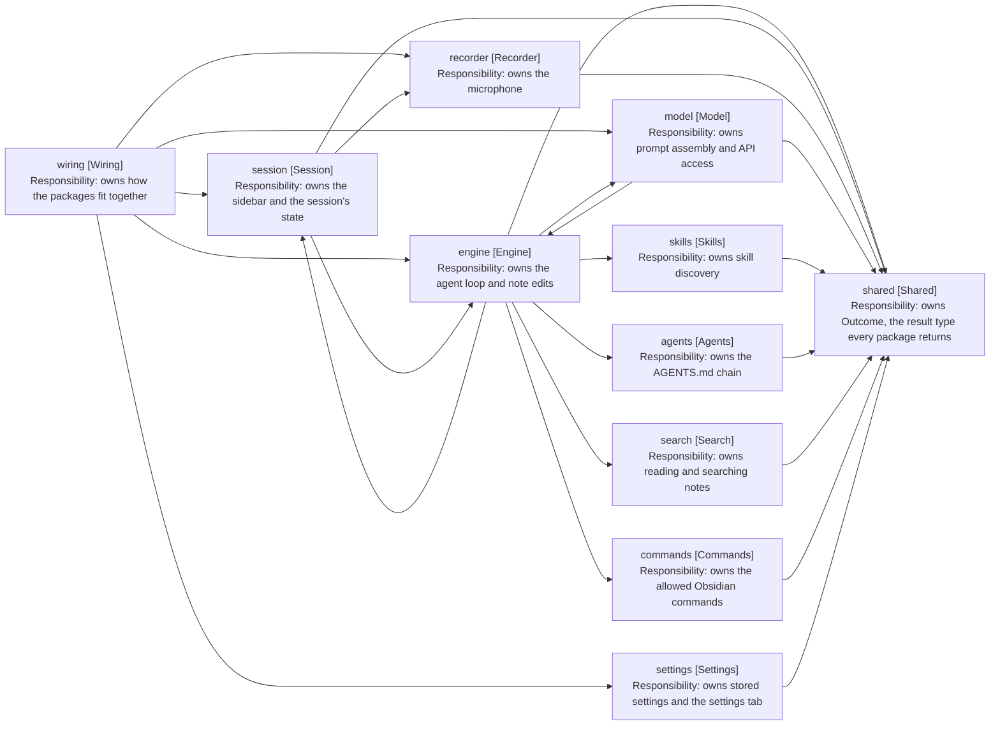

# Architecture Overview

Entry point for the architecture docs, and the home of the rules that hold
across packages: which way dependencies run, who may construct, and how big a
folder gets.

One file per subsystem, each holding a diagram and the boundaries a reader
cannot grep. Detail that src states plainly is left to src.

- [2-vocabulary.md](2-vocabulary.md) - turn, turn step and progress line, the entry kinds, and the words this codebase settles on
- [3-capture.md](3-capture.md) - the microphone, and getting an utterance transcribed
- [4-the-turn.md](4-the-turn.md) - the agent loop, how a turn ends, and how it parks on a person
- [5-asking-the-model.md](5-asking-the-model.md) - what one model call is made of, and the order the messages go in
- [6-reaching-a-note.md](6-reaching-a-note.md) - finding the note a turn writes to, and writing to it
- [7-the-panel.md](7-the-panel.md) - the two records a turn leaves, and what builds the sidebar

Read 2-vocabulary before naming anything a turn, a turn step or a progress
line. The three nest, and the middle one never reaches the screen.

## Packages

| Package      | Owns                                                  | Depends on             |
| ------------ | ----------------------------------------------------- | ---------------------- |
| shared       | Outcome, the result type every package returns        | nothing                |
| recorder     | The microphone: one utterance per start-stop cycle    | shared                 |
| model        | Talking to the model: prompt assembly and API access  | engine, shared         |
| skills       | Skill discovery and reading from the vault            | shared                 |
| agents       | AGENTS.md discovery and the instruction chain         | shared                 |
| search       | Reading, globbing and grepping notes                  | shared                 |
| commands     | The Obsidian commands the plugin registers            | shared                 |
| engine       | The agent loop and note editing                       | model, skills, session |
| session      | The Obsidian sidebar: React views and panel state     | engine, recorder       |
| settings     | Settings storage and its settings tab                 | shared                 |
| wiring       | Construction knowledge: how the packages fit together | every package          |
| test-support | Fakes and builders. Test-only, never imported by src  | any                    |

Arrows: uses-relationship (client to supplier).

## The Dependency Rule

Dependencies point one way: session to engine, engine to model and the vault
readers, everything to shared. Wiring is the exception by design, since
construction knowledge has to reach every package.

A package needing a type from one above it means the type belongs lower down,
not that the arrow should reverse. Two cycles break the rule today, and both
close by moving values rather than by reversing an arrow.

- Model and engine. Engine calls into model, while model reads OpenNote and
  NoteDetails back out of engine. Both are what a prompt is made of, so they
  move below both packages.
- Engine and session. Session reads the engine's turn state, and engine names
  SessionRepository and TranscriptRepository across its own files.
  SessionRepository is turn state and moves below both; the transcript splits
  by direction, so engine declares a port that session's class implements.

## Who May Construct

A file may construct a class from another package only if its path starts with
src/wiring. Everything else codes against what its own package already exposes.

The rule is positional, so it is checkable by reading a path. An exemption
naming one class is not.

The same reasoning gives the second positional rule: nothing outside a views
folder imports React. A reader who wants the UI opens views; a reader who wants
the logic knows the rest of the package is free of it.

test-support is the one exception left open. It constructs across every
boundary and is test-only, so it is either exempt or a second wiring package.
That is undecided.

## Three Kinds Of Package

| Kind    | Owns                   | May construct across packages | Named after       |
| ------- | ---------------------- | ----------------------------- | ----------------- |
| Wiring  | Construction knowledge | Yes, every package            | Its job           |
| Service | Behaviour, one entry   | No                            | Its entry service |
| Value   | Types, no behaviour    | No                            | The concept       |

A value package holds values only. A repository accumulates state and changes
it, so it sits beside the services that use it however small it is. The test is
a mutable collection surviving across calls, not the presence of methods.

Files group by concept rather than by kind, and a value object sits beside the
service that reads it. Views are the one exception: views holds the React
components, views/hooks the subscription hooks, and views/obsidian what extends
an Obsidian class rather than rendering React.

A smaller package adds models, views and tests only when there is enough to
fill each.

## Size

The limit is 10 files per folder, counting the package root as a folder of its
own. Tests count against their own folder and are exempt.

No count is written down here. A count is stale on the next merge and nothing
tells the reader it has gone wrong. A reader who wants one runs ls.
