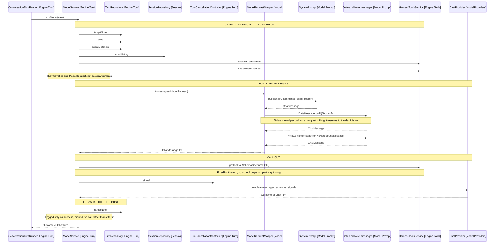

# Asking the Model

The object graph behind ModelService.askModel (Engine Turn), which is one of the
two outward calls a turn step makes. The other is ToolCallExecutor (Engine
Turn), covered by [8-parking-a-turn.md](8-parking-a-turn.md).

The loop decides when to ask, ModelService gathers what the ask needs, and
ModelRequestMapper (Model) turns that into the messages sent. It is static, the
request being all it needs.

## Who holds whom

TurnRunnerFactory (Engine Turn) builds the graph. It holds what outlives a turn
and constructs what does not, so the turn-scoped boundary is one class.

| Collaborator               | Scope   | Supplies to the ask                    |
| -------------------------- | ------- | -------------------------------------- |
| SessionRepository          | Session | The chat history, across turns         |
| TurnRepository             | Turn    | Target note, skills, AGENTS.md chain   |
| TurnCancellationController | Turn    | The abort signal the provider takes    |
| HarnessToolsService        | Session | Tool schemas, allowed commands, search |
| ChatProvider               | Session | The completion itself                  |

Only the history and the harness reach are session-scoped. An editor handle
cannot outlive its turn, so the note reaches the request through TurnRepository.

## One ask, end to end

Arrows: uses-relationship (client to supplier).

## Message order

The mapper orders messages by how stale a copy the history could hold: the
system prompt first, then the conversation, then the date and the final
context. The last two sit after the history so the model cannot read either off
an earlier turn.

The date and the note are system-role messages that sit outside the system
prompt, because the history holds a stale copy of each and only the last read
wins. VaultInstructions is turn-scoped too, but stays inside: its blocks are
quoted vault content, and the rules fencing them off hold only while they sit
above the quote.

The final context has two shapes: a bound session gets the note's details, an
unbound one what it may still reach.

## Where skills enter

| What                           | Built by                 | Where             |
| ------------------------------ | ------------------------ | ----------------- |
| How they work, and which exist | SkillSection             | The system prompt |
| A skill's steps                | ToolDispatcher.loadSkill | A tool result     |

The rules and the names are one section: the rules mean nothing without the
names, and the names are what an utterance is matched against. A vault defining
no skills omits the section entirely.

The body never passes through message assembly. It arrives as a load_skill tool
result, which ToolCallExecutor appends to the history, so the next iteration
reads it as conversation. The harness never picks the skill: TurnRepository
only holds the model to answering before it writes.

## What ModelService does not do

It returns the outcome untouched, appending nothing to the history and ending no
turn. A text answer is ended by TurnEndingService, a failed ask by
ConversationTurnRunner (both Engine).

Its one side effect is the debug line, the only record of why a turn spent its
iterations: the panel shows commands and answers, not the edits retried.
