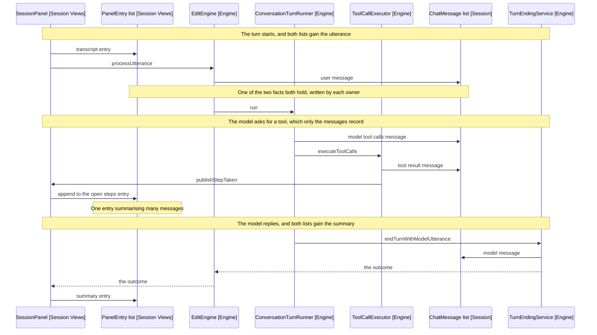

# The Two Records A Turn Leaves

A session is a list of turns, and each turn writes itself down twice: once for
the model to continue from, once for a person to read. Cross-cutting, like
[7-package-design.md](7-package-design.md), so it names the package beside each
class.

The two lists have different shapes, different owners and different readers, and
they meet once, when the session is stored.

This is the map of which is which, what triggers each write, and where the two
overlap.

## The two lists

|                     | ChatMessage[]                    | PanelEntry[]                        |
| ------------------- | -------------------------------- | ----------------------------------- |
| Held by             | SessionRepository [Session]      | the panel's reducer [Session Views] |
| Written by          | seven call sites, all in engine  | nineteen dispatches, all in views   |
| Read by             | the model, on the next request   | the reader, on screen               |
| Survives an unmount | yes, nothing about it is React's | no, it is React state               |
| Stored as           | messages                         | entries                             |

No file writes both. The engine cannot see the entries, and the panel cannot see
the tool results.

## What triggers each write

Both are driven by the same turn, but by different moments in it.

A message is appended wherever the conversation gains something the model must
see next time: the utterance as the turn starts, the model's tool calls, each
tool's result, and the summary or cancellation that ends it.

An entry is dispatched wherever the panel gains something a person should read:
the transcript, each step the turn took, a warning, a resolved instruction
chain, a question, and the summary or error at the end.

So a single tool call writes two messages and no entry of its own. It appends to
the open steps entry instead, which is one entry summarising many messages.

## Behaviour Sequence

One turn with a single tool call. Both lists are shown as participants, so the
interleaving is visible.



Arrows: uses-relationship (client to supplier).

The turn drives both, and neither list is derived from the other. Each owner
writes what its own reader needs, at the moment it knows it.

## Where they overlap

Two facts appear in both lists, and only two.

| The fact                        | Message           | PanelEntry      |
| ------------------------------- | ----------------- | --------------- |
| What the user said              | ChatMessage.user  | kind: user      |
| The summary that ended the turn | ChatMessage.model | kind: assistant |

Both are written twice because both audiences need them: the model continues
from the conversation, and the reader needs to see what they said and what came
back.

## What only the messages hold

| Message        | Why no entry                                                 |
| -------------- | ------------------------------------------------------------ |
| modelToolCalls | raw tool arguments, which the steps entry summarises instead |
| toolCallResult | tool output the model needs and a reader does not            |

## What only the entries hold

| PanelEntry       | Why no message                                                 |
| ---------------- | -------------------------------------------------------------- |
| steps            | one collapsed list standing for many tool messages             |
| error            | a failure the model never saw                                  |
| warning          | a turn nearing its cap, said to the user rather than the model |
| instructions     | which AGENTS.md files applied                                  |
| answer           | a reply rendered with its sources                              |
| choice, question | controls with pending state, settled when answered             |
| cancelled        | which notes a stopped turn had already changed                 |
| restored         | added on restore, and stripped again before storing            |

Nine of the eleven entry kinds have no message behind them, and two of the five
message kinds reach no entry.

## What is not in either list

The system prompt. ModelRequestParts assembles each request as the system
prompt, then the history, then the date and the session target, so the framing
is rebuilt every time rather than stored.

That is why a restored session gets today's date and the current note's context
rather than the copies its last turn ran with.

## Where the two meet

Once, in SessionSnapshotFactory.

```text
SessionSnapshotFactory.of(sessions, entries):
  targetPath from the repository
  messages   from the repository, mapped through StoredMessages
  entries    from the panel, with the restored line dropped
```

That is the only place both lists are in scope together, and the record is the
only artefact that holds both. Restoring splits them again: the messages rebuild
a SessionRepository, and the entries go straight to the panel's props.

The transcript is deliberately absent from the record. It carries prompts and
note excerpts verbatim, which NFR2 keeps off disk.

## References

- src/session/session-repository.ts:6 - the live conversation, held across turns
- src/session/models/panel-state.ts:12 - the eleven entry kinds
- src/model/providers/models/chat-message.ts:8 - the five message kinds
- src/session/session-snapshot-factory.ts:17 - the one place the two lists meet
- src/model/prompt/model-request-parts.ts:16 - the framing rebuilt per request
- src/engine/turn/tool-call-executor.ts:16 - two messages per tool call
- src/engine/turn-ending-service.ts:17 - the message that ends a turn
- src/session/views/SessionPanel.tsx:89 - runTurn, which dispatches around the call
