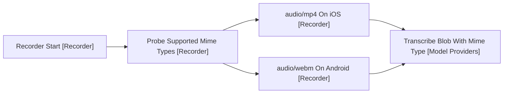

# Capture

Getting a spoken utterance into text. Covers recorder and model/providers.

A transcription provider is capture rather than a model call, which is why the
providers folder is read from both here and
[5-asking-the-model.md](5-asking-the-model.md). What differs is the endpoint,
not the package.

## One Utterance Per Cycle

The recorder records one utterance per start-stop cycle and hands back a blob.
Stop is what closes the utterance, so nothing downstream has to decide where
one instruction ends and the next begins.

Transcription is batch: the blob is posted on stop and the text comes back in
one piece. That is a plain REST call, which is what kept mobile cheap, since a
WebSocket in the mobile webview cannot set custom headers.

## The Container Differs By Platform

Arrows: data flow (direction data moves).

MediaRecorder gives a different container per platform: iOS WebKit records
audio/mp4, Android audio/webm. The recorder picks the first supported type from
a preference list and reports it with the blob.

Nothing transcodes. The mime type rides through to the provider, whose batch
endpoint accepts both containers, so the platform difference dies at the API
boundary rather than inside the plugin.

Mic permission is requested lazily on first record, and a denial renders as a
step-named error rather than a silent failure.

## Why The Skills Folder Is Not A Dot-Folder

The configured skills folder has to be a normal vault folder, and the
constraint comes from capture's platform rather than from skills.

Obsidian Sync copies no dot-folder to a phone except .obsidian and .trash, and
the mobile adapter resolves no symlink. So a dot-path, or a link to one, never
arrives on the device.

The symptom is an empty catalogue on the phone and a populated one on the
laptop, with no error in between. That silence is why the rule is written down.

Discovery goes through the vault adapter rather than the file API, which omits
dot-directories on desktop as well.

## References

- [5-asking-the-model.md](5-asking-the-model.md) - the other half of the providers folder
- [4-the-turn.md](4-the-turn.md) - what the transcript becomes once it is text
