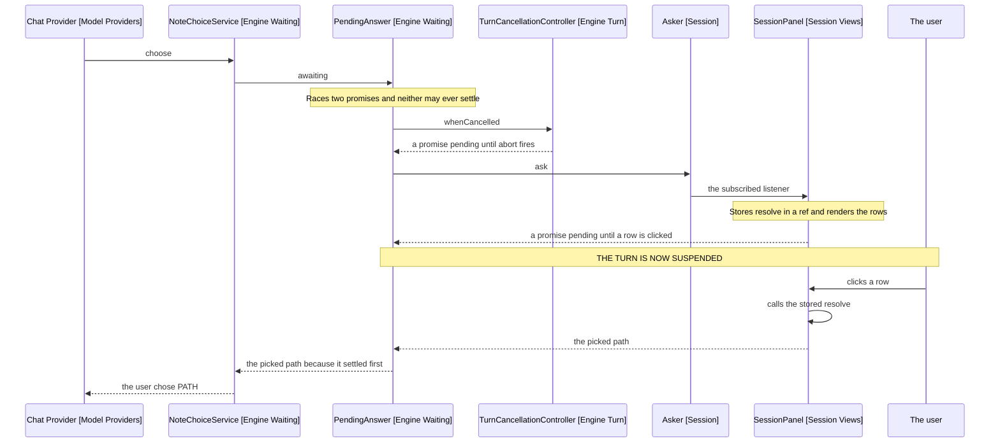
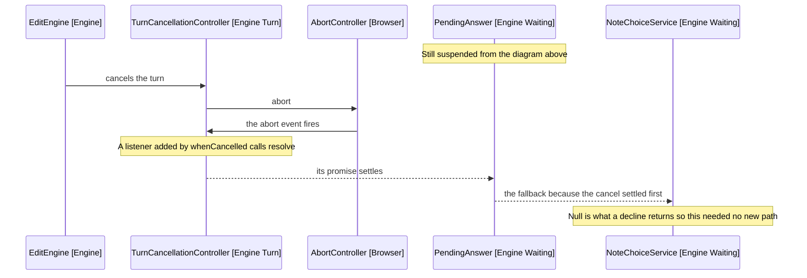

# The Turn

The agent loop: what one utterance runs, how it ends, and how it waits on a
person without hanging. Covers engine, apart from the note folders that
[6-reaching-a-note.md](6-reaching-a-note.md) owns. The words it uses are fixed
in [2-vocabulary.md](2-vocabulary.md).

## How A Turn Ends

The turn's return type is TurnResult (Engine Turn Ending): the ending kind
beside an Outcome of string, of whose three states only one carries that string.

| State     | Carries                  | Panel shows                                |
| --------- | ------------------------ | ------------------------------------------ |
| Success   | The model's answer       | An assistant entry, or none if it answered |
| Cancelled | The notes the turn wrote | A cancelled entry                          |
| Failure   | A step and a message     | An error entry                             |

The type parameter names the success case only. The other two are generic in
it so they can share the union, and hold no value of that type.

The kind travels beside the outcome because the outcome cannot say which ending
it was. A turn that answered from search succeeds carrying its answer, which the
panel has already shown, so the panel reads the kind to know not to show it
again.

## Why The Ending Returns Rather Than Publishes

Steps, warnings and answers reach the panel through subscriptions. The ending
does not, and that is the only asymmetry in how the panel hears from the engine.

A subscription suits an event with no caller waiting. The ending has one:
UtteranceQueue holds the promise so a second utterance waits on the first, and
the panel needs the ending to leave the thinking phase.

## Parking On A Person

Ordinary async waits on something that will finish. A turn offering a choice
waits on a person who may never answer, while a cancel may arrive first. That
needs machinery the rest of the codebase does not have.

| Class                      | Package | Answers                                        |
| -------------------------- | ------- | ---------------------------------------------- |
| NoteChoiceService          | Engine  | What is being asked, in domain terms           |
| PendingAnswer              | Engine  | Answer or cancel, whichever settles first      |
| TurnCancellationController | Engine  | Has this turn been cancelled, asked three ways |
| Asker                      | Session | Who answers, and what if nobody is listening   |

UserQuestionService sits beside NoteChoiceService and works the same way, so
only one is drawn.

Arrows: uses-relationship (client to supplier).

Storing resolve and calling it later is the unusual shape. Most promise code
returns a promise built from something already async; here the panel becomes
the async thing. It is the only way to bridge a person clicking in the DOM to a
turn that awaits.

## The Same Turn, Cancelled

Arrows: uses-relationship (client to supplier).

A cancel arrives where a decline does, which is why cancellation needed no
handling of its own, and it must settle the same promise because nothing else
can.

TurnCancellationController wraps an AbortController rather than a boolean,
because three consumers need three shapes of one fact: a boolean for the loop
between steps, an AbortSignal for the provider's fetch, and a promise for the
race above.

## What Guarantees A Turn Always Resumes

Three fallbacks, each owned by a different collaborator.

- Asker resolves to its default when no panel is subscribed, since a question
  nobody can see is one nobody answered.
- PendingAnswer settles on the cancel when the person never answers.
- NoteChoiceService answers itself in auto mode, so the turn never parks.

## Engine's Folders

Engine is large enough to split by concept, and two of its folders hold a
folder of their own.

| Folder        | Holds                                                          |
| ------------- | -------------------------------------------------------------- |
| turn          | The loop and the turn-scoped repositories                      |
| turn/spending | TurnSpend and the two counters it holds                        |
| turn/ending   | How a turn ends: its kind, its step outcomes and its outcomes  |
| tools         | Tool services, their results and the tool schemas              |
| skill-gating  | Whether a call declared the skills it needed before it ran     |
| waiting       | Parking a turn on a question or a choice, and the two requests |
| note-editing  | The note editor, its parser and positions                      |
| note-binding  | Resolving and opening the target note                          |

The root holds only what spans the folders. The placement test for tools: a
tool takes a ToolCall and returns a result, so NoteEditor, which takes an
EditOperation, is not one.

Everything under turn dies with the turn. The one repository that outlives it,
PathsReturnedByVaultRepository, is session-scoped and lives in
TurnRunnerFactory. It records every path the vault returned, a read included,
so a note found in one turn can be opened in the next.

TurnRepository holds a second, per-turn copy that only glob and grep fill. The
check on how a turn ends reads that one: a turn answers through
answer_from_search only when its own search found notes, not when it read the
note it edits or when an earlier turn searched.

## References

- [2-vocabulary.md](2-vocabulary.md) - turn, turn step, progress line, and the six endings
- [5-asking-the-model.md](5-asking-the-model.md) - what one step's model call is made of
- [7-the-panel.md](7-the-panel.md) - where the ending and the progress lines land
