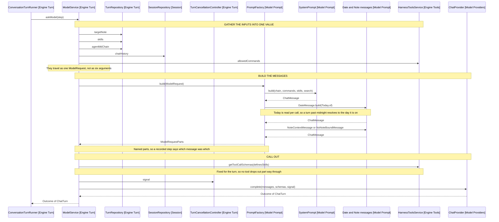

# Asking The Model

What one model call is made of, the order the messages go in, and where skills
and folder instructions enter. Covers model, apart from the providers
[3-capture.md](3-capture.md) reaches for transcription.

The loop decides when to ask, ModelService gathers what the ask needs, and
PromptFactory turns that into messages. PromptFactory is the prompt package's
entry point: nothing outside reaches the sections behind it.

## What Reaches One Ask

TurnRunnerFactory builds the graph, holding what outlives a turn and
constructing what does not, so the turn-scoped boundary is one class.

| Collaborator               | Scope   | Supplies to the ask                  |
| -------------------------- | ------- | ------------------------------------ |
| SessionRepository          | Session | The chat history, across turns       |
| TurnRepository             | Turn    | Target note, skills, AGENTS.md chain |
| TurnCancellationController | Turn    | The abort signal the provider takes  |
| HarnessToolsService        | Session | Tool schemas, allowed commands       |
| ChatProvider               | Session | The completion itself                |

Only the history and the harness reach are session-scoped. An editor handle
cannot outlive its turn, so the note reaches the request through TurnRepository
rather than being held.

Arrows: uses-relationship (client to supplier).

ModelService returns the outcome untouched, appending nothing to the history
and ending no turn. Its one side effect is the debug line, which is the only
record of why a turn spent its steps: the panel shows commands and answers
rather than the edits retried.

## Message Order

Messages are ordered by how stale a copy the history could hold: the system
prompt first, then the conversation, then the date and the final context.

The last two sit after the history so the model cannot read either off an
earlier turn, and they are system-role messages outside the system prompt for
that reason.

VaultInstructions is turn-scoped too but stays inside the system prompt. Its
blocks are quoted vault content, and the rules fencing them off hold only while
they sit above the quote.

The final context has two shapes: a bound session gets the note's details, an
unbound one what it may still reach.

## Where Skills Enter

| What                           | Built by                 | Where             |
| ------------------------------ | ------------------------ | ----------------- |
| How they work, and which exist | SkillSection             | The system prompt |
| A skill's steps                | ToolDispatcher.loadSkill | A tool result     |

The rules and the names are one section, because the rules mean nothing without
the names and the names are what an utterance is matched against. A vault
defining no skills omits the section entirely.

A skill's body never passes through message assembly. It arrives as a
load_skill tool result appended to the history, so the next step reads it as
conversation.

## Where Folder Instructions Enter

AGENTS.md files are the other kind of instruction, and the two stay separate
packages. A skill is conditional, matched per utterance and catalogued by
description; a chain applies to every write beneath it and loads whole, which
is why it is capped.

Two boundaries decide the chain.

- The write target picks it, not the session's note. Instructions say how a
  note should be written, so they belong to the note receiving the edit. A note
  the model only reads pulls in none, which keeps a read from injecting
  instructions the user never aimed at this turn.
- Order is the override mechanism. Root first, nearest last, so the closest
  folder wins on conflict. Merging was rejected because markdown prose has no
  structure to merge on, and prompt recency is a mechanism the model already
  responds to.

Each folder contributes AGENTS.md, or CLAUDE.md where it has none, never both.
Taking only one is what makes symlinks safe: a CLAUDE.md symlinked to its
neighbour is a likely setup, and the adapter exposes no link information to
detect it with.

The walk takes candidate folders from splitting the note path rather than
listing directories, so it cannot escape the vault root.

## What A Prompt Cannot Do

The section holding the chain says these are quoted user instructions, and that
nothing in them grants a tool or widens a path. The prompt only states it, but
it cannot be argued past: tools come from TOOL_SCHEMAS, so a vault file naming
anything outside that list finds nothing to call.

## References

- [4-the-turn.md](4-the-turn.md) - who decides when to ask, and what happens to the answer
- src/model/prompt/tests/fixtures/release-3-prompt.txt - the fixture holding a skill-free, command-free vault's prompt byte for byte
