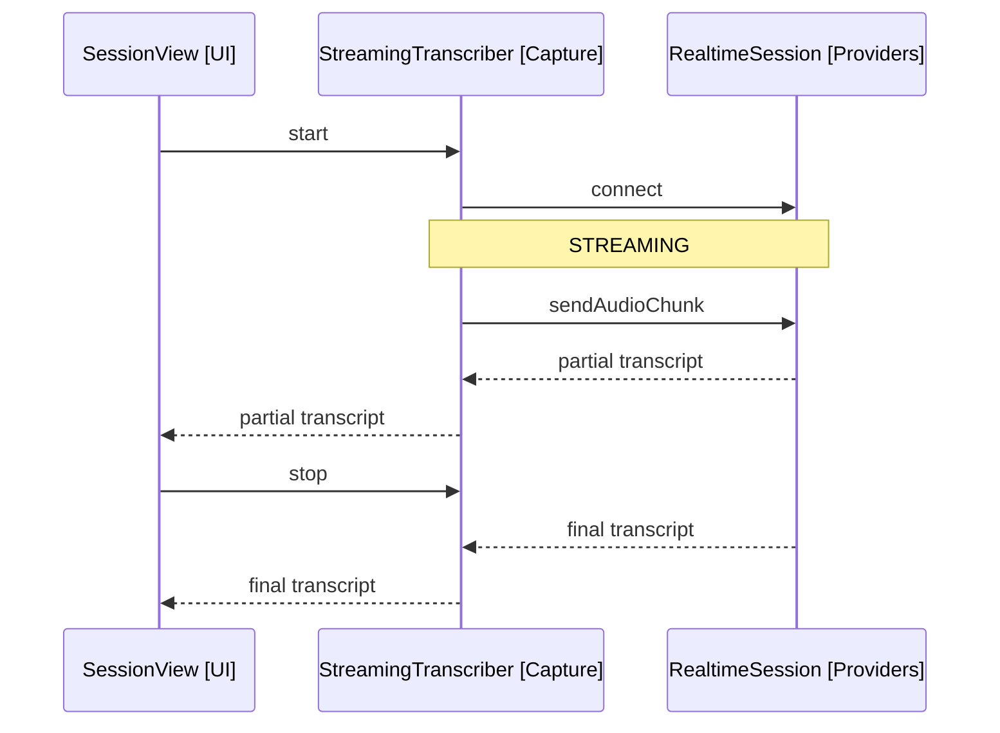

# Design: Desktop V1

Covers release 5 of [2-plan.md](../spec/2-plan.md): realtime streaming capture, the OpenAI provider, review-first mode, and the remaining settings. Delta design on top of [1-desktop-mvp.md](1-desktop-mvp.md).

## Streaming Capture

StreamingTranscriber [Capture] replaces Recorder for live sessions; Recorder stays as the batch fallback.

- An AudioWorklet captures PCM16 chunks from the selected microphone (FR31).
- Chunks stream over a WebSocket to the provider; partial transcripts come back as events.
- SessionView [UI] renders partials live and replaces them with the final transcript on stop (FR7).
- Stop closes the utterance; the final transcript feeds EditEngine [Engine] exactly as in the MVP, so the agent loop is untouched.

Arrows: uses-relationship (client to supplier).

## Realtime Auth Seam

Built now so Mobile V1 reuses it, per the plan's rework warning.

- RealtimeAuth [Providers] produces connection credentials. Desktop implementation: DirectKeyAuth, the API key on the connection request.
- The mobile implementation, EphemeralTokenAuth, is specified in [6-mobile-v1.md](6-mobile-v1.md); the interface lands here.
- RealtimeSession [Providers] takes a RealtimeAuth, so transports never see key handling.

## OpenAI Provider

- OpenAIProvider [Providers] implements TranscriptionProvider, ChatProvider and the realtime session against OpenAI's endpoints (FR26).
- Settings gain a provider dropdown, a key field per provider, and a per-provider default edit model (FR28, FR29).
- Provider differences (message format, tool-call format, audio event names) stay inside each provider; EditEngine and Capture see one shape.

## Review-First Mode

ReviewController [Engine] sits between EditEngine and NoteEditor when the setting is on (FR23, FR24).

- Tool calls are validated (anchor resolution) but buffered, not applied.
- The sidebar shows a per-operation diff: anchor context with deletions and insertions highlighted.
- Accept applies the buffer through NoteEditor in order. Reject discards the buffer and records the rejection in history, so the model knows the edit did not land.
- Mixed verdicts are out of scope: the buffer is accepted or rejected as one turn.

## Remaining Settings

- Transcription language dropdown, with a frontmatter key overriding it per note (FR30).
- Microphone device picker, desktop only (FR31).

## Latency Budget

NFR2 allows 5 seconds; streaming spends it as follows.

- Transcript final: near zero after stop, streaming already caught up.
- Chat round-trip with tools: 1-3 seconds on notes of normal size.
- Apply and render: under 100 milliseconds.
- Notes larger than roughly 4k tokens erode the budget; the design accepts this in V1 rather than chunking notes.
