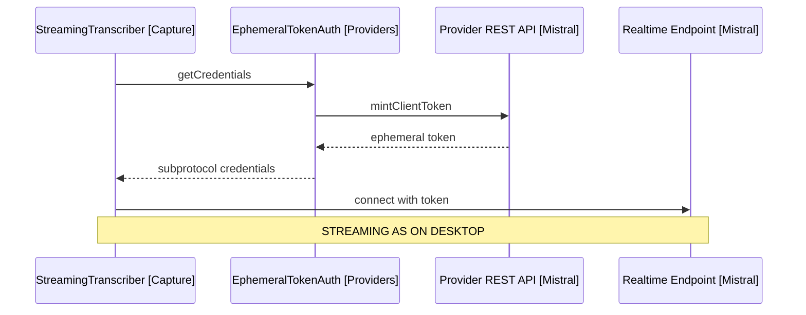

# Design: Mobile V1

Covers release 6 of [2-plan.md](../spec/2-plan.md): streaming on mobile via ephemeral tokens, graceful fallback, mic lifecycle, and the public release. Delta design on top of [5-desktop-v1.md](5-desktop-v1.md).

## Ephemeral Token Auth

The mobile webview cannot set custom headers on WebSocket connections (NFR3). EphemeralTokenAuth [Providers] implements the RealtimeAuth seam from Desktop V1.

- Before connecting, it mints a short-lived client token via a plain REST call authenticated with the user's API key.
- The token rides the WebSocket subprotocol field, which the webview can set.
- The API key itself only ever travels in the REST mint call, never in the WebSocket handshake.
- Tokens are minted per session start, not cached; expiry mid-utterance triggers the fallback below.

Arrows: uses-relationship (client to supplier).

The same flow applies to the OpenAI provider; only the endpoint names differ inside the provider.

## Fallback to Batch

- A failed token mint or a refused WebSocket connection drops the session to batch capture: Recorder [Capture] records, MistralProvider [Providers] transcribes on stop, exactly the Mobile MVP path.
- The drop is per session, announced with one notice, and retried on the next session start.
- EditEngine [Engine] is unaffected; it receives a final transcript either way.

## Mic Lifecycle

- App backgrounding while recording: a setting chooses stop-and-send or stop-and-discard; default is stop-and-send, since losing dictated content is worse than sending a truncated utterance.
- Returning to the app never auto-restarts the mic; the user taps again.
- Incoming interruptions (calls, other apps taking the audio session) are treated as backgrounding.

## Release

- Community plugin submission: manifest, README, and the plugin-review checklist.
- README states the privacy posture plainly: audio and note content go only to the selected provider with the user's own key; both shipped providers have no-training-by-default API policies (NFR1).
- Mobile support declared in the manifest; the Mobile MVP and V1 exit tests are the release gate.
