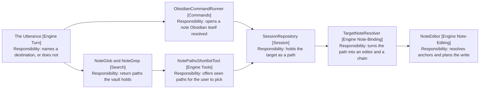

# Reaching A Note

Finding the note a turn writes to, and writing to it. Covers search, commands,
engine/note-binding and engine/note-editing.

Finding and writing are one question because of what joins them: a path only
becomes writable once the user has consented to it, and consent has three
shapes.

## From Utterance To Write

Arrows: uses-relationship (client to supplier).

## The Model Never Picks A Write Path

Three routes reach the session's target, and none of them is the model naming a
path it thought of.

- A command. The destination is whatever Obsidian's own command opened, which
  the user configured. The allow-list is the user's, and nothing in a prompt, a
  skill or an AGENTS.md file can widen it.
- A shortlist the user picks from, offering only paths a search returned. The
  pick is both which note and permission to write to it, which is why the
  choice is a parked turn rather than a tool result.
- The note already open, when the session bound to it.

The shortlist has a guard worth knowing: a path only reaches the user if the
vault returned it earlier in the session. Otherwise the model could invent a
path, shortlist it, and let the user's pick stand in as permission for a
destination nothing ever found.

The shortlist also refuses rather than truncating when there are too many
candidates. Silently dropping the note the user wanted is the failure it was
built to replace.

## The Target Is A Path, Not A Handle

The session holds the target as a path, and TargetNoteResolver turns it into an
editor per turn.

A path survives between turns; an editor handle goes stale the moment the user
closes the tab. That is also why an unbound session resolves to a distinct
state rather than a failure: the turn still opens, and the search tools still
work, so a question can be answered without any note bound.

A retarget is told to the model rather than happening silently. An anchor
applied to the wrong note is the failure this path most needs to avoid.

## Anchors Must Be Unique

An edit names the text it is anchored to, and that text must appear in the note
exactly once. Zero matches and several matches both fail the same way.

The failure goes back to the model as the tool result, so it lengthens the
anchor or asks the user. Nothing guesses which match was meant.

Offsets are recomputed after each applied operation, since an earlier operation
in the same turn shifts the positions of the ones after it.

## Writing Is Bounded To The Target

Every write tool edits the turn's target and nothing else. A whole-note rewrite
is still that note, and opening another moves the target rather than writing to
a second one. No tool creates a note at a path the model computed.

That makes the tool list the real boundary, rather than anything a skill
declares about itself. A skill reaching for a cross-file tool finds nothing to
call, so a skill file cannot widen what the plugin does however it is written.

The model draws the line for the user: when a skill fits the utterance but
needs another file, it names the skill, says the capability is absent, and
makes no partial edit. A frontmatter scope flag was rejected for the opposite
reason: it would be one more thing to set when authoring a skill, and it would
drift from what the skill actually does.

## Search Answers Touch No Note

A search answer is a copyable panel block citing the notes it drew on. It is
never written into a note, and it never reaches the chat history.

So the two flows share the agent loop and nothing else. A command resolves a
destination and an edit may follow; a search reads and terminates at the panel.

## References

- [4-the-turn.md](4-the-turn.md) - how a shortlist parks the turn until the user picks
- [5-asking-the-model.md](5-asking-the-model.md) - how the target picks the AGENTS.md chain
- [2-vocabulary.md](2-vocabulary.md) - target and retarget, and the choice entry
