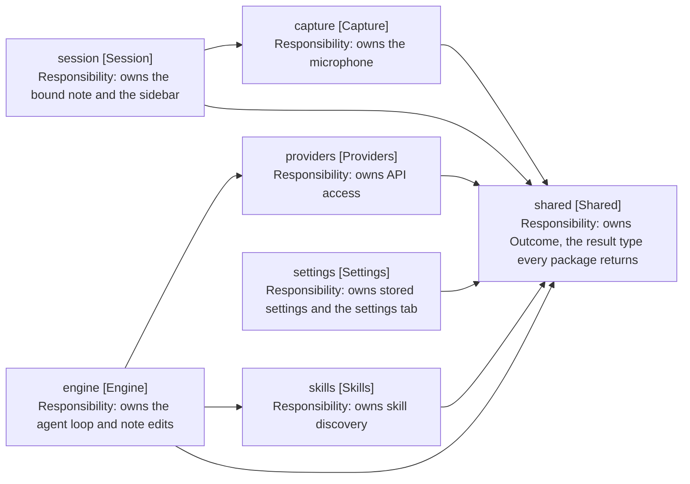

# Design: Package Structure

Cross-cutting, not tied to a release. Records what each package owns and which
way dependencies run.

## Packages

| Package      | Owns                                                 | Depends on                |
| ------------ | ---------------------------------------------------- | ------------------------- |
| shared       | Outcome, the result type every package returns       | nothing                   |
| capture      | The microphone: one utterance per start-stop cycle   | shared                    |
| providers    | API access: transcription and chat against Mistral   | shared                    |
| skills       | Skill discovery and reading from the vault           | shared                    |
| engine       | The agent loop, note editing, prompt assembly        | providers, skills, shared |
| session      | The Obsidian sidebar: React views and panel state    | capture, shared           |
| settings     | Settings storage and its settings tab                | shared                    |
| test-support | Fakes and builders. Test-only, never imported by src | any                       |

The engine owns everything a turn runs on: the value objects, the note editor,
and WorkspaceNoteLocator, which finds the editor holding the bound note. Session
is left as the UI package, so it depends on engine for nothing.

WorkspaceNoteLocator is a concrete class with no interface. It has one consumer
and one implementation, so the indirection bought nothing that a spy on locate
does not already give the tests.

## Dependency Rule

Dependencies point one way: session to engine, engine to providers and skills,
everything to shared. Nothing points back, and no cycles exist. A package that
needs a type from a package above it is a signal that the type belongs lower
down, not that the arrow should reverse.

Arrows: uses-relationship (client to supplier).

## Layout Within a Package

Files group by concept, not by kind, and a value object sits beside the service
that reads it. Engine is large enough to split into six concept folders:

| Folder       | Holds                                                        |
| ------------ | ------------------------------------------------------------ |
| turn         | The loop, its counters, outcomes and turn-scoped repositories |
| tools        | Tool services, their results and the tool schemas            |
| waiting      | Parking a turn on a question or a choice                     |
| note-editing | The note editor, its parser and positions                    |
| note-binding | Resolving and opening the target note                        |
| prompting    | Prompt assembly                                              |

The root holds only what spans the folders. The placement test for tools/ is
written down: a tool takes a ToolCall and returns a result, so NoteEditor,
which takes an EditOperation, is not one.

Smaller packages keep three subfolders, each added only when there is enough to
fill it: models for value objects, views for anything that renders, and tests
for the package's test files. Vitest matches on filename, not directory, so the
tests folder needs no configuration. A package with a single value object keeps
it in the root, so skills keeps skill.ts beside skill-repository.ts.

## Size

The limit is 10 files per folder, counting the package root as a folder of its
own. Tests are counted against their own folder and exempt from the limit.

| Package   | Root | Sub-folders                                                      | tests |
| --------- | ---- | ---------------------------------------------------------------- | ----- |
| shared    | -    | models 1                                                         | 1     |
| capture   | 1    | -                                                                | 1     |
| commands  | 6    | models 4                                                         | 7     |
| engine    | 8    | turn 13, tools 12, note-binding 5, note-editing 5, waiting 3, prompting 3 | 29 |
| providers | 3    | models 3                                                         | 2     |
| session   | 8    | views 16, models 4                                               | 5     |
| settings  | 1    | -                                                                | 4     |
| skills    | 3    | -                                                                | 2     |

Over the limit today: engine/turn, engine/tools and session/views. Each is a
split waiting to be specified, not a reason to raise the limit.
