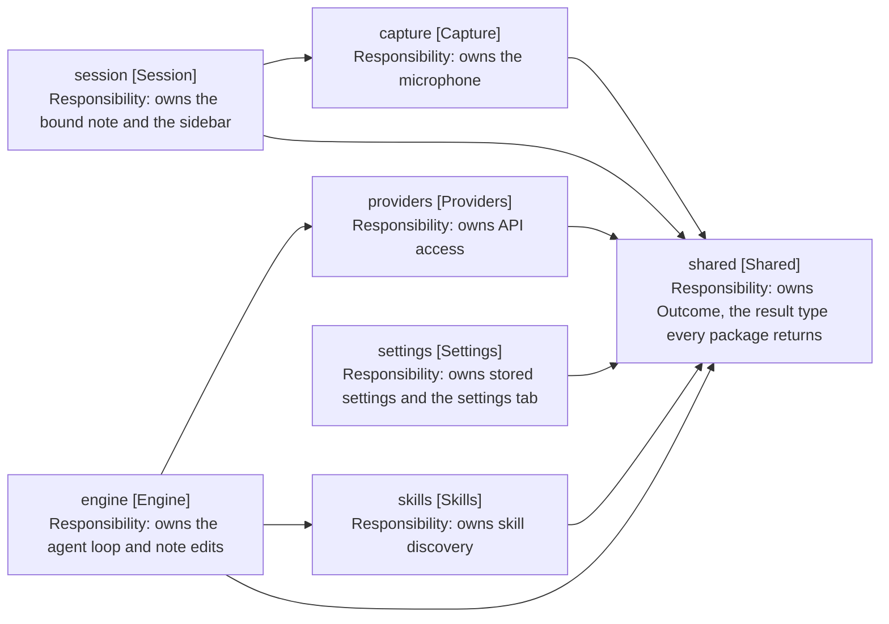

# Design: Package Structure

Cross-cutting, not tied to a release. Records what each package owns and which
way dependencies run.

## Packages

| Package      | Owns                                                 | Depends on                |
| ------------ | ---------------------------------------------------- | ------------------------- |
| shared       | Outcome, the result type every package returns       | nothing                   |
| capture      | The microphone: one utterance per start-stop cycle   | shared                    |
| providers    | API access: transcription and chat against Mistral   | shared                    |
| skills       | Skill discovery and reading from the vault           | shared                    |
| engine       | The agent loop, note editing, prompt assembly        | providers, skills, shared |
| session      | The Obsidian sidebar: React views and panel state    | capture, shared           |
| settings     | Settings storage and its settings tab                | shared                    |
| test-support | Fakes and builders. Test-only, never imported by src | any                       |

The engine owns everything a turn runs on: the value objects, the note editor,
and WorkspaceNoteLocator, which finds the editor holding the bound note. Session
is left as the UI package, so it depends on engine for nothing.

WorkspaceNoteLocator is a concrete class with no interface. It has one consumer
and one implementation, so the indirection bought nothing that a spy on locate
does not already give the tests.

## Dependency Rule

Dependencies point one way: session to engine, engine to providers and skills,
everything to shared. Nothing points back, and no cycles exist. A package that
needs a type from a package above it is a signal that the type belongs lower
down, not that the arrow should reverse.

Arrows: uses-relationship (client to supplier).

## Layout Within a Package

Services sit in the package root. Three subfolders hold everything else, each
added only when a package has enough to fill it:

- models holds the package's value objects. The naming rule already says which
  kind a type is; the folder puts the same answer in the path.
- views holds anything that renders: React components and Obsidian view classes.
- tests holds the package's test files, beside the code they cover. Vitest
  matches on filename, not directory, so the folder needs no configuration.

A package with a single value object keeps it in the root. A folder holding one
file costs the reader more than it saves, so skills keeps skill.ts beside
skill-repository.ts.

## Size

The limit is 7 files per package, counting the services in the package root.
Models, views and tests are counted against their own folders.

| Package   | Root | models | views | tests |
| --------- | ---- | ------ | ----- | ----- |
| shared    | -    | 1      | -     | -     |
| capture   | 1    | -      | -     | 1     |
| engine    | 7    | 4      | -     | 3     |
| providers | 3    | 3      | -     | 2     |
| session   | -    | 1      | 5     | 2     |
| settings  | 3    | -      | -     | -     |
| skills    | 3    | -      | -     | 2     |
