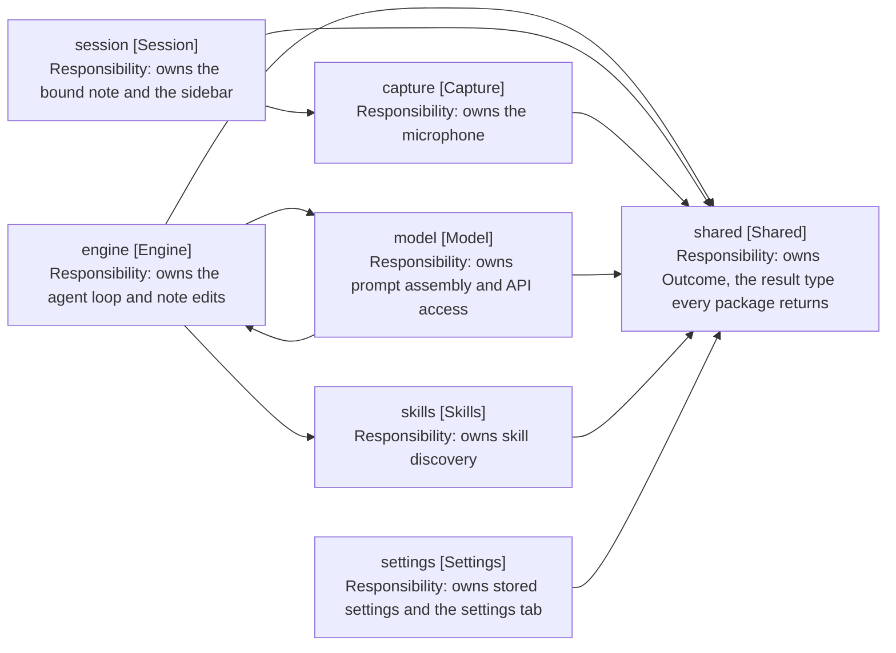

# Design: Package Structure

Cross-cutting, not tied to a release. Records what each package owns and which
way dependencies run.

## Packages

| Package      | Owns                                                 | Depends on            |
| ------------ | ---------------------------------------------------- | --------------------- |
| shared       | Outcome, the result type every package returns       | nothing               |
| capture      | The microphone: one utterance per start-stop cycle   | shared                |
| model        | Talking to the model: prompt assembly and API access | engine, shared        |
| skills       | Skill discovery and reading from the vault           | shared                |
| agents       | AGENTS.md discovery and the instruction chain        | shared                |
| search       | Reading, globbing and grepping notes                 | shared                |
| commands     | The Obsidian commands the plugin registers           | shared                |
| engine       | The agent loop and note editing                      | model, skills, shared |
| session      | The Obsidian sidebar: React views and panel state    | capture, shared       |
| settings     | Settings storage and its settings tab                | shared                |
| test-support | Fakes and builders. Test-only, never imported by src | any                   |

The engine owns everything a turn runs on: the value objects, the note editor,
and WorkspaceNoteLocator, which finds the editor holding the bound note. Session
is left as the UI package, so it depends on engine for nothing.

Model owns one turn's conversation with the provider: the request value, the
mapper that turns it into messages, and two folders under it. Prompt holds one
class per message, and under it one per section of the system prompt, each
owning its own text and deciding whether it appears; providers holds the API
client. What decides when to ask stays in engine, so ModelService sits
in engine/turn beside ToolCallExecutor, the other outward call a step makes.

WorkspaceNoteLocator is a concrete class with no interface. It has one consumer
and one implementation, so the indirection bought nothing that a spy on locate
does not already give the tests.

## Dependency Rule

Dependencies point one way: session to engine, engine to model and skills,
everything to shared. A package that needs a type from a package above it is a
signal that the type belongs lower down, not that the arrow should reverse.

Model and engine are the one exception, and it is a cycle: engine calls into
model, while model reads OpenNote and NoteDetails back out of engine. Both are
what a prompt is made of, so the way out is to move them below both packages
rather than to reverse either arrow.

Arrows: uses-relationship (client to supplier).

## Layout Within a Package

Files group by concept, not by kind, and a value object sits beside the service
that reads it. Engine is large enough to split into six concept folders, two of
which hold a folder of their own:

| Folder        | Holds                                                          |
| ------------- | -------------------------------------------------------------- |
| turn          | The loop and the turn-scoped repositories                      |
| turn/spending | TurnSpend and the two counters it holds                        |
| turn/ending   | How a turn ends: its kind, its step outcomes and its outcomes  |
| tools         | Tool services, their results and the tool schemas              |
| skill-gating  | Whether a call declared the skills it needed before it ran     |
| waiting       | Parking a turn on a question or a choice, and the two requests |
| note-editing  | The note editor, its parser and positions                      |
| note-binding  | Resolving and opening the target note                          |

Session's views outgrew the limit as one concept, so it is the one place that
splits by kind: views/ holds the React components, views/hooks/ the four
subscription hooks, and views/obsidian/ what extends an Obsidian class rather
than rendering React.

The root holds only what spans the folders. The placement test for tools/ is
written down: a tool takes a ToolCall and returns a result, so NoteEditor,
which takes an EditOperation, is not one.

Smaller packages keep three subfolders, each added only when there is enough to
fill it: models for value objects, views for anything that renders, and tests
for the package's test files. Vitest matches on filename, not directory, so the
tests folder needs no configuration. A package with a single value object keeps
it in the root, so skills keeps skill.ts beside skill-repository.ts.

## Size

The limit is 10 files per folder, counting the package root as a folder of its
own. Tests are counted against their own folder and exempt from the limit.

| Package  | Root | Sub-folders                                                                                                 | tests |
| -------- | ---- | ----------------------------------------------------------------------------------------------------------- | ----- |
| shared   | -    | models 1                                                                                                    | 1     |
| capture  | 1    | -                                                                                                           | 1     |
| agents   | 6    | -                                                                                                           | 5     |
| commands | 6    | models 4                                                                                                    | 7     |
| engine   | 8    | turn 8, turn/spending 3, turn/ending 3, tools 10, skill-gating 3, waiting 5, note-binding 5, note-editing 5 | 32    |
| model    | 6    | prompt 4, its sections 7, providers 3, providers/models 3                                                   | 6     |
| search   | 5    | models 7                                                                                                    | 8     |
| session  | 10   | views 10, views/hooks 4, views/obsidian 3, models 8, transcript 8, transcript/models 5                      | 24    |
| settings | 8    | -                                                                                                           | 5     |
| skills   | 4    | -                                                                                                           | 3     |

Every folder is within the limit. session sits exactly on it, so the next file
added there is the one that forces a split.
