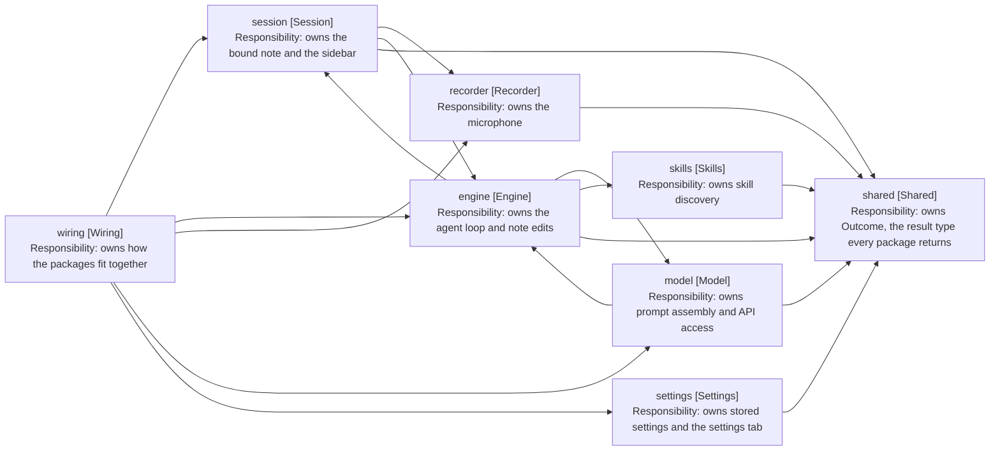

# Design: Package Structure

Cross-cutting, not tied to a release. Records what each package owns and which
way dependencies run.

## Packages

| Package      | Owns                                                  | Depends on             |
| ------------ | ----------------------------------------------------- | ---------------------- |
| shared       | Outcome, the result type every package returns        | nothing                |
| recorder     | The microphone: one utterance per start-stop cycle    | shared                 |
| model        | Talking to the model: prompt assembly and API access  | engine, shared         |
| skills       | Skill discovery and reading from the vault            | shared                 |
| agents       | AGENTS.md discovery and the instruction chain         | shared                 |
| search       | Reading, globbing and grepping notes                  | shared                 |
| commands     | The Obsidian commands the plugin registers            | shared                 |
| engine       | The agent loop and note editing                       | model, skills, session |
| session      | The Obsidian sidebar: React views and panel state     | engine, recorder       |
| settings     | Settings storage and its settings tab                 | shared                 |
| wiring       | Construction knowledge: how the packages fit together | every package          |
| test-support | Fakes and builders. Test-only, never imported by src  | any                    |

The engine owns everything a turn runs on: the value objects, the note editor,
and WorkspaceNoteLocator, which finds the editor holding the bound note.

Engine and session depend on each other. Session reads the engine's turn state
and its waiting services, and engine takes SessionRepository and
TranscriptRepository as collaborator types in ten files. That cycle is open; the
Dependency Rule below says what closes it.

Model owns one turn's conversation with the provider: the request value, the
mapper that turns it into messages, and two folders under it. Prompt holds one
class per message, and under it one per section of the system prompt, each
owning its own text and deciding whether it appears; providers holds the API
client. What decides when to ask stays in engine, so ModelService sits
in engine/turn beside ToolCallExecutor, the other outward call a step makes.

WorkspaceNoteLocator is a concrete class with no interface. It has one consumer
and one implementation, so the indirection bought nothing that a spy on locate
does not already give the tests.

## Dependency Rule

Dependencies point one way: session to engine, engine to model and skills,
everything to shared. Wiring sits above all of them and is the exception by
design: it holds construction knowledge, so it reaches every package. A package
that needs a type from a package above it is a signal that the type belongs
lower down, not that the arrow should reverse.

Two cycles break that rule today, and both close by moving values rather than by
reversing an arrow.

- Model and engine: engine calls into model, while model reads OpenNote and
  NoteDetails back out of engine. Both are what a prompt is made of, so they
  move below both packages.
- Engine and session: session reads the engine's turn state, and engine names
  SessionRepository and TranscriptRepository in ten files. SessionRepository is
  turn state and moves below both; the transcript splits by direction, so engine
  declares a recorder port that session's class implements.

Arrows: uses-relationship (client to supplier).

## Layout Within a Package

Three package kinds, and one rule each. The rule is positional: a file may
construct a class from another package only if its path starts with src/wiring.
That is checkable by reading the path, which an exemption naming one class is
not.

| Kind    | Owns                   | May construct across packages | Named after       |
| ------- | ---------------------- | ----------------------------- | ----------------- |
| Wiring  | Construction knowledge | Yes, every package            | Its job           |
| Service | Behaviour, one entry   | No                            | Its entry service |
| Value   | Types, no behaviour    | No                            | The concept       |

A value package holds values only. A repository accumulates state and changes
it, so it sits beside the services that use it however small it is. The test is
a mutable collection surviving across calls, not the presence of methods.

test-support is the one exception left open. It constructs across every package
boundary, and it is test-only, so it is either exempt from the rule or a second
wiring package. That is undecided.

Files group by concept, not by kind, and a value object sits beside the service
that reads it. Engine is large enough to split into six concept folders, two of
which hold a folder of their own:

| Folder        | Holds                                                          |
| ------------- | -------------------------------------------------------------- |
| turn          | The loop and the turn-scoped repositories                      |
| turn/spending | TurnSpend and the two counters it holds                        |
| turn/ending   | How a turn ends: its kind, its step outcomes and its outcomes  |
| tools         | Tool services, their results and the tool schemas              |
| skill-gating  | Whether a call declared the skills it needed before it ran     |
| waiting       | Parking a turn on a question or a choice, and the two requests |
| note-editing  | The note editor, its parser and positions                      |
| note-binding  | Resolving and opening the target note                          |

Views are the one thing that splits by kind, and they split the same way in
every package that renders: views/ holds the React components, views/hooks/ the
subscription hooks, and views/obsidian/ what extends an Obsidian class rather
than rendering React. Session and settings both follow it, so nothing outside a
views/ folder imports React.

That rule is positional like the construction rule above it, and for the same
reason. A reader who wants the UI opens views/; a reader who wants the logic
knows the rest of the package is free of it. Both are checkable by reading a
path.

The root holds only what spans the folders. The placement test for tools/ is
written down: a tool takes a ToolCall and returns a result, so NoteEditor,
which takes an EditOperation, is not one.

Smaller packages keep three subfolders, each added only when there is enough to
fill it: models for value objects, views for anything that renders, and tests
for the package's test files. Vitest matches on filename, not directory, so the
tests folder needs no configuration. A package with a single value object keeps
it in the root, so skills keeps skill.ts beside skill-repository.ts.

Wiring holds the three scopes, each of which lives for as long as the one above
it and builds the one below.

| Scope   | Class                    | Lives for         | Holds                                                          |
| ------- | ------------------------ | ----------------- | -------------------------------------------------------------- |
| Plugin  | PluginScope              | The loaded plugin | app, settings, SkillRepository, AgentsMdRepository, ActiveNote |
| Session | EngineFactory            | One bound note    | SessionRepository, TranscriptRepository, the EditEngine        |
| Panel   | SessionPanelPropsBuilder | One visible panel | The listeners, the askers, the notices, the panel props        |

PluginScope reads settings through a function rather than holding a value, since
the settings tab replaces the object the plugin holds. A snapshot would freeze
the settings at plugin load.

Two classes sit beside that chain rather than in it, since neither builds the
scope below it. SessionController drives one session's life once the leaf
exists: the panel props, the restore, and the engine following the user. It
reaches the scopes through SessionPanelPropsBuilder rather than replacing them.
SessionLeaf is the workspace side of the panel, finding the leaf holding the
session and putting it in front of the user.

The split between them is what each needs from Obsidian. SessionLeaf reads
app.workspace and nothing else, so it tests against a workspace fake.
SessionController needs two registrations only the plugin can make: one for the
file Obsidian opened, and one for Obsidian going to the background. It takes
each as a constructor callback rather than taking the plugin, which keeps
Obsidian's lifecycle class out of wiring and left main.ts at 83 lines holding
registration, settings persistence and delegation.

SettingsPanelBuilder sits outside that chain, since the settings tab outlives
every session and builds nothing below it. It assembles the panel's
collaborators, reading settings through a function for the same reason
PluginScope does: the allow-list is read off the settings being edited, so a
search built once would answer against the entries as they stood when the tab
opened. Saving an edit stays with the tab, which owns the React root the
re-render goes through.

## Size

The limit is 10 files per folder, counting the package root as a folder of its
own. Tests are counted against their own folder and exempt from the limit.

| Package  | Root | Sub-folders                                                                                                 | tests |
| -------- | ---- | ----------------------------------------------------------------------------------------------------------- | ----- |
| shared   | -    | models 1                                                                                                    | 1     |
| recorder | 1    | -                                                                                                           | 1     |
| agents   | 6    | -                                                                                                           | 5     |
| commands | 6    | models 4                                                                                                    | 7     |
| engine   | 7    | turn 9, turn/spending 3, turn/ending 3, tools 10, skill-gating 3, waiting 5, note-binding 5, note-editing 5 | 33    |
| model    | 4    | prompt 6, its sections 7, providers 3, providers/models 3                                                   | 6     |
| search   | 5    | models 6                                                                                                    | 7     |
| session  | 10   | views 10, views/hooks 5, views/obsidian 2, models 8, transcript 9, transcript/models 4                      | 24    |
| settings | 1    | views 6, views/obsidian 1                                                                                   | 5     |
| skills   | 4    | -                                                                                                           | 3     |
| wiring   | 7    | -                                                                                                           | 5     |

Every folder is within the limit, and two sit exactly on it: views, and the
session root now that SessionRecorder has joined it. Either is the next split.

## Open: The Retarget Rule Sits in Wiring

Two rules moved into SessionController with the extraction, and neither is
construction knowledge:

- Markdown only, in retargetActiveEngine. Obsidian opens canvases, PDFs and
  Bases files through the same event, and binding to one strands every later
  turn.
- Only the newest engine follows the user, in followActiveNoteWith. An earlier
  session's engine keeps the note it was bound to.

Both are about what the engine does with the note the user opens, so they read
as engine's. Wiring owns no behaviour, which makes this the one place it does.

Moving them means engine declares the port and wiring registers it, the way the
transcript split above is described. It is a behaviour-adjacent change rather
than a mechanical one, so it was left out of the extraction that created the
class. SessionController has no test covering either rule today, which is the
other half of the cost.
