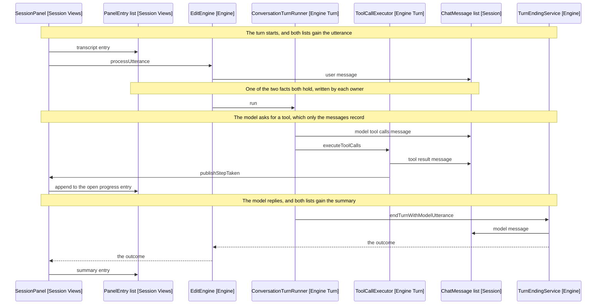

# The Panel

The two records a turn leaves, what stores them, and what builds the sidebar.
Covers session and settings.

The entry kinds and what a turn holds are in
[2-vocabulary.md](2-vocabulary.md).

## The Two Lists

Each turn writes itself down twice: once for the model to continue from, once
for a person to read.

|                     | ChatMessage list                 | PanelEntry list                     |
| ------------------- | -------------------------------- | ----------------------------------- |
| Held by             | SessionRepository [Session]      | the panel's reducer [Session Views] |
| Written by          | call sites in engine             | dispatches in views                 |
| Read by             | the model, on the next request   | the reader, on screen               |
| Survives an unmount | yes, nothing about it is React's | no, it is React state               |

No file writes both. The engine cannot see the entries, and the panel cannot
see the tool results.

A message is appended wherever the conversation gains something the model must
see next time; an entry wherever the panel gains something a person should
read. So a single tool call writes two messages and no entry of its own: it
appends to the open progress entry, which is one entry summarising many
messages.



Arrows: uses-relationship (client to supplier).

Neither list is derived from the other. Each owner writes what its own reader
needs, at the moment it knows it.

## Where They Overlap

Two facts appear in both lists, and only two: what the user said, and the
summary that ended the turn. Both audiences need both.

Everything else sits in one list. The messages alone hold raw tool arguments
and tool output. The entries alone hold the progress list, errors, warnings,
the instruction chain, answers, the two parking controls, and what a cancelled
turn had already changed.

Most entry kinds have no message behind them, which is the asymmetry: an entry
is usually about the turn rather than in the conversation.

## What Is In Neither

The system prompt. Each request rebuilds its framing rather than storing it,
which is why a restored session gets today's date and the current note's
context rather than the copies its last turn ran with.

## Where The Two Meet

Once, in SessionSnapshotFactory, the only place both lists are in scope
together.

```text
SessionSnapshotFactory.of(sessions, entries):
  targetPath from the repository
  messages   from the repository, mapped through StoredMessages
  entries    from the panel, with the restored line dropped
```

Restoring splits them again: the messages rebuild a SessionRepository, and the
entries go straight to the panel's props.

The transcript is deliberately absent from the record, because it carries
prompts and note excerpts verbatim and those stay off disk.

## What Builds A Panel

Wiring holds three scopes, each living as long as the one above it and building
the one below.

| Scope   | Class                    | Lives for         | Holds                                             |
| ------- | ------------------------ | ----------------- | ------------------------------------------------- |
| Plugin  | PluginScope              | The loaded plugin | app, settings, the vault repositories, ActiveNote |
| Session | EngineFactory            | One bound note    | The session repositories and the engine           |
| Panel   | SessionPanelPropsBuilder | One visible panel | The listeners, askers, notices and panel props    |

PluginScope reads settings through a function rather than holding a value,
since the settings tab replaces the object the plugin holds. A snapshot would
freeze the settings at plugin load.

Two classes sit beside that chain, since neither builds the scope below it.

- SessionController drives one session's life once the leaf exists. It needs
  two registrations only the plugin can make, and takes each as a constructor
  callback rather than taking the plugin, which keeps Obsidian's lifecycle
  class out of wiring.
- SessionLeaf is the workspace side, finding the leaf holding the session and
  putting it in front of the user. It reads app.workspace and nothing else, so
  it tests against a workspace fake.

SettingsPanelBuilder sits outside the chain too, since the settings tab
outlives every session. It reads settings through a function for the same
reason: the allow-list comes off the settings being edited, so a search built
once would answer against the entries as they stood when the tab opened.

## Open: Two Rules Sit In Wiring

SessionController holds two rules that are not construction knowledge.

- Markdown only. Obsidian opens canvases, PDFs and Bases files through the same
  event, and binding to one strands every later turn.
- Only the newest engine follows the user. An earlier session's engine keeps
  the note it was bound to.

Both are about what the engine does with the note the user opens, so they read
as engine's, and wiring owns no behaviour. Moving them means engine declares a
port and wiring registers it, the way the transcript cycle closes. Neither rule
has a test today, which is the other half of the cost.

## References

- [2-vocabulary.md](2-vocabulary.md) - the entry kinds, and what a turn holds
- [4-the-turn.md](4-the-turn.md) - why the ending returns rather than publishing
- [1-overview.md](1-overview.md) - the cycle these scopes sit inside
