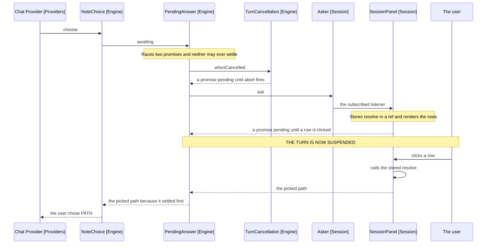
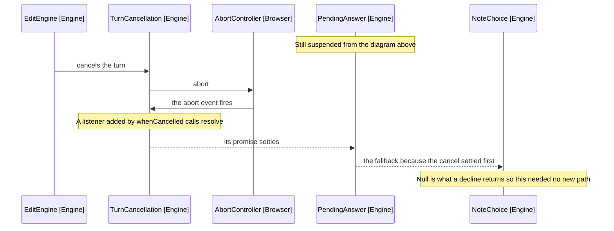

# Parking a Turn on a Person

How a turn suspends mid-flight to wait for the user, and unwinds cleanly when
they stop it instead. Cross-cutting, like [7-package-design.md](7-package-design.md),
rather than belonging to one release.

Ordinary async waits on something that will finish: a file read, an HTTP call.
This waits on a person who may never answer, while a cancel may arrive first.
That needs machinery the rest of the codebase does not.

## The four collaborators

| Class            | Package | Answers                                        |
| ---------------- | ------- | ---------------------------------------------- |
| NoteChoice       | Engine  | What is being asked, in domain terms           |
| PendingAnswer    | Engine  | Answer or cancel, whichever settles first      |
| TurnCancellation | Engine  | Has this turn been cancelled, asked three ways |
| Asker            | Session | Who answers, and what if nobody is listening   |

UserQuestion sits beside NoteChoice and works the same way, so only one is drawn.

## One choice, from tool call to settled promise



Arrows: uses-relationship (client to supplier).

## The same turn, cancelled instead



Arrives at the same place a decline does, which is why cancellation needed no
handling of its own.

## What each one is for

NoteChoice states the domain question. It knows a shortlist is being offered and
records the pick as consent to write. It does not know a panel exists.

PendingAnswer is the race, and the whole of it:

```typescript
Promise.race([this.ask(request), this.cancellation.whenCancelled().then(() => whenCancelled)])
```

Generic over request and answer, because parking is the same work whether what
is asked is a path and the reply a pick, or a question and the reply a sentence.

TurnCancellation wraps an AbortController rather than a boolean, because three
consumers need three shapes of the same fact: a boolean for the loop between
iterations, an AbortSignal for the provider's fetch, and a promise for the race
above. A boolean would serve only the first.

Asker is the slot the panel fills. It holds one listener, which may be absent:
a question nobody can see is one nobody answered, so it resolves to a fallback
rather than parking on a promise no panel will settle.

## The shape that is unusual

Storing resolve and calling it later. Most promise code returns a promise built
from something already async; here the panel becomes the async thing. It keeps
resolve in a ref, renders the rows, and calls it when the user clicks.

This is the only way to bridge a person acting in the DOM to a turn that awaits.
It is also why a cancelled turn must settle the same promise: nothing else can.

## What guarantees a turn always resumes

Three fallbacks, each owned by a different collaborator.

- Asker resolves to its default when no panel is subscribed
- PendingAnswer settles on the cancel when the person never answers
- NoteChoice.automatic answers itself in auto mode, so the turn never parks
