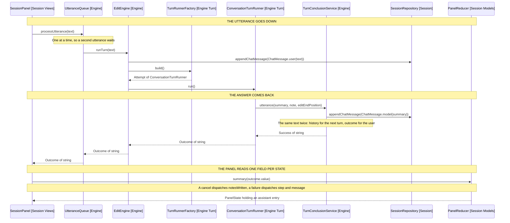

# An Utterance and Its Answer

How one spoken instruction reaches the engine, and how the answer comes back to
the panel. Cross-cutting, like [7-package-design.md](7-package-design.md),
rather than belonging to one release.

The turn's return type is Outcome of string. Only one of its three states
carries that string, and each state reaches the panel by a different field.

## What the outcome carries

| State     | Built by                        | Carries                  | Panel shows        |
| --------- | ------------------------------- | ------------------------ | ------------------ |
| Success   | TurnConclusionService.utterance | The model's answer       | An assistant entry |
| Cancelled | TurnConclusionService.cancelled | The notes the turn wrote | A cancelled entry  |
| Failure   | unfinished, stuck, exhausted    | A step and a message     | An error entry     |

The type parameter names the success case only. Failure and Cancelled are
generic in it so they can share the union, and hold no value of that type.

## From utterance to answer

Arrows: uses-relationship (client to supplier).

## Where the string is read

SessionPanel is the only reader of the success value. It branches on the three
states and dispatches a different action for each, so no downstream code sees
an outcome.

The reducer turns the action into an entry. HistoryEntry renders that entry's
text, and the entry kind decides the styling class and the weight. All three
endings carry the reply weight, so each gets a Copy button; a step line and the
user's own utterance do not.

## Why the engine returns rather than publishes

Steps, warnings and answers reach the panel through subscriptions, wired in
SessionBuilder. The turn's ending does not.

A subscription suits an event with no caller waiting. The utterance has one:
UtteranceQueue holds the promise so the next utterance can wait on it, and the
panel needs the ending to leave the thinking phase. Returning it keeps both
facts in the same value.
