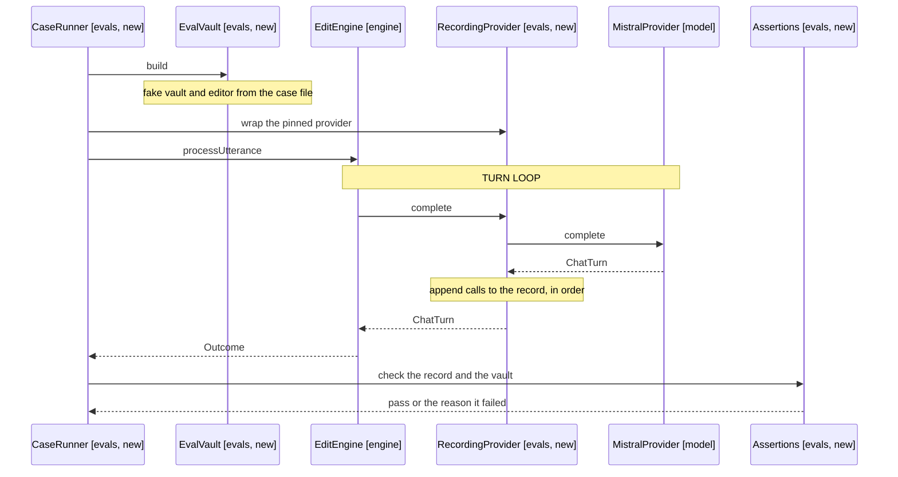

# Design: Eval Suite

How a case runs: the runner, the recording provider, the assertion vocabulary,
and where the suite sits relative to the unit tests.

## Table of Contents

1. [Goal](#goal)
2. [Shape of the suite](#shape-of-the-suite)
3. [What runs a case](#what-runs-a-case)
4. [Recording the calls](#recording-the-calls)
5. [Case file format](#case-file-format)
6. [Assertion vocabulary](#assertion-vocabulary)
7. [Sampling and thresholds](#sampling-and-thresholds)
8. [Reporting](#reporting)
9. [Out of scope](#out-of-scope)
10. [References](#references)

## Goal

Run the real engine against the real provider over an in-memory vault, assert
what the model chose as well as what it wrote, and report a pass rate per case.

Nothing in src changes. The suite is additive, and the seam it hangs off is the
builder the unit tests already use.

## Shape of the suite

A sibling of the unit suite, not a member of it.

```
evals/
  vitest.eval.config.ts   the suite's own config, include evals only
  eval.config.ts          pinned model id, run defaults, concurrency
  cases/
    editing/add-under-heading.yaml
    finding/date-before-glob.yaml
    answering/read-only-question.yaml
  runner/
    case.ts               the case type, parsed from a file
    case-loader.ts        reads a folder of files into cases
    eval-vault.ts         builds the fakes a case describes
    recording-provider.ts the decorator that records calls
    assertions.ts         the vocabulary, one function per key
    case-runner.ts        runs one case N times, tallies
    reporter.ts           console lines plus the results file
  README.md
```

Vitest hosts it under its own config rather than a standalone script. It buys
reporting, concurrency limits and filtering by name for nothing, and a case is
already a test in every way but where it lives (FR1, NFR1).

The suite is reached by its own command, so the build stays offline:

```bash
bun run eval              # every case
bun run eval -- finding   # cases whose name matches
```

## What runs a case

One run of one case is five steps, and only the provider is real.



Arrows: uses-relationship (client to supplier).

The engine is built by anEngine from test-support, with the recording provider in
the slot the unit tests fill with a mock (FR1). That builder wires the resolver,
the turn factory and the ending service exactly as EngineFactory does, so a case
exercises the shipped path without importing Obsidian.

Two collaborators come from test-support unchanged: FakeVault holds the notes a
case declares, FakeEditor holds the target note's text and is what a vault
assertion reads afterwards (FR2).

Search must be enabled for the search tools to be offered, so EvalVault builds
the harness tools service with search on and a command allow list the case can
set. A case that needs no commands leaves the list empty, which is also the
configuration the byte-for-byte prompt fixture describes.

## Recording the calls

A decorator satisfying ChatProvider. It delegates and keeps what went past.

```ts
export class RecordingProvider implements ChatProvider {
  readonly calls: ToolCall[] = []
  readonly turns: ChatTurn[] = []

  constructor(private inner: ChatProvider) {}

  async complete(
    messages: ChatMessage[],
    tools: ToolSchema[],
    signal?: AbortSignal,
  ): Promise<Outcome<ChatTurn>> {
    const outcome = await this.inner.complete(messages, tools, signal)
    if (outcome.succeeded()) {
      this.turns.push(outcome.value)
      this.calls.push(...outcome.value.calls)
    }
    return outcome
  }
}
```

A decorator rather than reading the session's chat history, for three reasons.
It sees every round-trip including ones the dispatcher rejects for invalid
arguments, it preserves order across round-trips without reconstructing it from
message roles, and turns.length is the round-trip count a loop assertion needs
(FR3, FR8).

A failed provider call is relayed untouched, so the runner can tell a rate limit
from a wrong answer (FR14).

## Case file format

YAML, one case per file, no code (FR7, NFR5).

```yaml
name: adds a task under the named heading
utterance: add bananas to the fruit list
target: Groceries.md
vault:
  Groceries.md: |
    # Groceries

    ## Fruit
    - apples

    ## Dairy
    - milk
runs: 5
threshold: 4
expect:
  calls:
    - replace_text
  noteEquals: null
  noteContains: '- bananas'
  containsUnderHeading:
    heading: '## Fruit'
    text: '- bananas'
  unchangedRegion: '## Dairy'
```

The vault is inline so the input to a failure is readable beside the assertion
(NFR3). A case needing a vault too large to inline is a sign the case is testing
too much at once.

## Assertion vocabulary

One key per assertion, each a pure function of the record and the final note.

| Key                  | Family      | Passes when                                         |
| -------------------- | ----------- | --------------------------------------------------- |
| calls                | Trajectory  | Every named tool was called at least once           |
| callsInOrder         | Trajectory  | The first of each named pair precedes the second    |
| exactlyOneOf         | Trajectory  | Exactly one of the named tools was called           |
| maxRoundTrips        | Trajectory  | The recorded turn count is at or under the cap      |
| noteEquals           | Vault state | The target note's text equals the value exactly     |
| noteContains         | Vault state | The text appears in the target note                 |
| containsUnderHeading | Vault state | The text appears after the heading, before the next |
| unchangedRegion      | Restraint   | The named section is byte-identical to the input    |
| noEdits              | Restraint   | No edit tool appears in the record                  |
| onlyTargetWritten    | Restraint   | No note beyond the target changed                   |
| answerContains       | Answer text | An answer_from_search argument holds the value      |
| sourcesInclude       | Answer text | The answer's sources list the named path            |

The three edit tools are the closed set replace_text, insert_text and insert_at,
so noEdits is a membership test rather than a heuristic.

Nothing in the vocabulary reads the model's prose (FR11). answerContains checks a
fact inside the answer argument, never a sentence, and no key asserts on the
turn's closing summary or a question's phrasing. That omission is deliberate:
wording changes run to run, and a suite that fails on it stops being read.

## Sampling and thresholds

A case states runs and threshold, and passes when its passes reach the threshold
(FR4, FR5). Runs of one case go sequentially; different cases go concurrently up
to the configured limit, which is what keeps a full run inside a nightly window
without tripping the rate limit (NFR4).

Thresholds are measured, not guessed. A new case runs about ten times before its
threshold is set, and the measured rate goes in a comment in the case file.

A case sitting near 60 percent is a prompt bug, not a threshold to lower. That is
the rule that keeps the suite honest: lowering a threshold to get green is how
these suites stop meaning anything.

The model id is pinned in eval.config.ts and recorded in the results, so a red
run separates our change from the model moving under us (FR6).

## Reporting

Console output is one line per case with the tally, then a block per failure
naming the utterance, the recorded calls in order, and the final note (FR12).
That block is the whole point: a failure should be diagnosable from the log
without rerunning it.

The same run writes a JSON file holding the model id, the commit, and each case's
tally, so a scheduled run can be kept and compared (FR13). No key and no vault
content beyond what the case file already declares reaches that file (NFR2).

### CI

Two workflows, because the triggers differ.

| Workflow | Trigger                                         | Runs          |
| -------- | ----------------------------------------------- | ------------- |
| unit     | Every push and pull request                     | bun run build |
| eval     | Nightly schedule, and prompt-path pull requests | bun run eval  |

The repo has no workflows at all today, so the unit one is a prerequisite worth
landing in the same pass.

The eval workflow watches the paths that change judgement: src/model/prompt and
the tool schemas (FR16). It publishes the tally to the job summary so the result
is read without opening a log (FR15), and skips when the key is absent, which is
every fork pull request (FR17). It is never attached to push (FR18).

## Out of scope

- A judge. The vocabulary covers the four families with predicates, and a judge
  adds cost and noise before a case has shown it needs one.
- Transcription cases. A different provider method and a different fixture kind.
- Comparing models. The suite watches one pinned model for drift in our prompt.
- Asserting the panel. The engine's outcome and the vault are the boundary; what
  the React panel renders is unit-tested.
- A case per tool. The starter set covers the rules most at risk, not the surface.

## References

- [2-requirements.md](2-requirements.md) - open first, for what each FR and NFR
  asks of the runner
- src/test-support/builders.ts:62 - anEngine, the seam the whole suite hangs off
- src/engine/tools/tool-schemas.ts:19 - the fourteen tools, and the ordering
  rules in their descriptions that the trajectory family guards
- src/model/providers/types.ts:11 - ChatProvider, the interface the recorder
  implements
- docs/AGENTS.md:67 - the prompt-changes-are-behaviour-changes rule this suite
  answers, and the byte-for-byte fixture it must not disturb
