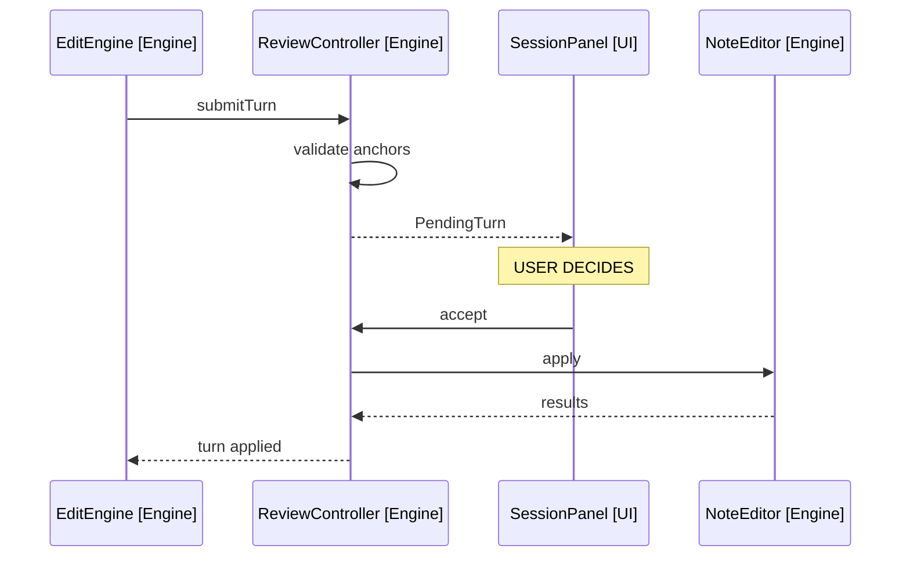

# Desktop V1: Review Mode

ReviewController (src/engine/review-controller.ts) sits between EditEngine and NoteEditor when settings.reviewFirst is on (FR23, FR24). Off by default; the MVP path is unchanged when disabled.

## Flow

Arrows: uses-relationship (client to supplier).

- Validation runs at submit time: anchors resolve against the live note, so a stale anchor is caught before the user sees the diff.
- Accept applies the buffered operations in order through NoteEditor; a validation-to-apply race (the note changed while the diff was open) re-validates on accept and reports any newly failing operation.
- Reject discards the buffer and appends a rejection message to the session history, so the model knows the edit did not land and can respond to "why did you reject" follow-ups.
- The buffer is accepted or rejected whole; mixed verdicts are out of scope for V1.

## Diff Rendering (SessionPanel.tsx)

Per operation, a card in the history region:

- Anchor context: up to two lines before and after the affected text.
- Replace: deleted text struck through, inserted text highlighted.
- Insert: inserted text highlighted at its position in the context.
- Accept and Reject buttons render once below the cards, acting on the whole turn.

Styling uses Obsidian's diff-friendly variables (--text-error background for deletions, --text-success background for insertions), no hardcoded colours.

## Model Interaction While Pending

- In review mode, each tool call gets the tool result "queued for user review" instead of "applied". The model then closes the turn with its text summary, which renders above the diff cards.
- Because results are queued rather than applied, the model cannot chain a second operation on the outcome of a first within one turn; multi-step instructions still work, since anchors are validated against the pre-turn note and applied in order on accept.
- On accept, no further model call happens; the standing summary remains accurate.
- On reject, the rejection message is appended to history only; the model sees it on the next utterance.
