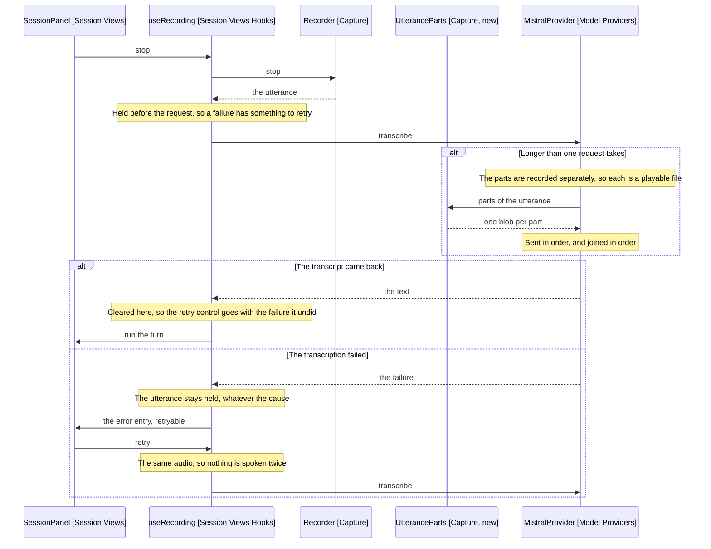

# Design

The panel holds the utterance until a transcript comes back, and the provider
stops being handed more audio than one request takes.

## Goal

Make a failed transcription cost a click rather than a recording, and make a
recording's length stop deciding whether it can be sent.

## Where the held utterance lives

useRecording (Session Views Hooks) drops the utterance today: stop awaits the
transcription and dispatches a failure, and the blob has no other reference.

It gains a ref holding the last utterance, set before the transcription is
attempted and cleared when one succeeds. The hook already owns a ref for the
background listener, so this is the shape it uses.

```text
stop():
  utterance = recorder.stop()
  held.current = utterance
  transcribe(utterance)

retry():
  if nothing held, return
  transcribe(held.current)

transcribe(utterance):
  transcript = ports.transcribe(utterance.blob, utterance.mimeType)
  if failed, dispatch failed and keep what is held
  otherwise clear what is held and run the turn
```

Recording again overwrites the ref, which is what drops the previous utterance.
Cancel clears it, because a cancelled recording is one the user chose to lose.

The ref holds one utterance. A second recording replaces the first rather than
queueing, which matches what the panel offers: one retry, for the recording just
made.

## The retry reaches the entry that failed

The failure is already an error entry carrying its step (PanelState, Session
Models). Only a transcription-step failure is retryable, because only that step
has audio behind it: a chat or apply failure has a transcript the model already
received.

The error entry gains a retryable flag, set by the reducer when the step is
transcription and the panel is holding audio. HistoryEntry (Session Views)
renders a retry control on a retryable entry, the way it renders choices on a
pending choice entry.

The flag is cleared on every entry when a new recording starts, so a stale retry
control never sits above a fresh recording. That is the same settling the
reducer does for asked entries at the end of a turn.

## Behaviour Sequence

One utterance, stopped and transcribed. The outer alt is whether the
transcription came back, which is the failure this spec is about.



Arrows: uses-relationship (client to supplier).

## Splitting cannot be done on the finished blob

A WebM blob is a container, not a stream of independent audio. Slicing it at a
byte offset gives one piece with a header and no terminator, and a second piece
that is not a media file at all. Neither transcribes.

So the split happens at capture. Recorder (Capture) calls MediaRecorder.start
with no timeslice today, which is why ondataavailable fires once and everything
lands in one buffer.

It gains a timeslice, so chunks arrive during recording. Chunks are still
concatenated into one blob for the normal path, and the chunk boundaries are
what a part boundary can land on.

That is not sufficient on its own: in WebM only the first chunk carries the
header, so a later run of chunks is headerless. UtteranceParts (Capture, new)
prepends the header chunk to every part after the first, which is what makes
each part a file a decoder accepts.

```text
parts(chunks, limit):
  if the total is within limit, one part holding all of them
  otherwise, fill parts up to limit, each after the first
  carrying the header chunk ahead of its own
```

This is the part of the change with real risk, and the tasks file treats it that
way: it is built last, behind the hold that does not depend on it.

## The limit is duration, not bytes

The two Mistral documents disagree, and 60 minutes is the lower of the numbers,
so it is the one designed against. The threshold sits below it with room to
spare, at 40 minutes, because the cost of splitting early is an extra request
and the cost of splitting late is the failure this spec removes.

Bytes are not the constraint: 500 MB is hours of speech at any bitrate
MediaRecorder produces. The size check stays out.

Duration is known from the chunk count and the timeslice, so no decoding is
needed to measure it.

## Joining the transcripts

Parts are transcribed in order and joined with a single space. Voxtral returns
punctuated text, so no sentence repair is attempted.

A part boundary can fall mid-word, and a word can be lost or doubled across one.
That is accepted: a 40-minute boundary is rare, and the alternative is
overlapping the parts and reconciling the overlap, which is a larger change for
a smaller error.

Any part failing fails the utterance, which the held audio makes cheap to retry.
No part is retried alone.

## What does not change

- Recorder's contract: start, stop and cancel, returning one Utterance.
- The transcribe port's signature, so the panel still passes a blob and a type.
- Cancel, which still discards without offering a retry.
- The background discard, which is its own loss and its own question.
- Every non-transcription failure, which has no audio to retry.

## Test plan

- The utterance is held when transcription fails
- Retry sends the same blob and type
- A successful transcription clears what is held
- A successful retry runs the turn with its transcript
- A second failure leaves the utterance held
- Recording again replaces what is held
- Cancel clears what is held
- A chat-step failure is not retryable
- The reducer marks a transcription failure retryable only while audio is held
- A new recording clears the retryable flag on earlier entries
- UtteranceParts returns one part for an utterance within the limit
- It splits an utterance over the limit on chunk boundaries
- Every part after the first carries the header chunk
- The provider joins part transcripts in order
- A failed part fails the utterance

## Out of scope

- Persisting audio across a reload. The hold is in memory, per the requirements.
- Retrying one part of a split utterance.
- Changing the background discard, which loses a recording without a request.
- A countdown or size indicator, which splitting makes unnecessary.
- Streaming capture, which is [Upcoming/desktop-v1](../desktop-v1/3-streaming-capture.md).

## References

- [2-requirements.md](2-requirements.md) - what is lost today, and the two candidate causes
- src/session/views/hooks/useRecording.ts:61 - stop, which drops the blob on failure
- src/capture/recorder.ts:55 - start with no timeslice, which is why one chunk arrives
- src/capture/recorder.ts:63 - takeUtterance, which builds the single blob
- src/model/providers/mistral-provider.ts:21 - transcribe, which posts it whole
- src/session/models/panel-state.ts:15 - the error entry the retry control sits on
- src/session/views/HistoryEntry.tsx:56 - where a pending entry renders its control
