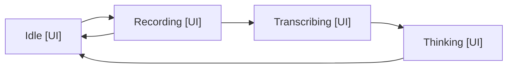

# Desktop MVP: UI and Settings

React components mounted from Obsidian shells: the ItemView and PluginSettingTab create a React root and render a panel component. Capture and engine components are in [3-component-design.md](3-component-design.md).

## SessionView (session-view.tsx)

An ItemView registered for the right sidebar, view type voice-edit-session. Its only job is mounting SessionPanel with the session, recorder, provider and engine as props, and unmounting on close.

## SessionPanel (SessionPanel.tsx)

Layout, top to bottom:

- Header: note name the session is bound to.
- History list: scrolling region of turn entries.
- Input row: mic button, text input, send button.

State machine held in a useReducer, driving the mic button and input row:

Arrows: state transitions (user action or step completion).

- Idle to Recording: mic tap. Recording to Transcribing: mic tap (stop). Recording to Idle: cancel.
- Transcribing to Thinking: transcript received and rendered as a user entry (FR7).
- Thinking to Idle: turn summary rendered. Typed input skips straight to Thinking (FR8).
- Buttons disable outside their valid states; the engine's single-flight queue is the backstop.

History entries, append only in this release:

- User entry: the transcript or typed text.
- Assistant entry: turn summary or clarifying question.
- Error entry: step name plus message, styled distinctly (NFR5).

## Session Binding (main.ts + agent-session.ts)

- The command and ribbon icon open the view and bind it to the active markdown file (FR1, FR2).
- If a session exists for another file, the user is asked: keep it or start over. No implicit rebinding.
- Closing the view ends the session and drops history.

## Recorder (capture/recorder.ts)

Documented here for the UI contract; design detail in [3-component-design.md](3-component-design.md).

- start() begins one recording; stop() resolves with blob and mime type; cancel() discards.
- SessionPanel maps these to the state machine above.

## Settings (settings-tab.tsx + SettingsPanel.tsx)

- SettingsPanel fields: Mistral API key (password-style input), edit model (text input, default mistral-medium-latest), skills folder (text input, default `0 - Meta/Skills`, empty to disable).
- Changes save through an updateSettings callback into the plugin's saveData.
- A note in the panel states the key never leaves the device except toward the provider (NFR1).

## Styling (styles.css)

- Obsidian CSS variables only, no hardcoded colours.
- Classes prefixed voice-edit-. Mic button uses the microphone lucide icon, switching to a stop icon while recording.
