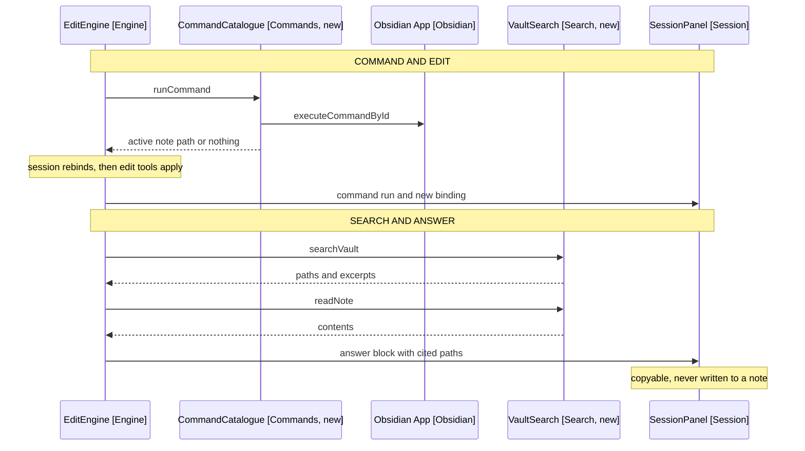

# Requirements: Obsidian Agent Harness

Widen the plugin from single-note editing to a small agent harness for the
vault. The model gains two capabilities beyond editing the open note: run an
Obsidian command, and search the vault to answer a question.

Scope is deliberately narrow. This is not an open-ended vault agent. Writes
still land in one note, and that note is always one the user or a command
opened, never one the model chose.

## Problem

The session binds to one note at start and never moves (FR2 of
[1-requirements.md](../1-requirements.md)). Two kinds of instruction fail as a
result.

- "Open my daily note and add a paragraph under heading X" names a destination
  the session cannot move to.
- "What did I write about Lewis school recently" asks a question about the
  vault, which no tool can read.

Both are within reach. The first is a command run before an edit. The second is
a search, and an answer the user reads rather than a note the plugin writes.

## Goals

- Let the model run an Obsidian command the user could run from the palette.
- Rebind the session to the note a command opened, so the edit tools target it.
- Let the model search the vault and answer questions from what it finds.
- Keep the harness closed: a listed set of commands, not the whole app.
- Keep every write on a path the user can see before it lands.

## Non-goals

- Writing a search result into a note. The answer is copyable; the user places
  it.
- Choosing a write destination by path. Destinations come from commands.
- Editing more than one note per turn. Cross-file writes are release 7.
- Arbitrary code execution, or calling plugin APIs directly.
- Commands that are destructive, irreversible, or open external targets.
- Background or unattended operation. Every turn is user-initiated.

## User stories

- As a user, I say "open my daily note and add a paragraph about the standup
  under Meetings", and the daily note opens and gains the paragraph.
- As a user with a shopping list command, I say "add eggs to my shopping list",
  and this week's list opens and gains the item.
- As a user, I say "find my notes about Lewis school", and the panel lists the
  matching notes with enough context to pick one.
- As a user, I say "what did I write about Lewis school recently", and the panel
  shows a summary I can copy, naming the notes it drew on.
- As a user, I paste that summary into whichever note I want, having read it
  first.
- As a user, I see in the panel which command ran and which note the session is
  now bound to, before any edit is described.

## Two flows, separately bounded

The release ships two independent capabilities. They share the agent loop and
nothing else.

| Flow              | Destination comes from | Model chooses       | Ends in       |
| ----------------- | ---------------------- | ------------------- | ------------- |
| Command and edit  | An allowed command     | Which command       | A note edit   |
| Search and answer | Nothing; no write      | Which notes to read | A panel block |

Splitting them is the point. A command resolves a path through the user's own
configuration, so the destination is deterministic and an edit can follow it. A
search picks notes by relevance, so its output is a judgement, and it stops at
something the user reads.

Arrows: uses-relationship (client to supplier).

Numbered requirements are in
[2-functional-requirements.md](2-functional-requirements.md). Decisions and the
questions gating a design are in [3-decisions.md](3-decisions.md).
