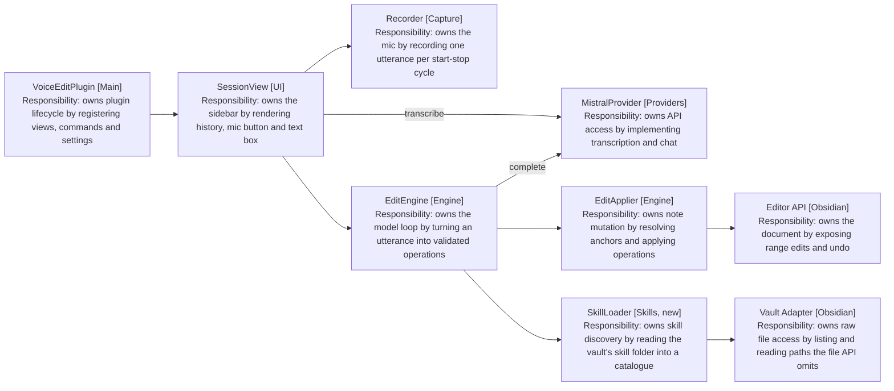
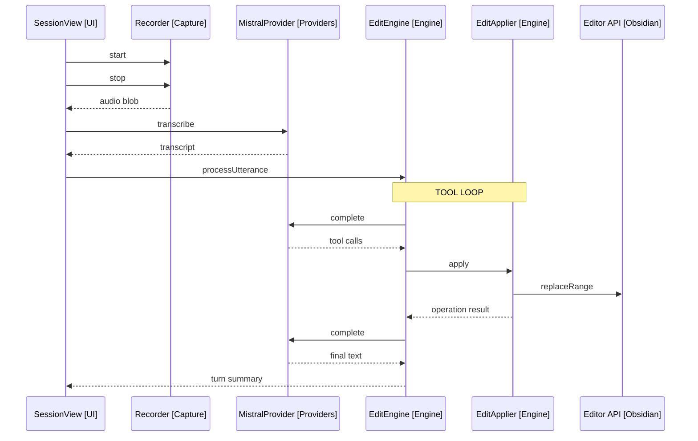

# Design: Desktop MVP

Covers release 1 of [2-plan.md](../2-plan.md): the full loop on desktop with record-then-transcribe capture. Modules referenced in brackets: UI, Capture, Providers, Engine, plus the external systems Obsidian and Mistral.

## Module Map

Arrows: uses-relationship (client to supplier).

## Provider Interface

- TranscriptionProvider [Providers]: transcribe(audio, language) returns text. MVP implementation posts the recorded blob to Mistral's batch endpoint.
- ChatProvider [Providers]: complete(messages, tools) returns tool calls or text.
- MistralProvider [Providers] implements both. The interfaces are the seam FR26 requires; no second implementation ships in this release.

## Utterance Flow

Arrows: uses-relationship (client to supplier).

The loop repeats while the model returns tool calls. A text-only response ends the turn; it is either a summary or a clarifying question, and SessionView renders it in the history either way.

## Edit Tools

| Tool         | Arguments                                      | Effect                                 |
| ------------ | ---------------------------------------------- | -------------------------------------- |
| replace_text | anchor_text, replacement                       | Replaces the unique anchor match       |
| insert_text  | anchor_text, position (before/after), content  | Inserts content adjacent to the anchor |
| insert_at    | location (note_start/note_end/cursor), content | Inserts at a fixed location            |

- The system prompt carries the full note content, the cursor position, and the dictation-formatting rules (FR15-21).
- One turn may contain several tool calls (FR14); they apply in order.

## Anchor Resolution

- An anchor must match the note text exactly and uniquely.
- Zero matches or multiple matches fail the operation; the failure is returned to the model as the tool result, and the model retries with a longer anchor or asks the user (FR13).
- Offsets are recomputed after each applied operation, since earlier operations shift positions.

## Conversation State

- EditSession [Engine] holds the bound file, the message history, and the applied-operation log.
- History is provider-format messages, so follow-ups reuse the same array (FR4).
- The note content is re-read and re-sent each turn; the note may have been edited by hand between utterances.

## Vault Skills

- SkillLoader [Skills, new] reads the configured skills folder through the vault adapter on session start, parsing the name and description out of each SKILL.md (FR34).
- The catalogue holds descriptions, never bodies, so prompt cost scales with skill count rather than skill size (NFR6).
- EditEngine [Engine] lists the catalogue in the system prompt, and omits the section entirely when it is empty, leaving a skill-free vault byte-identical to a build without the feature (FR35, FR38).
- Discovery goes through the adapter rather than `app.vault.getFiles()`, which omits dot-directories. The configured folder is a normal vault folder, since Obsidian Sync copies no dot-folder to mobile and the mobile adapter resolves no symlink (NFR3).
- A missing folder, a file without frontmatter, and a malformed file are all non-events: the first yields an empty catalogue, the others are skipped (FR38).

## Skill Scope

The MVP tools edit the open note and nothing else, so a skill is followable only while its steps stay in that note. Of a typical vault, a todo archiver qualifies; a journal router that creates files at computed paths does not.

The model draws that line, using the descriptions in the prompt and the tools it holds (FR36). When a skill fits the utterance but needs another file, it names the skill, says the capability is not there yet, and makes no partial edit (FR37).

Skills declare no scope of their own. A frontmatter flag would be one more thing to set when authoring a skill and would drift from what the skill actually does, whereas the tool list cannot drift: no cross-file tool exists, so a skill reaching for one finds nothing to call. That makes the tools the real boundary and the model's judgement the explanation the user hears.

Release 5 lifts the limit, at which point the FR37 message narrows to whatever is still unsupported.

## Error Handling

- Each layer returns an Outcome; SessionView is the only place that renders errors, naming the failing step (NFR5).
- A failed transcription leaves the history untouched. A failed operation mid-turn stops the turn; already-applied operations stay, and the summary says what landed.
