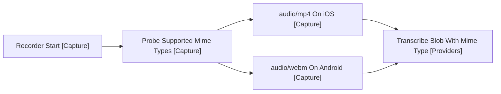

# Design: Mobile MVP

Covers release 2 of [2-plan.md](../2-plan.md): the Desktop MVP loop running on iOS and Android. This is a delta design; everything not listed here carries over from [1-desktop-mvp.md](1-desktop-mvp.md) unchanged (FR32). Batch transcription is plain REST, so no auth changes are needed.

## Deltas

### Session Start

- VoiceEditPlugin [Main] registers a mobile toolbar action alongside the ribbon icon. Obsidian shows toolbar actions in the mobile editing toolbar above the keyboard (FR1).
- Platform.isMobile [Obsidian] gates the registration; desktop sees no change.

### Sidebar as Drawer

- SessionView [UI] is unchanged. Obsidian renders right-sidebar views as a slide-over drawer on mobile natively (FR3).
- CSS additions only: minimum 44px touch targets on the mic, send and history controls, and no hover-dependent affordances (FR33).

### Audio Capture

- Recorder [Capture] keeps using MediaRecorder, but the container differs by platform: iOS WebKit records audio/mp4 (AAC), Android records audio/webm (Opus).
- Recorder picks the first supported mime type from a preference list and reports it with the blob.
- MistralProvider [Providers] passes the mime type through; the batch endpoint accepts both containers, so no transcoding is done client-side.
- Mic permission is requested lazily on first record, and a denial renders as a step-named error in the sidebar (NFR5).

### Vault Skills

- SkillLoader [Skills] is unchanged. It reads through the vault adapter, which Obsidian implements on both platforms, so the catalogue and the prompt match desktop (FR34, FR32).
- The skills folder must be a normal vault folder rather than a dot-folder. Obsidian Sync copies no dot-folder to a phone except `.obsidian` and `.trash`, and the mobile adapter resolves no symlink, so a dot-path or a link to one never arrives.
- The symptom of an unmigrated vault is an empty catalogue on the phone and a populated one on the laptop.

## Capture Decision Flow

Arrows: data flow (direction data moves).

## Risks Checked by This Release

- MediaRecorder behaviour inside the Obsidian mobile webview, per OS.
- Adapter access to the skills folder on a real device, confirming the catalogue matches desktop.
- Keyboard, toolbar and drawer interplay: recording while the drawer is open, keyboard covering the toolbar.
- App backgrounding mid-recording: MVP behaviour is stop-and-discard with a notice; configurable behaviour is a Mobile V1 concern.

## Out of Scope

Streaming, ephemeral tokens, and mic lifecycle across app switches stay in [4-mobile-v1.md](4-mobile-v1.md).
