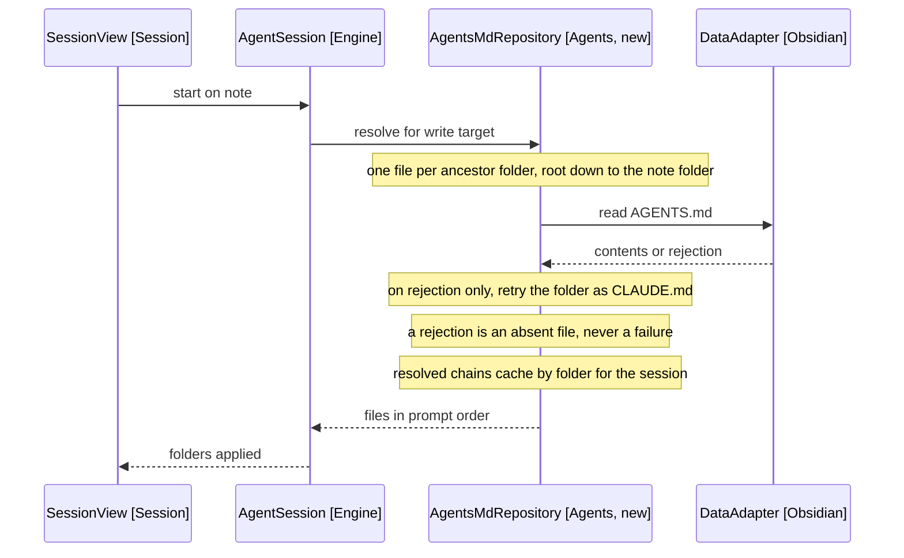

# Design: AGENTS.md Loading

Covers release 3 of [2-plan.md](../2-plan.md): standing instructions a folder sets for the notes inside it. Delta design on top of [2-mobile-mvp.md](2-mobile-mvp.md). Requirement IDs refer to [3-agents-md-loading/2-functional-requirements.md](../3-agents-md-loading/2-functional-requirements.md).

## Two Kinds of Instruction

The MVPs ship one: skills, conditional and matched per utterance, catalogued by description and read on demand. This release ships the other.

| Kind      | When it applies                  | Loaded as         | Cost paid              |
| --------- | -------------------------------- | ----------------- | ---------------------- |
| Skill     | When an utterance matches it     | Description first | Per matching turn      |
| AGENTS.md | Every write to a note beneath it | Whole file        | Every write, so capped |

They stay separate packages. Merging them would give one package two reasons to change and would tempt an implementation that loads skill bodies eagerly, which the MVP design rejects.

## The Write Target Picks the Chain

Instructions say how a note should be written, so they belong to the note receiving the edit rather than to the note that started the session (FR8). A journal entry filed from a project note follows the journal folder's rules, not the project's.

This release writes to one note per turn, so target and session note coincide today. The axis is chosen now because release 7 makes them diverge, and because the caching shape differs: keyed by folder, not by session (NFR2).

A note the model only reads pulls in no instructions. Its folder's rules govern writes into that folder, not the edit in hand, and excluding reads keeps a read from injecting instructions the user never aimed at this turn.

## Discovery by Path

AgentsMdRepository (Agents, new) reads one file per ancestor folder of the note being written to, from the vault root down, through the same DataAdapter (Obsidian) that SkillRepository (Skills) uses (FR1, NFR4). No directory listing: the candidate folders come from splitting the note path, so the walk cannot escape the vault root (FR3).

Each folder contributes AGENTS.md, or CLAUDE.md where it has no AGENTS.md, never both (FR2). Supporting both names lets a vault shared with Claude Code work unchanged. Taking only one is also what makes symlinks safe: a CLAUDE.md symlinked to its neighbour is a likely setup, and the adapter exposes no link information to detect it with, so reading both would silently duplicate instructions.

Order is the override mechanism. Root first, nearest last, so the closest folder's instructions read last in the prompt and win on conflict (FR4). Merging was rejected: markdown prose has no structure to merge on, and prompt recency is a mechanism the model already responds to.

Arrows: uses-relationship (client to supplier).

## Prompt Placement

The chain becomes a fourth section in PromptBuilder (Engine), after the dictation rules and before the skill catalogue (FR5). Each file is fenced and labelled with its folder (FR6). An empty chain omits the section, so a vault with no instruction files produces the release 2 prompt byte for byte (FR11).

The section states that these are quoted user instructions, and that nothing in them grants a tool or widens a path. A vault file cannot argue its way past the single-note limit release 7 removes (NFR3).

## Cost Control

Whole files load, so the cap is what makes the feature affordable. Fill from the nearest folder outward, stop at 40,000 characters, and drop the vault-wide file first, keeping the most specific instructions (FR9). That is roughly 10,000 tokens, under 8% of the edit model's 128k window, and far above what folder instructions realistically run to: a safety rail rather than a routine constraint. Resolved chains cache by folder for the life of the session, so a long session re-walks nothing (NFR2).

A drop is reported three ways, each catching a different user. SessionPanel (Session) lists the folders that applied and says when the cap dropped one (FR10). A Notice catches the user not watching the panel (FR14). A console line names every dropped file and its folder (FR15). Without them a dropped file and a file that was never there look identical.

The Notice fires once per resolved chain rather than once per dropped file, and a drop is not an error: the turn runs on the chain that fitted (FR16, NFR5).

## Risks Checked by This Release

- Whether AGENTS.md is the right filename in a vault, where it is visible in the explorer and appears in search results.
- Whether nearest-last ordering is a strong enough override in practice, or whether the model needs the conflict called out per rule.
- Whether a stale chain after mid-session edits to an AGENTS.md is annoying enough to warrant a vault event listener.

## Out of Scope

Instruction files above the vault root, an include mechanism, and per-note frontmatter instructions. Resolving a chain for a note the model reads is excluded by design, not deferred. Multiple write targets in one turn arrive with the cross-file tools in [7-cross-file-skills/index.md](../7-cross-file-skills/index.md), which reuse this resolution unchanged.
