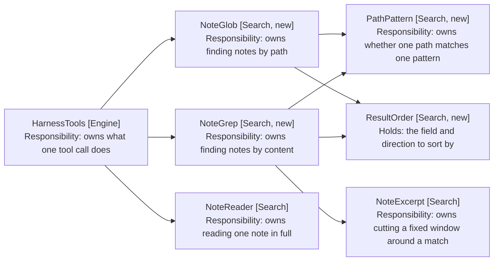

# Finding Notes: Component Design

How a path pattern becomes a list of notes, and how a regular expression becomes
a list of matches. Delta on the
[harness MVP](../4-harness-mvp/05-component-design.md); unlisted components are
unchanged.

## Table of Contents

1. [One Matcher, Two Searchers](#one-matcher-two-searchers)
2. [The Glob Is a Compiled Pattern](#the-glob-is-a-compiled-pattern)
3. [Two Searchers Over One Pass](#two-searchers-over-one-pass)
4. [The Two Schemas](#the-two-schemas)
5. [What the Model Reads Back](#what-the-model-reads-back)
6. [Behaviour Sequence](#behaviour-sequence)
7. [Ordering Is a Value, Not a Branch](#ordering-is-a-value-not-a-branch)
8. [What Replaces VaultSearch](#what-replaces-vaultsearch)
9. [Feeding an Opened Note](#feeding-an-opened-note)
10. [Two Tools, Two Budgets](#two-tools-two-budgets)
11. [The Prompt States the Order](#the-prompt-states-the-order)
12. [Retiring search_vault](#retiring-search_vault)
13. [Out of Scope](#out-of-scope)

## One Matcher, Two Searchers

Both tools take a path pattern: glob to select what it returns, grep to narrow
what it reads. So the matcher is one collaborator that neither owns.



Arrows: uses-relationship (client to supplier).

NoteGlob (Search, new) reads no note contents, which is NFR2 by construction: it
holds the vault to list files and never calls cachedRead.

## The Glob Is a Compiled Pattern

PathPattern (Search, new) compiles the pattern once and tests each path against
it, rather than walking segments per path.

```typescript
// path-pattern.ts
// Compiled once per call, because a vault of a thousand notes tests the same
// pattern a thousand times. A regular expression rather than a segment walk:
// the three wildcards are a translation, and a walk would reimplement
// backtracking for `**`.
export class PathPattern {
  static compile(pattern: string): PathPattern

  matches(path: string): boolean
}
```

compile returns a pattern rather than an Attempt. Every character that is not
one of the three wildcards is escaped, so no input can fail to compile: an
Attempt here would be a branch no test could reach and no caller could trigger.
A pattern that matches nothing is an answer, not an error (NFR5).

The translation is three rules and one escape:

| Pattern | Becomes    | Means                           |
| ------- | ---------- | ------------------------------- |
| `**/`   | `(?:.*/)?` | Any folders, or none            |
| `**`    | `.*`       | Anything, folder separators too |
| `*`     | `[^/]*`    | Anything within one segment     |
| `?`     | `[^/]`     | One character, not a separator  |

`**/` collapsing to an optional group is what makes `**/*.md` reach a note at the
vault root. Treating `**` as `.*` alone would require the separator, and a note
with no folder would not match a pattern the user reads as "anywhere".

Every other regular-expression character is escaped, so a vault folder named
`1 - Journal` or `Notes (old)` is matched literally rather than parsed.

The compiled expression is anchored at both ends. `Week-35/*.md` therefore does
not match `1 - Journal/Weekly/Week-35/04-09-Fri.md`, and reaching it mid-path
needs `**/Week-35/*.md`. Anchoring is what makes a pattern mean one thing: an
unanchored `*.md` would match every note in the vault, which is never what the
model meant by it.

The pattern matches the whole path including the extension, and nothing is
appended. `Week-35/*` and `Week-35/*.md` both match a markdown note, because the
candidate set is getMarkdownFiles and holds nothing else.

Matching is case-insensitive. Obsidian's own search is, macOS vault paths are
case-insensitive on disk, and a model that recalls `week-35` should not miss
`Week-35`.

An unparseable pattern is an Attempt failure, so HarnessTools refuses it the way
it refuses every other bad argument rather than throwing.

## Two Searchers Over One Pass

Both walk getMarkdownFiles once and stop there (NFR1).

```typescript
// note-glob.ts
// No cachedRead anywhere in this class: a path match must not cost a read
// (NFR2), which is what makes listing cheap enough to use speculatively.
export class NoteGlob {
  async find(pattern: string, order: ResultOrder): Promise<Attempt<GlobResult>>
}

// note-grep.ts
// The path filter runs before the read, so narrowing a grep to a folder costs
// one pass over paths rather than a read of every note in the vault.
export class NoteGrep {
  async find(request: GrepRequest, order: ResultOrder): Promise<Attempt<GrepResult>>
}
```

GrepRequest (Search, new) carries the expression, the two narrowings, and
whether paths alone are wanted. A value rather than four arguments, because
HarnessTools builds it from the tool call and nothing else constructs one.

```typescript
// grep-request.ts
export class GrepRequest {
  constructor(
    readonly pattern: string,
    readonly pathPattern: string | null,
    readonly paths: readonly string[],
    readonly pathsOnly: boolean,
  ) {}

  // Both narrowings apply where both are given, so a model that passes each
  // gets the intersection. One silently overriding the other is how a search
  // returns a confident answer to a question it did not ask.
  admits(path: string): boolean
}
```

An empty paths array is no filter rather than no notes. A model sending one
almost certainly has no list to offer, and reading it literally returns "no notes
contain X" for a search that never looked at one.

paths filters the vault's own file list rather than reading what it names, so a
path with no note behind it is dropped rather than raising. That matches
SeenPaths, where a stale path is a miss and not a failure.

Both results carry their rows and whether the cap trimmed them:

```typescript
// glob-result.ts and grep-result.ts
// The total is held beside the rows rather than derived from them, because the
// rows are what survived the cap and the total is what the model must be told
// about (FR13).
export class GlobResult {
  constructor(
    readonly paths: readonly string[],
    readonly total: number,
  ) {}

  wasTrimmed(): boolean
}

export class GrepResult {
  constructor(
    readonly hits: readonly SearchHit[],
    readonly total: number,
    readonly pathsOnly: boolean,
  ) {}

  wasTrimmed(): boolean
}
```

Glob holds paths and grep holds SearchHits, which is the same asymmetry the
result format has: a path match has no excerpt to carry.

The regular expression is the model's, compiled with `new RegExp(pattern, 'gi')`
inside a try. A failure becomes a refusal naming the expression and the reason
the engine gave, so the model can correct the pattern rather than guess at it
(FR9). It is compiled once per call, like the path pattern.

Three properties of that compile are the model's contract, so they are stated in
the schema rather than left to be discovered:

| Property | Value          | Why                                               |
| -------- | -------------- | ------------------------------------------------- |
| Case     | Insensitive    | Matches the path matcher, and prose varies        |
| Scope    | The whole note | A match may cross lines, as prose does            |
| Global   | Yes            | The match count is what `sort: matches` orders by |

Case-insensitivity is the one worth stating in the tool description, because a
model that assumes otherwise writes `[Rr]oofing` and gets the same answer for
more effort.

The expression runs against the note's full text rather than line by line. A
grep over prose is not a grep over code: a sentence wraps, and a pattern that
must match within one line would miss what the user is looking for. The excerpt
is then cut around the match offset, which is what NoteExcerpt already does.

The global flag is not optional. Without it the count is always one, and
`sort: matches` orders by nothing.

Both results carry whether the cap trimmed them (FR13). A model told it saw
everything behaves differently from one told it saw the first fifty, and the
difference matters when the answer is "there are no others".

## The Two Schemas

Written out because the argument names are the contract: the prompt, the schema
and the parser must agree, and a name invented at build time drifts from every
later reader.

```typescript
// tool-schemas.ts, beside the existing entries
{
  name: GLOB_NOTES,
  description:
    'List the notes whose path matches a pattern. Use this before guessing a filename: a folder listing shows the naming convention. Returns paths only.',
  parameters: {
    type: 'object',
    properties: {
      pattern: {
        type: 'string',
        description:
          'A path pattern from the vault root. * matches within one folder, ** across folders, ? one character. Example: 1 - Journal/Weekly/Week-35/*.md',
      },
      sort: { type: 'string', enum: ['path', 'modified'] },
      order: { type: 'string', enum: ['ascending', 'descending'] },
    },
    required: ['pattern'],
  },
},
{
  name: GREP_NOTES,
  description:
    'Find notes whose contents match a regular expression, with an excerpt around each match. Narrow it with path_pattern when you know roughly where to look, or with paths when a listing already showed you which notes matter.',
  parameters: {
    type: 'object',
    properties: {
      pattern: {
        type: 'string',
        description:
          'A JavaScript regular expression, matched case-insensitively across the whole note. Plain text works: most searches need no special characters.',
      },
      path_pattern: {
        type: 'string',
        description: 'Only read notes whose path matches this glob. Same syntax as glob_notes.',
      },
      paths: {
        type: 'array',
        items: { type: 'string' },
        description:
          'Only read these exact notes, as a previous call returned them. Use it to look inside the few a listing showed were relevant.',
      },
      paths_only: {
        type: 'boolean',
        description: 'Return paths without excerpts, when the answer is which note rather than what it says.',
      },
      sort: { type: 'string', enum: ['path', 'modified', 'matches'] },
      order: { type: 'string', enum: ['ascending', 'descending'] },
    },
    required: ['pattern'],
  },
},
```

`pattern` is the first argument of both, because it is the same idea in both: what
to match. Grep's path filter is `path_pattern` rather than a second `pattern`.

`ascending` and `descending` in full, rather than `asc` and `desc`. The model
writes these, and a truncation is one more thing to get exactly right for no
gain.

Both `sort` and `order` are optional and neither is in `required`, so the common
call is `glob_notes({ pattern })`.

## What the Model Reads Back

The result string is what the model acts on, so it is specified rather than left
to the searcher.

| Case                | Glob returns               | Grep returns                                   |
| ------------------- | -------------------------- | ---------------------------------------------- |
| Nothing matched     | `no notes match <pattern>` | `no notes contain <pattern>`                   |
| Nothing to read     | n/a                        | `no notes to search: <narrowing> matched none` |
| Matched             | One path per line          | `<path> (<n> matches): <excerpt>` per line     |
| Matched, paths only | One path per line          | One path per line                              |
| Cap trimmed         | A trailing line, below     | A trailing line, below                         |

The trailing line is `showing the first <cap> of <total>; narrow the pattern to
see the rest`. It names the cap and the total, because a model told it saw
everything answers "are there others?" differently from one told it saw ten of
forty (FR13).

The "nothing to read" case is grep's alone and it is not the same as no match
(FR6c). A path_pattern naming a folder that does not exist reads no notes at all,
and reporting that as "no notes contain X" tells the model its text is absent
when what is wrong is its scope. The distinction costs one branch and prevents
the model concluding something false about the vault.

Grep's line reuses SearchHit (Search) with the match count as its score, which is
what that field always effectively held. Its describe() gains a form without the
decimal, since a count is not a score.

A glob returns bare paths rather than SearchHit lines. There is no score to
report and no excerpt to carry, and a format that renders both as empty invites
the model to read meaning into them.

## Behaviour Sequence

```mermaid
sequenceDiagram
    participant Engine as EditEngine [Engine]
    participant Dispatcher as ToolDispatcher [Engine]
    participant Harness as HarnessTools [Engine]
    participant Glob as NoteGlob [Search, new]
    participant Grep as NoteGrep [Search, new]
    participant Seen as SeenPaths [Search]

    Note over Engine,Seen: THE MODEL LISTS A FOLDER BEFORE IT GUESSES
    Engine->>Dispatcher: execute
    Dispatcher->>Harness: execute
    Harness->>Glob: find
    Note over Glob: no contents read; paths only
    Harness->>Seen: record
    Note over Seen: an opened note must be one a search offered

    Note over Engine,Seen: THEN IT LOOKS INSIDE THE ONES THAT MATTER
    Engine->>Dispatcher: execute
    Dispatcher->>Harness: execute
    Harness->>Grep: find
    Harness->>Seen: record

    Note over Engine,Seen: A SPENT BUDGET REMOVES THE TOOL
    Note over Harness: schemas() drops it, so a refusal cannot be retried
```

Arrows: uses-relationship (client to supplier).

Both tools record their paths on SeenPaths (Search), because
[9-model-chosen-targets](../9-model-chosen-targets/1-index.md) makes a search hit
the only source of a path open_note accepts. A glob that could not feed open_note
would leave the model able to find a note and unable to open it.

## Feeding an Opened Note

SeenPaths (Search) is what open_note checks before it moves the session, so a
note either tool found must be recorded there or the model can find a note it
cannot open.

Its record takes SearchHit values today, which a glob has none of. It gains a
second method rather than a fabricated hit:

```typescript
// seen-paths.ts, beside record
// Paths rather than hits, because a glob has no score and no excerpt and a hit
// carrying empty ones would invite the model to read meaning into them.
recordPaths(paths: readonly string[]): void
```

record keeps its signature and delegates: it only ever read hit.path, so the two
methods are one behaviour with two shapes of argument.

HarnessTools records after each call, as it already does for a search. A glob
records its paths; a grep records the paths of its hits, including when
paths_only left them without excerpts.

## Ordering Is a Value, Not a Branch

ResultOrder (Search, new) holds the field and the direction, and knows the
default direction for each field.

```typescript
// result-order.ts
// A value, so both searchers sort through one comparator rather than each
// growing a switch. The direction defaults per field: ascending is right for a
// path and wrong for a date (FR12).
export class ResultOrder {
  static of(sort?: string, order?: string): ResultOrder

  // The caller supplies one key per field it supports, and the value picks the
  // one its field names. A searcher therefore states what it can sort by
  // without branching on which was asked for.
  sorted<T>(items: readonly T[], keys: SortKeys<T>): T[]
}

// Every field a caller can offer. modified and matches are optional, so a glob
// declares no match count and a caller that omits a key the order asks for
// falls back to path.
export interface SortKeys<T> {
  path(item: T): string
  modified?(item: T): number
  matches?(item: T): number
}
```

An unrecognised sort field falls back to path, and so does a recognised field the
caller supplied no key for. The field is the model's, the set is small, and a
turn should not end because it asked for an ordering that does not exist.

That fallback is how matches stays grep's alone without ResultOrder knowing which
tool called it. A glob passes no matches key, so `sort: matches` on a glob orders
by path rather than refusing. The schema does not offer the model that value, and
the fallback is what makes the schema advisory rather than load-bearing.

## What Replaces VaultSearch

VaultSearch (Search) goes. NoteGlob and NoteGrep take what it owned, and its
three pieces land differently.

| VaultSearch held        | Becomes                                       |
| ----------------------- | --------------------------------------------- |
| The one pass over files | Both searchers, each walking getMarkdownFiles |
| prepareSimpleSearch     | Gone. Exact matching replaces scoring         |
| The recency filter      | ResultOrder's modified sort                   |
| Path scoring            | Gone. PathPattern replaces it exactly         |

The path scoring added to VaultSearch was a narrowing of this design onto the
wrong tool: it made a folder name reachable by fuzzy score when what the model
needed was to list the folder. PathPattern does exactly what the weighting
approximated.

modified_within_days goes with it. A window filters, where sorting orders, and
the model asking "recently" wants the newest first rather than an arbitrary
cutoff it has to pick. Dropping it removes an argument the model had to guess a
number for.

SearchHit (Search) stays, since a grep hit is still a path, a relevance figure
and an excerpt. Its score becomes the match count, which is what it always
effectively was.

## Caps and Steps

Two caps, different numbers, because the rows cost differently.

| Cap              | Value | Why                                                   |
| ---------------- | ----- | ----------------------------------------------------- |
| Glob results     | 50    | A row is a path, and a folder listing wants all of it |
| Grep results     | 10    | A row carries a 200-character excerpt                 |
| Grep, paths only | 50    | The rows are paths again                              |

Fifty is enough that a real folder listing is never trimmed, which matters
because a trimmed listing is exactly the case where the model starts guessing
again. Ten matches the eight the deleted search returned, rounded to a number
the cap message can state plainly.

TurnStep (Engine) gains two factories beside its six:

```typescript
// turn-step.ts, beside searched
static globbed(pattern: string, found: number): TurnStep
static grepped(pattern: string, found: number): TurnStep
```

Labelled `Globbed` and `Grepped`. Reusing searched would render a folder listing
as "3 matches", which reads as relevance where it is an enumeration; the detail
reads `<pattern> — 3 notes` for a glob and `<pattern> — 3 notes` for a grep.

## Two Tools, Two Budgets

TurnBudget (Engine) gains two counters beside the four it has.

| Flow      | Cap | Spent by    |
| --------- | --- | ----------- |
| Commands  | 3   | run_command |
| Searches  | 4   | read_note   |
| Globs     | 3   | glob_notes  |
| Greps     | 4   | grep_notes  |
| Opens     | 1   | open_note   |
| Questions | 4   | ask_user    |

Separate counters, because a glob costs no read and a grep costs one per
candidate. Sharing them would let cheap reconnaissance starve the reads it exists
to inform, which is what the failing turn did.

The caps exceed what ten iterations can spend, deliberately. The iteration cap is
the real bound; these stop one flow monopolising a turn, and each refusal now
removes its tool from the offered set rather than inviting a retry (FR15).

## The Prompt States the Order

Four ways to reach a note need a stated order, or the model reaches for the most
general (NFR6). RuleBuilder (Engine) replaces searchRules with a sequence:

```typescript
// rule-builder.ts, replacing the first two lines of searchRules
'Reach a note in this order: run a listed command that opens it; glob for its',
'path when you know roughly where it lives; grep for text you expect it to',
'contain; read it only once you know which note you mean.',
'Glob before you guess a filename. A folder listing shows the naming convention,',
'and a guessed name that matches nothing tells you nothing.',
```

The second rule is the one the failing turn needed. A model that globs
`1 - Journal/Weekly/Week-35/*.md` reads the convention off the result; a model
that greps for a guessed name learns only that its guess was wrong.

Three of the five lines searchRules holds today survive verbatim, and only the
first two go:

| Line today                                     | Fate                  |
| ---------------------------------------------- | --------------------- |
| You can search the vault and read the notes... | Replaced by the order |
| ...no tool writes a search result into a note  | Kept: still true      |
| Answer a question with answer_from_search...   | Kept: FR17            |
| When a search finds nothing, say so...         | Kept: load-bearing    |

The last is the one to be careful with. It is what stops the model answering a
vault question from its own knowledge, and an exact search makes it matter more
rather than less: a grep that finds nothing is now proof, and the model must say
so rather than fill the silence.

Commit one ships the order line naming only the command, the glob and the read,
since grep does not exist yet. Commit two adds the grep clause. Both are prompt
changes, and both verify the rest byte for byte against git.

## Retiring search_vault

Deleting a tool reaches further than deleting its class, and the compile errors
are the smaller half.

| File                                  | Change                                                                                     |
| ------------------------------------- | ------------------------------------------------------------------------------------------ |
| `providers/models/tool-call.ts`       | Drop SEARCH_VAULT and isSearchVault; add the two new names and predicates to isHarnessTool |
| `engine/engine-factory.ts`            | Construct NoteGlob and NoteGrep where VaultSearch was constructed                          |
| `test-support/builders.ts`            | noHarness builds the two searchers instead                                                 |
| `test-support/__mocks__/obsidian.ts`  | prepareSimpleSearch and the SearchResult types go with their only consumer                 |
| `search/vault-search.ts` and its test | Deleted                                                                                    |

Four test files call search_vault to reach a note, and each needs the same
substitution rather than deletion:

| Test file                          | What it uses search_vault for                                  |
| ---------------------------------- | -------------------------------------------------------------- |
| `edit-engine-model-chosen.test.ts` | findsTodo, which feeds SeenPaths for every open test           |
| `harness-tools-open.test.ts`       | search, the same helper at unit level                          |
| `edit-engine-harness.test.ts`      | Six sites, including the offered-set and search-cap assertions |
| `edit-engine-unbound.test.ts`      | One site                                                       |
| `turn-budget.test.ts`              | Asserts spentTools names search_vault                          |

The first two are the ones to get right. Their helpers exist to put a path in
SeenPaths so open_note will accept it, and a glob does that as well as a search
did: findsTodo becomes a glob_notes call for the note's own folder. A test suite
that deletes them instead loses the coverage that open_note refuses an unseen
path, which is FR3 of the spec before this one.

## Out of Scope

- Tags. getAllTags makes the lookup cheap, but no test double has a
  MetadataCache and that scaffolding is its own piece of work.
- Fuzzy matching in any form. Exactness is the point, and a fuzzy flag would
  restore the choice this design removes.
- Brace expansion and character classes in a glob. Two globs express what braces
  would, and `*` already matches digits.
- Writing what either tool found into a note, which stays with
  [13-cross-file-skills](../13-cross-file-skills/1-index.md).
- Searching anything but markdown, since getMarkdownFiles is the one pass.
