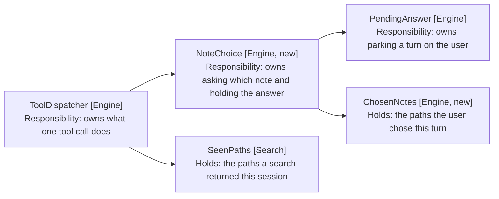
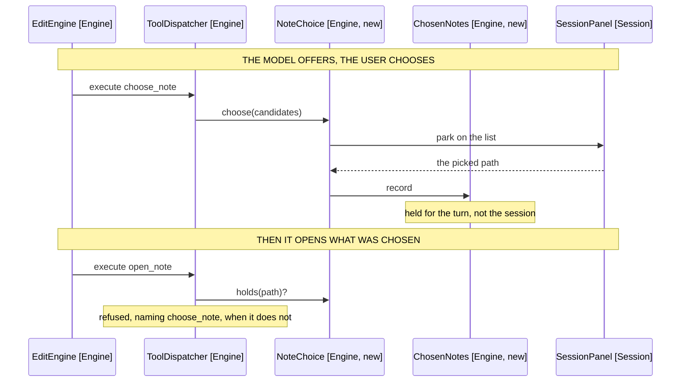

# Choosing the Note: Component Design

How a shortlist becomes a chosen path, and what that path licenses. Delta on
[9-model-chosen-targets](../9-model-chosen-targets/3-component-design.md);
unlisted components are unchanged.

## Table of Contents

1. [One Picker, Two Scopes](#one-picker-two-scopes)
2. [The Tool Is Named for the Act](#the-tool-is-named-for-the-act)
3. [What Replaces OpenApproval](#what-replaces-openapproval)
4. [The Shortlist Is Checked Before It Is Shown](#the-shortlist-is-checked-before-it-is-shown)
5. [The Schema](#the-schema)
6. [What the Model Reads Back](#what-the-model-reads-back)
7. [Behaviour Sequence](#behaviour-sequence)
8. [The Two Scopes Are Two Repositories](#the-two-scopes-are-two-repositories)
9. [The Setting Keeps Its Stored Values](#the-setting-keeps-its-stored-values)
10. [A Decline Is an Answer](#a-decline-is-an-answer)
11. [The Panel Renders a List, Not a Pair](#the-panel-renders-a-list-not-a-pair)
12. [The Prompt States the Order](#the-prompt-states-the-order)
13. [Out of Scope](#out-of-scope)

## One Picker, Two Scopes

The picker parks the turn the way the confirmation did. What changes is what
comes back: a path rather than a boolean, and a repository that holds it for the
turn rather than the session.



Arrows: uses-relationship (client to supplier).

NoteChoice (Engine, new) replaces OpenApproval (Engine) one for one: same
position in the dispatcher, same construction per turn, same cancellation.

## The Tool Is Named for the Act

The tool asks the user to decide which note, so it is named for deciding rather
than for permitting.

| Candidate name   | Why not                                             |
| ---------------- | --------------------------------------------------- |
| request_approval | Approval is what the pick implies, not what it is   |
| confirm_note     | Confirming is judging one guess, which is what goes |
| ask_which_note   | Reads as a question, and ask_user already is one    |
| choose_note      | The user chooses; the model offers                  |

choose_note it is (FR1). The model offers, the user chooses, and the name says
which side does which.

That distinction is the whole of why ask_user survives beside it (FR14).
ask_user asks a question whose answer is prose; choose_note asks one whose
answer is a path. A model that has candidates uses the second, and only the
second records consent.

## What Replaces OpenApproval

OpenApproval (Engine) goes. Its three pieces land differently.

| OpenApproval held       | Becomes                                                          |
| ----------------------- | ---------------------------------------------------------------- |
| The parked yes/no       | NoteChoice's parked pick, over the same PendingAnswer            |
| The per-path grant set  | ChosenNotes, turn-scoped rather than session-scoped              |
| The auto-mode granted() | NoteChoice.automatic(), which chooses the first candidate (FR13) |

```typescript
// note-choice.ts
// Built per turn, because it takes the turn's cancellation and because what the
// user chose is about this turn's write (FR5).
export class NoteChoice {
  static of(
    ask: (candidates: readonly string[]) => Promise<string | null>,
    cancellation?: TurnCancellation,
  ): NoteChoice

  // Auto mode: the first candidate, without asking. The mode is a choice of
  // collaborator rather than a branch in the dispatcher.
  static automatic(): NoteChoice

  // Null when the user declined every candidate, which is an answer rather
  // than a failure (FR6).
  async choose(candidates: readonly string[]): Promise<string | null>

  // What open_note checks. Separate from choose, because opening is a later
  // call than choosing and must not re-ask.
  holds(path: string): boolean
}
```

choose returns the path rather than a boolean, so the caller learns which note
without having proposed one. A null is the decline, and it is a value rather
than a failure because the user answering "none of these" is the tool working.

automatic() choosing the first candidate is a change, not a translation. Auto
mode today grants the one path the model named, because the model named one; a
shortlist gives it several, and the first is the model's own best guess.

Deleting the confirmation reaches sixteen production files, and the compile
errors are the smaller half.

| File                                          | Change                                                                       |
| --------------------------------------------- | ---------------------------------------------------------------------------- |
| `engine/open-approval.ts` and its test        | Deleted, replaced by note-choice.ts                                          |
| `session/approval-repository.ts` and its test | Deleted; ChosenNotes replaces it at turn scope                               |
| `engine/tool-dispatcher.ts`                   | Holds NoteChoice; openModelChosenNote checks holds rather than granting      |
| `engine/turn-factory.ts`                      | buildOpenApproval becomes buildNoteChoice; TurnAskers renames its field      |
| `engine/engine-factory.ts`                    | EngineAskers renames openApproval to noteChoice                              |
| `session/turn-askers.ts`                      | openApproval becomes noteChoice; drops the ApprovalRepository it held        |
| `session/session-builder.ts`                  | Renames the asker it wires, and onOpenRequested to onChoiceRequested         |
| `session/models/panel-action.ts`              | openRequested and openAnswered become choiceRequested and choiceAnswered     |
| `session/models/panel-state.ts`               | The confirm entry kind becomes choice; the confirming phase becomes choosing |
| `session/models/asked-entries.ts`             | settledConfirm becomes settledChoice, naming the pick rather than a yes      |
| `session/models/entry-weight.ts`              | The confirm weight is keyed choice                                           |
| `session/views/EntryConfirm.tsx`              | Becomes EntryChoice.tsx: a list of paths and a decline                       |
| `session/views/HistoryEntry.tsx`              | Renders EntryChoice; onAnswerOpen becomes onChooseNote                       |
| `session/views/HistoryList.tsx`               | Threads the renamed prop                                                     |
| `session/views/SessionPanel.tsx`              | settleOpen becomes settleChoice, carrying a path or null                     |
| `session/views/useParkedAnswers.ts`           | The held resolver returns a path or null rather than a boolean               |
| `test-support/builders.ts`                    | anEngine's openApproval option becomes noteChoice                            |
| `styles.css`                                  | owl-entry-confirm becomes owl-entry-choice, stacked rather than a row        |

The settling is the piece to get right. AskedEntries (Session) turns a pending
entry into a record of what happened, and a choice has three outcomes where a
confirmation had two: picked, declined, and a turn that ended with neither.

## The Shortlist Is Checked Before It Is Shown

Every candidate is filtered through SeenPaths (Search) before the user sees it,
so the model cannot shortlist a path it invented.

That check is what keeps FR10 meaningful. Without it the model could route
around the seen-path guard by proposing a fabricated path, having the user pick
it, and opening it with the pick as consent. The user would be approving a note
that does not exist.

| Shortlist         | Shown            | Model told                     |
| ----------------- | ---------------- | ------------------------------ |
| Every path seen   | All of them      | The chosen path                |
| Some paths unseen | The seen ones    | The chosen path                |
| No path seen      | Nothing; no park | Which paths no search returned |
| Empty list        | Nothing; no park | To search before choosing      |

An unseen path is dropped rather than refusing the whole call, because a model
that shortlists four notes and misremembers one should still get its pick. Only
a shortlist with nothing left refuses, and it names the paths so the model can
search rather than guess again.

The cap is eight, applied after the filter (FR15). A glob returns fifty and a
model that passes all of them has not chosen; eight is what a person reads
without scrolling a phone drawer, and it matches the hit count the retired
search returned. Over the cap the call refuses rather than truncating, because
silently dropping the note the user wanted is the failure this spec exists to
remove.

## The Schema

```typescript
// tool-schemas.ts, beside the existing entries
{
  name: CHOOSE_NOTE,
  description:
    'Ask the user which note you mean, from paths a search returned. Their pick is both which note and permission to write to it. Call this before open_note, always: even one candidate is theirs to confirm.',
  parameters: {
    type: 'object',
    properties: {
      paths: {
        type: 'array',
        items: { type: 'string' },
        description:
          'The note paths to offer, exactly as a search returned them. Offer every note that plausibly matches; the user picks.',
      },
      purpose: {
        type: 'string',
        description:
          'What you will do with the note they pick, in one short phrase. Shown above the list so the user knows what they are agreeing to.',
      },
    },
    required: ['paths', 'purpose'],
  },
},
```

purpose is required rather than optional. The user is consenting to a write, and
a list of paths with no statement of what happens to the pick asks them to agree
to something unstated.

## What the Model Reads Back

| Case                   | Returns                                                                                                 |
| ---------------------- | ------------------------------------------------------------------------------------------------------- |
| The user picked one    | `the user chose <path>; open it with open_note` (FR4)                                                   |
| The user declined all  | `the user declined every note offered; ask them what they meant rather than searching again` (FR6, FR7) |
| No candidate was seen  | `no search returned <paths>; search before offering them`                                               |
| The list was empty     | `offer at least one path a search returned`                                                             |
| Over the cap           | `offer at most 8 notes; narrow your search first` (FR15)                                                |
| The turn was cancelled | The cancelled result every other tool returns                                                           |

The decline line names the next move (FR7). A model told only "declined" retries
the search, which is the loop this replaces; a model told to ask reaches for
ask_user, which is what a decline means the turn needs.

open_note's refusal changes to name the new tool (FR9):

```
<path> was not chosen by the user this turn; offer it with choose_note first
```

The seen-path refusal stays as it is (FR10), since a path no search returned is
a different mistake from one the user has not picked.

## Behaviour Sequence



Arrows: uses-relationship (client to supplier).

## The Two Scopes Are Two Repositories

ChosenNotes (Engine, new) lives on the turn; SeenPaths (Search) lives on the
session. Different lifetimes, different homes, and neither defaults into the
other.

```typescript
// chosen-notes.ts
// Per turn, because consent is about the write in front of the user. A session
// scope would let one pick license every later edit to that note.
export class ChosenNotes {
  includes(path: string): boolean
  record(path: string): void
}
```

ChosenNotes is built where TurnBudget is, in TurnRepository (Engine), and dies
with it (FR5). SeenPaths is passed in by TurnFactory (Engine), which holds one
for the session.

That placement is the whole of the scope. A ChosenNotes passed in by TurnFactory
would be session-scoped by accident, and the tests that prove a second turn asks
again would pass against a fixture that never opened a second turn (FR11).

The pair is the fix for the failure that motivated this. A note found last turn
opens this turn without re-searching, and a note chosen last turn is asked about
again, because those are the right answers to two different questions.

## The Setting Keeps Its Stored Values

OpenMode (Settings) stays `'confirm' | 'auto'` on disk, so no vault needs
migrating and a stored `'confirm'` keeps meaning "ask me" (FR16).

What changes is the wording the user reads. The checkbox says Owl shows you the
notes it found and waits for you to pick one, rather than that it shows you the
note and waits for you to approve.

| Piece           | Today                                      | Becomes                        |
| --------------- | ------------------------------------------ | ------------------------------ |
| Stored value    | 'confirm' or 'auto'                        | Unchanged                      |
| Default         | 'confirm'                                  | Unchanged                      |
| Checkbox label  | Ask before opening a note Owl found itself | Ask which note Owl should open |
| Accessible name | Confirm notes Owl chooses                  | Choose the note Owl opens      |

Renaming the type to ChoiceMode would touch the settings file, the panel and
every reader for no behaviour change, and a stored value that no longer matches
its type is worse than a name that has outlived its wording.

## A Decline Is an Answer

A declined shortlist spends no open budget (FR8). TurnBudget's open counter is
taken when a note is opened, not when one is offered, so a user who declines
three shortlists still has their one open to spend on the fourth.

That is the same rule the open budget already follows: asking is free and only
opening costs. A decline that spent the budget would leave the user's "none of
these" with nothing to redirect to, which is the dead end this spec exists to
remove.

## The Panel Renders a List, Not a Pair

The confirm entry becomes a choice entry: the purpose line, then one row per
candidate, then a decline.

| Entry kind today | Becomes                                               |
| ---------------- | ----------------------------------------------------- |
| confirm          | choice, holding the candidates and the purpose (FR12) |

Each row is a full vault-root path (FR3), and every candidate is a row, a
shortlist of one included (FR2). On a narrow drawer a path wraps rather
than truncating, because the segment that distinguishes two candidates is as
often the folder as the filename, and a middle ellipsis hides exactly the part
worth reading (NFR5).

Settled, the entry keeps the purpose and names the pick, the way the confirm
entry named its outcome. A declined entry says so, so a turn that went nowhere
still records what was offered.

## The Prompt States the Order

RuleBuilder (Engine) gains the choosing step in the reach order that
[10-finding-notes](../10-finding-notes/1-index.md) established:

```typescript
// rule-builder.ts, extending the order
'Reach a note in this order: run a listed command that opens it; glob for its',
'path when you know roughly where it lives; grep for text you expect it to',
'contain; offer what you found with choose_note; open what the user picked.',
'Never open a note the user has not picked. One candidate is still theirs to',
'confirm: you are asking which note they meant, not whether to proceed.',
```

The second rule is the one that carries FR2. A model told only to call
choose_note will skip it when it is confident, and confidence is exactly the
case the failure came from.

Where the user declines, the prompt says to ask rather than search:

```typescript
'When the user declines every note you offered, ask them what they meant.',
'Searching again offers the same notes and spends the turn.',
```

## Out of Scope

- Creating a note at a chosen path, which stays with
  [13-cross-file-skills](../13-cross-file-skills/1-index.md).
- Excerpts or modification times beside a candidate. The path identifies a note
  in a vault organised by path, and a read per candidate costs what a glob
  deliberately avoids.
- Choosing more than one note. One write goes to one note.
- A choice that outlives the session, which is a setting rather than a pick.
- Gating a command. A command opens its own note and the allow-list gates it.
