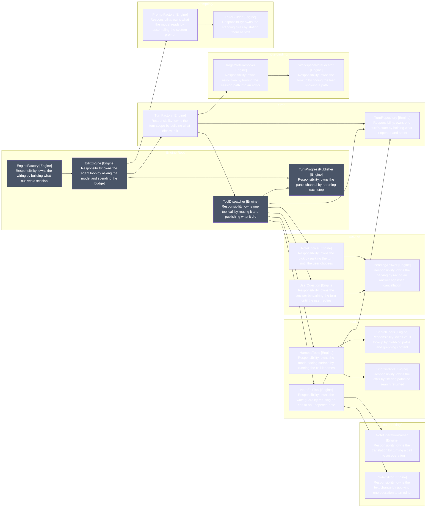
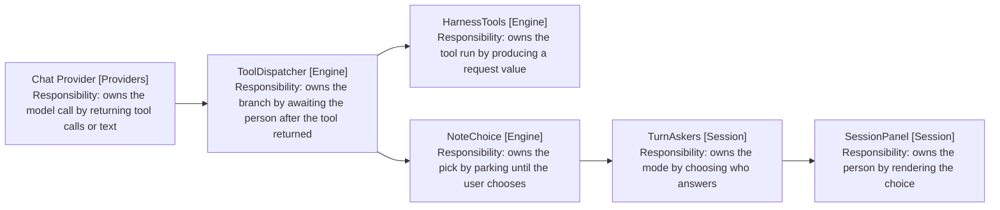

# Diagram: Sub-Package Dependencies

## How the sub-packages depend on each other

Arrows: uses-relationship (client to supplier).

Grey marks the root files that span sub-packages by design.

## What the shape shows

ToolDispatcher (Engine) touches five of the six sub-packages. That is the
dispatcher's job, and it is why the file stays at the root rather than joining
any one group.

Three arrows cross between non-root sub-packages, and two of them start at
NoteEditTool (Engine): it drives note-editing/ to make the change, and reads
TurnRepository (Engine) for its guard. The third is TurnFactory (Engine)
building against note-binding/.

That NoteEditTool sits in tools/ and reaches into note-editing/ is the shape
the split is meant to show. The tool is the surface; the editor is what the
surface drives.

prompting/ has no inbound edge except from EditEngine (Engine). It is the most
separable group in the package.

## The waiting/ boundary

Arrows: uses-relationship (client to supplier).

choose_note is a tool, so HarnessTools (Engine) runs it. That run produces a
ChoiceRequest, not a pick. The pick comes from a person, and NoteChoice
(Engine) waits for one. The chain leaves the engine at TurnAskers (Session), so
the boundary already exists in the code.
