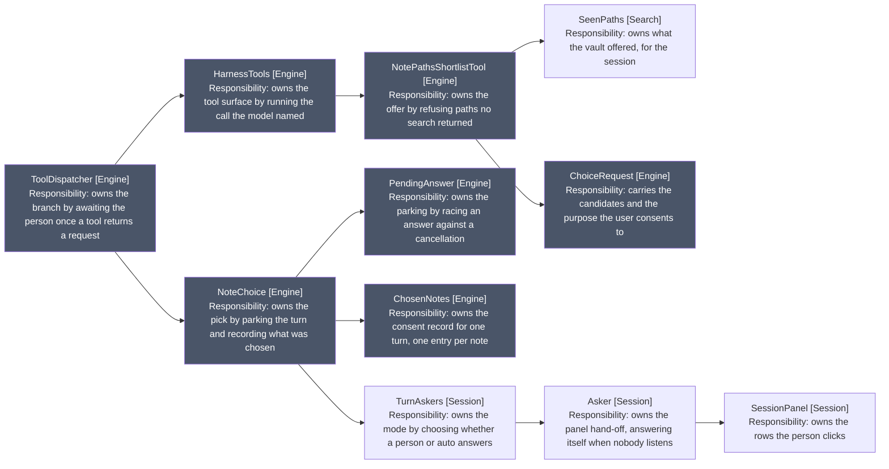
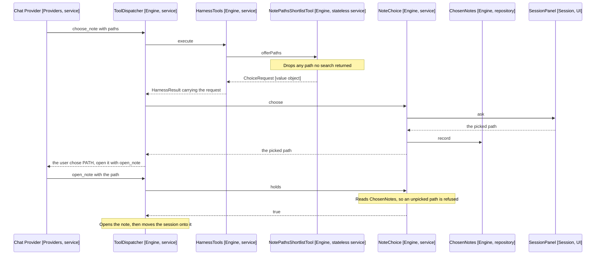

# The Choice Subsystem

How the model offering a note becomes the user picking one, and why that pick is
checked twice before an edit lands.

It answers one question, and never decides it: which note did the user mean. It
carries the model's shortlist to a person and the pick back, recording it as
consent to write.

## The collaborators

Arrows: uses-relationship (client to supplier). Grey marks the engine side. The
chain leaves it at TurnAskers (Session), where the mode is decided.

## One choice, end to end

Blocks, and where the code departs from them:

- Domain services: ToolDispatcher, HarnessTools, NoteChoice and
  NotePathsShortlistTool (Engine). Behaviour belonging to no single object. The
  shortlist tool is all-static, the stateless case stated in the type.
- Repository: ChosenNotes (Engine). A collection-like record of what the user
  consented to, with includes and record as its whole interface.
- Value objects: ChoiceRequest and AnswerRequest (Engine). Plain readonly
  fields, no collaborator, so the panel renders one without reaching back.
- Neither: PendingAnswer (Engine), absent above because it carries no domain
  meaning. It races an answer against a cancellation and is generic over both.

NoteChoice (Engine) bends the service rule: it holds ChosenNotes, and a service
is not supposed to hold the state it operates on. That is what forces it to be
rebuilt per turn. The alternative is for it to return the pick and let
ToolDispatcher (Engine) do the recording, which would leave the consent record
one writer instead of a service that both writes and reads it.

## Why the pick is checked twice

The pick is recorded on the choice and read again on the open, because they are
two model calls with a gap between them. The answer travels as the tool result,
so the model reads which note it may open rather than inferring one from prose.

Without the second check the first would be advice rather than a guard: a model
that skips the choice and opens a path it invented is refused, and the refusal
names the tool it missed.

## The three records, and why they are separate

| Record         | Scope   | Holds                          | Written by                |
| -------------- | ------- | ------------------------------ | ------------------------- |
| SeenPaths      | Session | What a search or read returned | SearchTools, HarnessTools |
| ChosenNotes    | Turn    | What the user picked           | NoteChoice                |
| openedThisTurn | Turn    | What actually opened           | TurnRepository            |

The scopes differ because the facts do. Finding a note is knowledge and does not
expire, so a note found in one turn opens in a later one without searching
again. Consent does expire, so one pick licenses one write rather than every
later edit to that note.

## Never parking forever

Three collaborators guarantee a parked turn always settles, each with its own
fallback. A cancelled choice resolves to null, the value a decline already
produced, so cancellation needed no new handling.

- PendingAnswer (Engine) races the person against the turn's cancellation. This
  is why TurnAskers (Session) builds both askers from one cancellation.
- NoteChoice.automatic (Engine) answers itself in auto mode, picking the first
  candidate. The mode is a choice of collaborator rather than a branch, so every
  refusal above it runs identically in both modes.
- Asker (Session) resolves to its fallback when no panel is subscribed.
