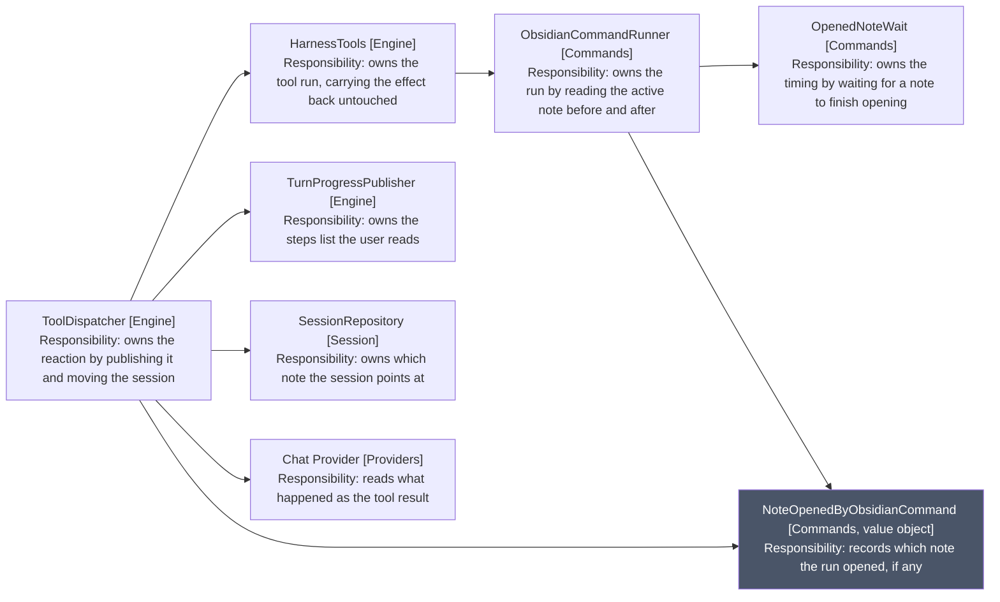
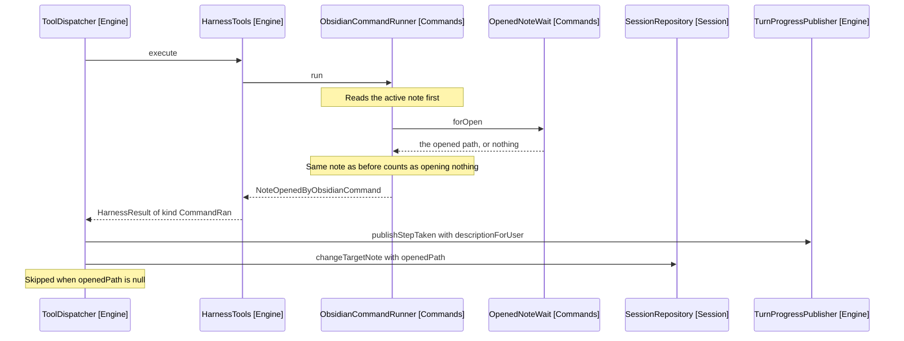

# NoteOpenedByObsidianCommand

What a run of an Obsidian command changed, as far as the harness can tell. It
answers one question: did the note under the session move, and to what.

The class holds two fields, commandName and openedPath, and the path is null
when the command opened nothing. Everything it does is report that fact to a
different audience.

## Where it comes from and goes

Arrows: uses-relationship (client to supplier). Grey marks the value object
every other participant either builds or reads.

## How the path is determined

The runner cannot ask Obsidian which note a command opened. It infers it by
comparing the active note before and after, and the wait is what makes the
after-read meaningful: without it the active file is still the one the user was
on.

Reopening the already-bound note counts as opening nothing, because the binding
does not move.

## One run, end to end

## Two descriptions, two audiences

| Method              | Read by   | Says                                           |
| ------------------- | --------- | ---------------------------------------------- |
| descriptionForUser  | The user  | The command, and the note if the binding moved |
| descriptionForModel | The model | That the session is now editing another note   |

The model needs the fuller text because a silent rebind leaves its next anchor
pointing at the wrong note. The panel line is shorter, because the steps list
has one row per step.

descriptionForModel takes whether the opened note turned out to be editable,
since only the dispatcher can observe that: it resolves the path against the
workspace after the command has run. A note that opened but has no editor yet
is distinct from opening nothing, because a retry still reaches it.

## Why the dispatcher reacts rather than the tool

HarnessTools can run the command; it cannot move the session. Only the
dispatcher holds SessionRepository (Session), so the effect travels back as a
HarnessResult and the dispatcher decides what it means.

This is the same boundary the choice flow uses, described in
[4-choice-subsystem.md](4-choice-subsystem.md): a tool reports what happened,
and the dispatcher owns everything a tool must not touch.

## Why it is named for the note rather than the command

It was CommandEffect, which said an effect occurred without saying which. The
producer is general, since any allow-listed command can run, but the content is
narrow: every field, both factories and all three methods concern which note
opened.

Naming it for the content puts the specific thing first and leaves the command
as the qualifier that distinguishes this route from the open_note tool. Two
alternatives were rejected: CommandResult reads as whether the run succeeded, a
question Attempt already answers upstream, and OpenNoteOutcome collides with
that tool while misdescribing the case where nothing opened.
