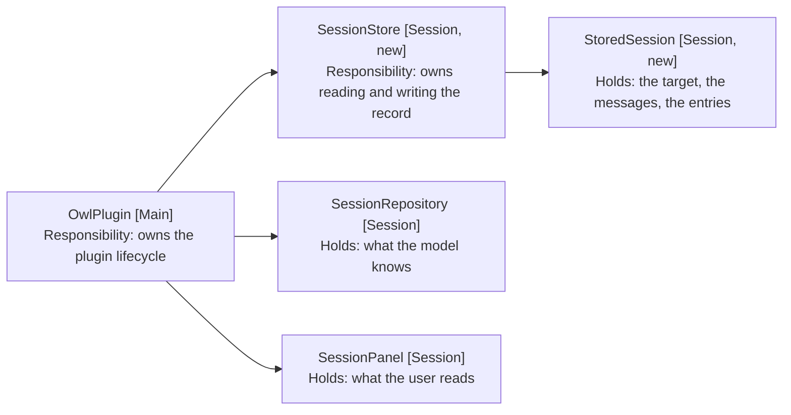
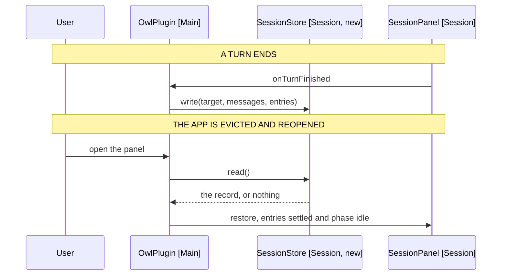

# Session Persistence: Component Design

What is written, who writes it, and when. Delta on
[7-sessions-without-a-note](../7-sessions-without-a-note/3-component-design.md);
unlisted components are unchanged.

## Table of Contents

1. [One Record, Two Stores](#one-record-two-stores)
2. [The Record Is a Value](#the-record-is-a-value)
3. [Who Writes It](#who-writes-it)
4. [Restoring Is a Different Shape from Building](#restoring-is-a-different-shape-from-building)
5. [A Restored Turn Is Never Running](#a-restored-turn-is-never-running)
6. [Behaviour Sequence](#behaviour-sequence)
7. [The File Sits Beside the Settings, Not In Them](#the-file-sits-beside-the-settings-not-in-them)
8. [What a Version Buys](#what-a-version-buys)
9. [Out of Scope](#out-of-scope)

## One Record, Two Stores

The session is already two stores holding plain values. Persistence adds a
repository that reads and writes both as one record, and nothing else moves.



Arrows: uses-relationship (client to supplier).

SessionStore (Session, new) is the only component that knows a session can
outlive the app. Neither store it reads knows it is being written.

## The Record Is a Value

```typescript
// stored-session.ts
// Plain data, because it crosses a file boundary: a class with methods would
// need reviving, and every field here is already a string or a list of them.
export interface StoredSession {
  // Bumped when a field changes meaning. A record from another version is
  // discarded rather than migrated (FR9).
  version: 1
  // Null for an unbound session, which is a session that can still search.
  targetPath: string | null
  messages: StoredMessage[]
  entries: Entry[]
}

// ChatMessage is a class with a private constructor, so the record holds its
// four fields and ChatMessage rebuilds itself from them.
export interface StoredMessage {
  role: ChatRole
  content: string
  toolCalls: { id: string; name: string; args: Record<string, unknown> }[]
  toolCallId: string
}
```

Entry needs no mapping. It is already a discriminated union of plain objects,
which is what makes storing what the user reads cheaper than rebuilding it.

Rebuilding the entries from the chat history was the alternative, and it does
not work: the history holds tool calls and tool results the panel never shows,
and the panel holds steps and refusals the history never carries. They are two
records of one turn, written for two readers.

## Who Writes It

The plugin, once a turn ends. Not the engine, which would have to know its own
conversation is being recorded, and not the panel, which would write on every
render.

| Moment              | Written | Why                                              |
| ------------------- | ------- | ------------------------------------------------ |
| A turn finishes     | Yes     | The session moved, and no turn is in flight      |
| A turn fails        | Yes     | The instruction is in the history and matters    |
| A turn is cancelled | Yes     | What was written before the stop is worth saying |
| Mid-turn            | No      | A half-turn is not a state to restore to (FR3)   |
| The user resets     | Deleted | The replaced session must not come back (FR8)    |

The panel tells the plugin when a turn finishes or fails, through
onTurnFinished and onTurnFailed. It tells it nothing when a turn is cancelled,
by design: the user stopped it and already knows.

Persistence needs all three, so the design must settle whether a cancel gains a
callback of its own or the three collapse into one that says how the turn
ended. The second is smaller and says what the plugin actually wants to know.

## Restoring Is a Different Shape from Building

SessionBuilder (Session) builds a session from a file. Restoring builds one from
a record, so the two differ in what they start from and agree on everything
after.

```typescript
// session-builder.ts, beside build
// The record supplies the target and the history; the file supplies neither,
// because the note a session was on is in the record.
build(file: TFile | null, presence: PanelPresence): SessionPanelProps
restore(stored: StoredSession, presence: PanelPresence): SessionPanelProps
```

The panel takes its entries as a prop it does not have today, defaulting to
empty. That is the whole of the panel's change: a reducer's initial state
becomes a parameter.

## A Restored Turn Is Never Running

A record written mid-turn cannot exist, since FR3 forbids the write. A record
written at a turn's end can still hold a pending entry, because a turn that
failed or was cancelled leaves its shortlist unanswered.

So restoring settles what it loads, using the path AskedEntries (Session)
already has:

| Stored entry       | Restored as                          |
| ------------------ | ------------------------------------ |
| A pending choice   | Settled, saying the turn ended (FR6) |
| A pending question | Settled, its suggestions gone        |
| Any phase          | idle (FR5)                           |

AskedEntries.turnEnded is exactly this transformation, so restoring runs it
rather than restating what settling means.

## Behaviour Sequence



Arrows: uses-relationship (client to supplier).

## The File Sits Beside the Settings, Not In Them

`session.json` in the plugin folder, written through the vault adapter the skill
and instruction repositories already read from. Those two only read; the adapter
also offers write, remove and exists, so the store needs no new mechanism.

Not data.json, for two reasons. A session write and a settings write would race
for one file, and the file holding the API key should not also hold every note
excerpt a turn read (NFR2, FR11).

A session is where the user is, so a synced session would carry a phone's
conversation to a desktop mid-turn. That is a different feature and probably an
unwanted one.

## What a Version Buys

One number, checked on read. A record whose version is not the current one is
deleted and treated as absent (FR9).

The alternative is migrating, which needs a second shape to migrate from. There
is one shape, so a migration would be written for a case that does not exist
yet and could not be tested against a real record.

## Out of Scope

- More than one stored session. Restoring becomes a choice, and a choice needs
  a way to make it.
- Trimming a long session. A session that outgrows a sensible write is worth
  measuring before it is worth solving.
- Syncing. A session is where the user is.
- Resuming an in-flight turn. The request is gone with the WebView, and
  reissuing it is a retry the user can already ask for.
