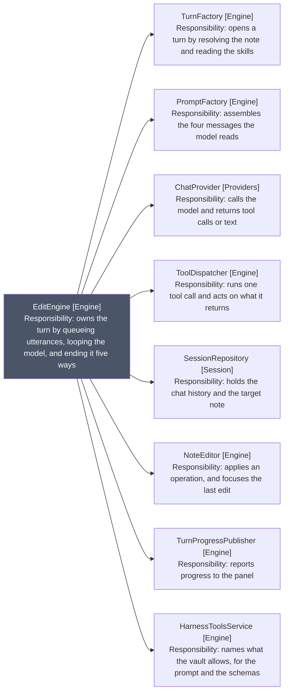
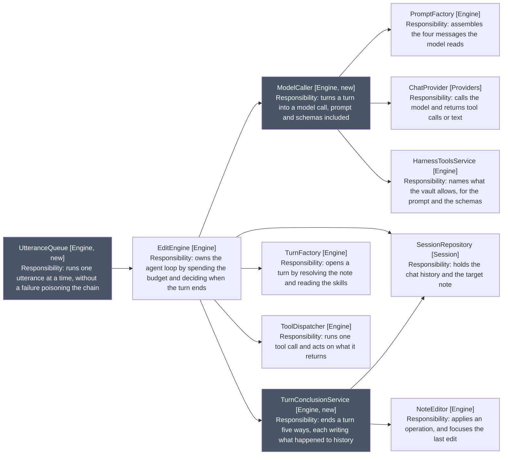

# Before and After

## As is

Arrows: uses-relationship (client to supplier). Grey marks the class carrying
more than one responsibility.

## To be, after all three

Arrows: uses-relationship (client to supplier). Grey marks what the three
extractions add.

EditEngine holds four, and nothing it gains holds more than two. ToolDispatcher
comes off the turn rather than the constructor, so it is drawn but not counted.

The queue sits above rather than beside: it decides when a turn runs, so the
plugin calls it and it calls the engine.

Two collaborators leave EditEngine entirely. NoteEditor is used once, to focus
the last edit when a turn succeeds, which is TurnConclusionService's job after the
move. ChatProvider and HarnessToolsService go to ModelCaller, which is the only place
either is used for prompting.

SessionRepository stays in both, which is the one shared dependency: the
conclusions append to history, and the loop still appends the utterance and each
tool result.
