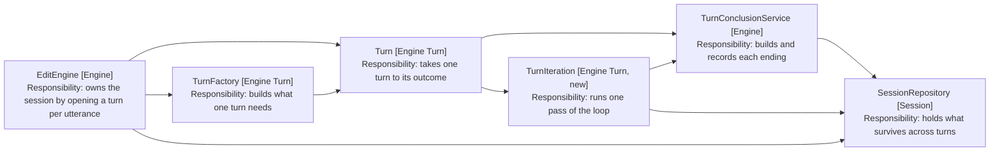
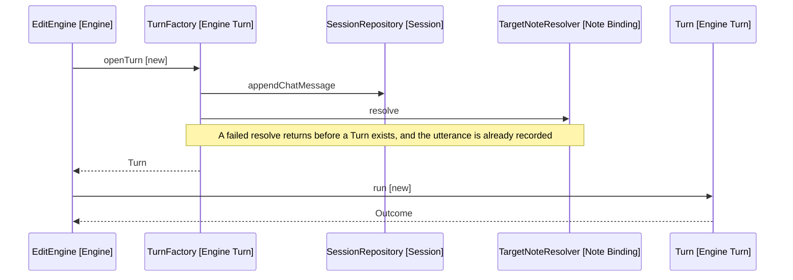

# Design: A Turn That Runs Itself

EditEngine holds the loop that drives a turn, so seven of its nine private
methods take a turn as a parameter. This moves the loop into Turn, which fixes
the chat history split as a side effect.

## The problem

Chat history is written from five places across two classes, and the split
between them is not a boundary anyone chose.

| Write            | Written by            | When                       |
| ---------------- | --------------------- | -------------------------- |
| User utterance   | EditEngine            | Before the turn opens      |
| Model tool calls | EditEngine            | Each iteration             |
| Tool result      | EditEngine            | Each tool call             |
| Model text       | TurnConclusionService | The turn ends on an answer |
| Cancel note      | TurnConclusionService | The user stopped the turn  |

TurnConclusionService does not own recording. It owns one message kind, and only
because that kind arrives last.

Extracting a writer would treat the symptom. The writes are scattered because
the loop lives outside the thing it loops over, and the parameter lists say so:
runIteration, askModel, requestFor, concludeCancelled, concludeUtterance,
executeToolCalls and logIteration all take a turn. EditEngine is a turn written
inside out.

## The proposal

Turn gains run, and takes itself to an outcome. EditEngine keeps what a session
does: queue an utterance, follow the active note, open a turn, run it.

Arrows: uses-relationship (client to supplier).

Four of the five writes land inside the turn without anyone extracting a writer.
The fifth, the utterance, moves into openTurn where the turn begins.
EditEngine drops from 159 lines to roughly 40. Turn exceeds 100 with the loop in
it, which is what TurnIteration is for: ask the model, execute the calls, record
the refusal.

The call-level view, with parameters and the block each class belongs to, is in
[6-design-turn-sequence.md](6-design-turn-sequence.md).

## Where the utterance is recorded

Today EditEngine records the utterance, then opens the turn. The ordering is
deliberate: a turn that fails to open still had something said to it. This moves
the write into openTurn, ahead of the resolve that is the only way opening fails.

The guarantee survives because the record lands in SessionRepository, which is
session-scoped, before anything can fail.

## Running and stopping

Turn ends up with two entry points called from different places. run is awaited
by the utterance that opened the turn. cancel arrives from the panel while run
is still in flight.

That is what the turn already does, spread across two classes: EditEngine.cancelTurn
reaches into runningTurn.cancellationController today. Naming it Turn.cancel
makes the pair visible rather than introducing it.

## What this costs

- TurnFactory grows from six constructor parameters to nine, since everything
  the loop needs must reach the turn it builds. It is already the widest
  constructor in the codebase.
- Every test building an engine builds a turn that runs, so the seams move.
- openTurn takes the utterance text, so no caller can open a turn without saying
  what opened it. Arguably a fix rather than a cost.

## What this does not fix

Two oddities in TurnConclusionService predate the split and survive the move.

- Two methods are static and three are not, so a caller has to know which
  spelling each ending uses.
- unfinished branches on the answer and delegates to cancelled, which is the
  caller's if moved into the service.

Both are worth settling once the loop has moved and the call sites are in one
class.
