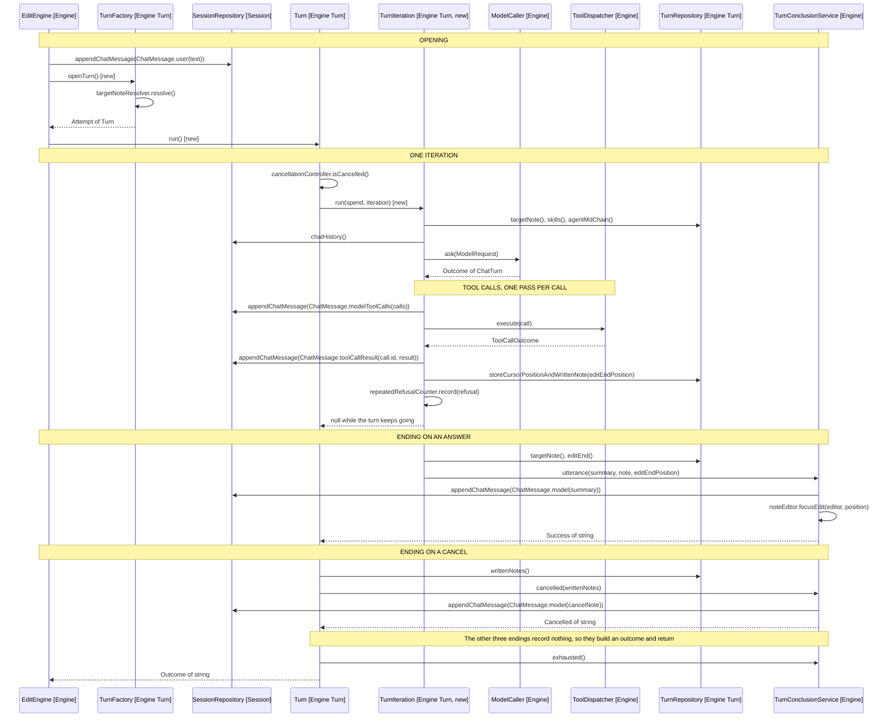

# Design: One Turn, Call by Call

The proposed shape from
[5-design-self-running-turn.md](5-design-self-running-turn.md), with the methods
each collaborator calls, what it passes, and the block each class belongs to.

Arrows: uses-relationship (client to supplier).

Two calls change owner rather than shape. The four appendChatMessage calls that
EditEngine makes today are made by TurnIteration and TurnConclusionService. The
fifth, the utterance, stays with EditEngine, recorded where the text arrives and
before openTurn runs: see
[5-design-self-running-turn.md](5-design-self-running-turn.md#moved-back-after-the-fact).

## What each class is

Blocks are the categories in [2-what-maps.md](2-what-maps.md) and
[3-what-does-not.md](3-what-does-not.md). The loop moves between classes; no
class changes what kind of thing it is.

| Class                 | Block        | Holds                                   |
| --------------------- | ------------ | --------------------------------------- |
| EditEngine            | Controller   | Collaborators, the running turn         |
| TurnFactory           | Service      | Collaborators, one session-scoped Set   |
| Turn                  | Service      | Collaborators only                      |
| TurnIteration         | Service, new | Collaborators only                      |
| TurnConclusionService | Service      | Collaborators only                      |
| ModelCaller           | Service      | Collaborators only                      |
| ToolDispatcher        | Service      | Collaborators only                      |
| SessionRepository     | Repository   | The target path and the chat history    |
| TurnRepository        | Repository   | What one turn opened, wrote and settled |
| TurnSpend             | Entity       | This turn's two counters                |
| ChatMessage           | Value object | One message, immutable                  |
| ModelRequest          | Value object | The five arguments of one model call    |
| Outcome               | Value object | A success, failure or cancellation      |

Turn stays a service, which is the point worth stating. It gains a loop but no
field it mutates: the spend it drives lives in TurnSpend, and the flag the
cancel flips lives in TurnCancellationController. A class holding only
collaborators is a service however much it does.

TurnIteration is the same shape. It is built per pass, so it holds the spend and
the turn it runs against, and mutates neither.
