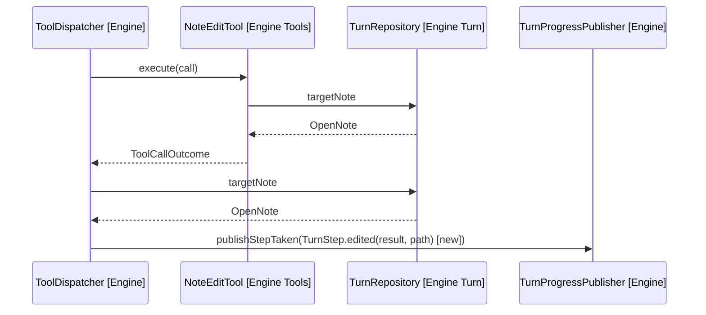
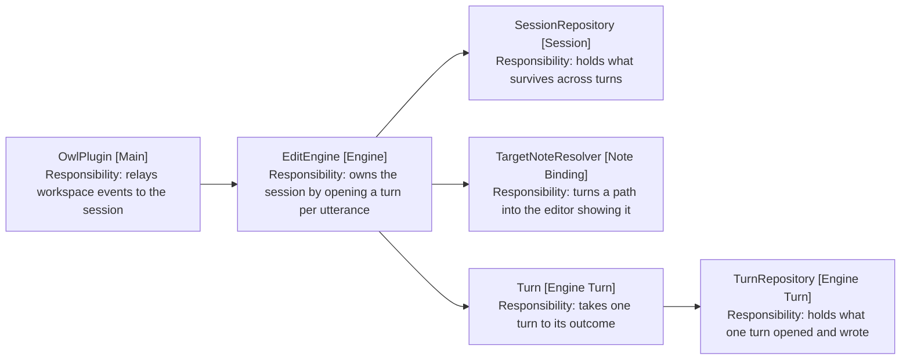

# Design

The edit step names its note, mayEdit goes, and the running turn follows the
note the user opens.

## The edit step names its note

ToolCallOutcome carries the position an edit ended at, not the note it landed
on. The dispatcher publishes the step, and the turn knows its own target, so the
name is available where the step is built.

Arrows: uses-relationship (client to supplier).

A refused edit keeps today's step, since the refusal text already names what
went wrong.

## The fields that go

| Field                | Was                                    | Now  |
| -------------------- | -------------------------------------- | ---- |
| noteTheTurnStartedOn | Permitted the note the turn started on | Gone |
| reachedOut           | Withdrew that permission after a search | Gone |
| openedThisTurn       | Permitted notes opened this turn        | Gone |

mayEdit goes with them, and NoteEditTool edits the target it already reads. The
unwritable-note check stays: a target that would not resolve is a different
fact, set when a command moves the session somewhere this turn cannot follow.

searchRan goes too, along with its two callers in SearchToolsService and the
method on TurnState, whose comment repeats the rationale being removed.

recordOpen stays. It spends the turn's one open and is a different method from
recordOpened, which fed the set and goes with it.

## The running turn follows the user

followActiveNote moves the session target and tells the panel. The running turn
hears nothing, so a note the user opens mid-turn is not the note the next edit
lands on.

Arrows: uses-relationship (client to supplier).

EditEngine holds the running turn already, for cancellation. Retargeting it is
the same reach: resolve the path, and hand the turn the resolved note through
retargetTo.

Resolving needs a collaborator EditEngine does not hold. TargetNoteResolver is
built in EngineFactory and passed to TurnFactory today, so it is injected into
EditEngine as well, which changes both wiring sites.

A resolve that fails leaves the turn on the note it had, which is what a command
opening an unfollowable note already does through cannotWriteTo.

## Why no permission check survives

Only the target is editable, and the target moves only through a consented open
or a command. There is no second note to choose between, so a permission check
has nothing to decide.

An edit made after a choice but before the open lands on the target, which is
the correct outcome rather than a tolerated one. Consent names a note the model
may open; it does not move the target, and until the open runs the turn is still
on the note the user has in front of them. Editing that note is what an edit
means.

What was missing is that the user could not see it. The step now names the note,
so a choice of one note followed by an edit to another reads as what it is: an
open the model did not run.
