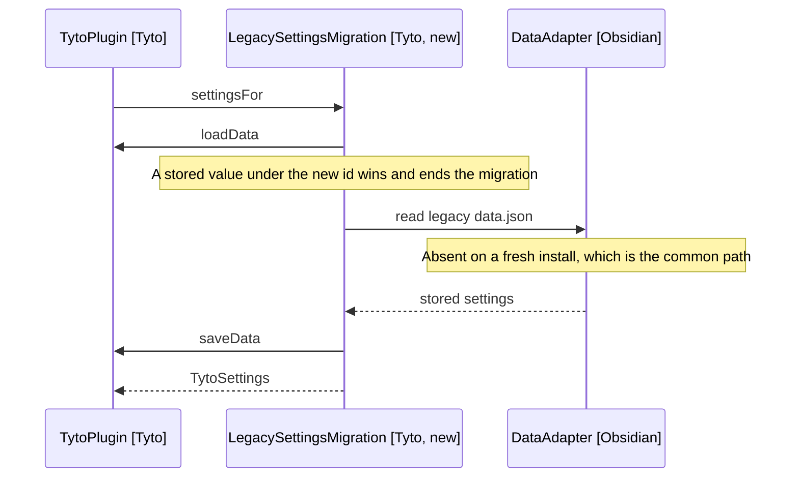

# The Rename to Tyto, and Its Migration

Owl becomes Tyto, the genus the barn owls sit in. This is a full rename: the
id, the display name, the user-visible strings, the identifiers, and the CSS
prefix. Doing it before the listing means users meet one name; doing it after
means a rebrand in public.

## The Manifest

```json
{
  "id": "tyto",
  "name": "Tyto"
}
```

The id clears the directory's rule, which is what forced the rename. `tyto` is
also far less likely to be taken than `owl`, so the open question about id
availability closes with it.

## What Carries the Old Name

Five groups, in descending order of risk.

| Group                | Count | Risk                                                        |
| -------------------- | ----- | ----------------------------------------------------------- |
| Plugin id and folder | 1     | Orphans stored settings, see below                          |
| View type constant   | 1     | Orphans a leaf in a saved workspace, see below              |
| User-visible strings | 5     | None beyond the wording                                     |
| Identifiers          | 4     | None, mechanical                                            |
| CSS classes          | 68    | None, mechanical, but src and styles.css must move together |

The five user-visible strings were the ribbon tooltip, the view's display text,
the transcript heading, the background-recording notice, and an aria-label in
the settings panel that the settings rewrite removes anyway.

Identifiers: OwlPlugin, OwlSettings, OwlSettingsTab and DEFAULT_SETTINGS' type
became Tyto-prefixed.

This part has shipped. What remains of the rename is the settings migration
below, and the prose sweep that commit 9 owns.

The system prompt carries no occurrence of the name, so the prompt fixture at
src/model/prompt/tests/fixtures/release-3-prompt.txt stayed green. The rename
could not change what the model does.

## Two Stateful Renames

The id and the view type are the only two that strand something a user already
has. Everything else is text.

The plugin folder in a vault is named after the id, so an existing install ends
up with a stale `obsidian-owl` folder beside the new `tyto` one. Obsidian lists
both, the old one now broken. The installer removes the old folder when it
finds one.

The view type `owl-session` is written into the saved workspace layout. Renamed
to `tyto-session`, Obsidian finds no view for the old type and drops the leaf.
The user loses a sidebar panel position, not a session: the session lives in
the plugin folder and is restored on the next start. Accept it rather than
migrate it, because a workspace migration reaches into a file Obsidian owns.

## Other Places

The install script reads the id from the manifest rather than hardcoding it, so
it needs no change. docs/CONTRIBUTING.md names the folder in prose and does.

48 files under docs, plus README.md and AGENTS.md, mention Owl. Prose only, and
no reader is blocked by a stale name, so they are swept once at the end rather
than commit by commit.

The repository name stays `obsidian-owl`. Only the manifest id is constrained,
and renaming the repo breaks every existing link for no gain.

## Why a Migration Is Needed

Obsidian keys `loadData` and `saveData` off the plugin folder, so the rename
starts the new id with no data. The old settings sit at
`<vault>/.obsidian/plugins/obsidian-owl/data.json`, which the Vault API cannot
reach but the adapter can.

## The Migration

Runs once, at load, before the settings are read.



Arrows: uses-relationship (client to supplier).

LegacySettingsMigration (Tyto, new) lives in settings/, beside the settings it
migrates. It reads the legacy path through the adapter, writes through the
plugin's own `saveData`, and returns the settings either way.

Rules it follows.

- Data under the new id wins. A user who has already configured the renamed
  plugin is never overwritten by a stale legacy file.
- A missing or unparseable legacy file yields the defaults, silently. This is
  the fresh-install path and it must not log or notify.
- The legacy file is left in place. Deleting a user's only copy of an API key
  on a guess is worse than leaving a stale file behind, and the installer
  handles the folder.

The stored session is not migrated. It lives in the plugin folder under a
version stamp, a session is a transient thing, and losing one costs a
conversation rather than a setting.
