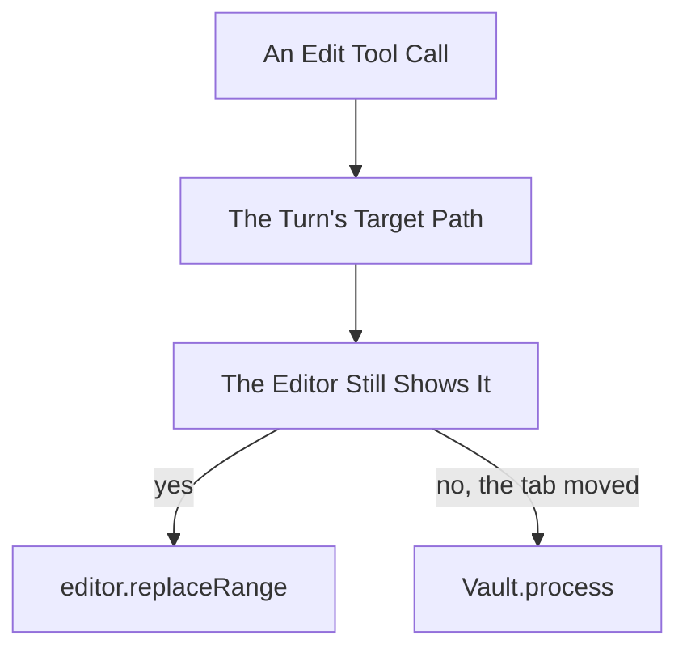

# Design

## Goal

Reach a note by its path rather than through a handle that moves, and make the
note a turn is writing to the thing the panel says about that turn.

## Behaviour Change

| Concern                   | Today                                 | New                                                  |
| ------------------------- | ------------------------------------- | ---------------------------------------------------- |
| A write                   | Through the editor the turn resolved  | The editor while it shows the target, else the vault |
| A read of the turn's note | vault.cachedRead, the file            | The editor the turn holds                            |
| A read of any other note  | vault.cachedRead                      | Unchanged                                            |
| grep_notes                | vault.cachedRead                      | Unchanged, per D2                                    |
| The note in the header    | The session's, always                 | Gone                                                 |
| A turn in the entry list  | Entries between two user entries      | One entry holding its own                            |
| A turn's target           | Nowhere                               | On the turn, from its first step                     |
| The whole-note guard      | The held editor, wrong on a moved tab | The target, wherever a write would go                |
| The cursor at turn end    | The held editor, wrong on a moved tab | Skipped once the tab has moved                       |
| The note context message  | The held editor, wrong on a moved tab | The target, so the model is never shown another note |

## Where A Write Lands



Arrows: data flow (direction data moves).

TargetNoteWriter (note-editing, new) holds the comparison, and NoteEditor stops
writing: plan works the new content out from the note as text, and the writer
sends it through the editor or the vault. The editor branch is what happens
today, so undo and the cursor are unchanged in the case that is almost always
true. The vault branch skips the cursor, since a user whose tab moved is not
watching that note.

Vault.process is async, so a write is. NoteEditTool already ran inside an async
method, so only applyOperation gains an await.

Three more reads of the held editor move to the writer, all the same defect in
another form. The whole-note guard compares the model's read against the note,
focusEdit scrolls to the last edit at the end of a turn, and the note context
message re-reads the note on every model call. On a moved tab each was reaching
the note the tab moved to.

The note context is the one the model sees. It states a path and then the
content under it, so a moved tab showed the model another note's content labelled
as the target, and the model said the open note was not the one it had asked for.
ModelRequest holds the note as NoteDetails read through the writer rather than an
OpenNote whose editor it reaches through, so PromptFactory cannot read a stale
handle even by accident. TargetNoteWriter.getDetails builds it, and
OpenNote.details goes, so nothing else can pair a path with content from
somewhere else.

The message said the note was re-read from the editor, which the vault branch
makes untrue. It now says re-read for this message, which is the claim that
earns the supersedes line either way.

ModelService.requestForModel becomes async, since the read is. It takes the
writer TurnRunnerFactory already holds rather than building a second one.

An Editor does not name the file it shows, so the comparison asks the locator:
WorkspaceNoteLocator.locate(path) returns the editor of the leaf showing that
path now, and the branch takes the editor when that is the handle the turn
holds. A different handle, or none, means the tab moved.

## Where A Read Comes From

NoteReader keeps reading files and gains no collaborator. The branch belongs
where the read is dispatched, since that is what holds the turn.

HarnessToolsService.readNote takes a TurnState already, but that interface
carries three repositories and no target note, so it widens by one method:
targetNote, which TurnRepository already answers. readNote then reads through
TargetNoteWriter where the path matches, and calls NoteReader otherwise. The
writer is what already knows whether the tab still shows the target, so the read
and the write cannot disagree about it.

```text
read_note for path P
  P is the turn's target and its editor still shows P
    answer from the editor
  otherwise
    answer from NoteReader, as today
```

That is the same comparison the write makes. A turn whose editor moved reads the
file, which is stale rather than wrong, and its writes take the vault branch
anyway.

## A Turn As A Container

PanelEntry gains a turn kind holding the utterance, the target and the entries
that belong to it. The eleven existing kinds stay as they are and become what a
turn holds rather than what sits beside one.

- PanelReducer appends to the open turn rather than to the list, so openStepsAt
  goes: there is no scanning back to the last user entry. withStep stays, and
  appends into the turn.
- PanelItem is what the panel holds at the top level: a turn, or an entry
  belonging to none. PanelState gains flattened and mapEntries so a reader that
  does not care about grouping is unchanged.
- The turn holds its utterance as the first of its entries, so the eleven kinds
  render exactly as they did. HistoryTurn (session/views, new) draws the target
  and delegates each entry to HistoryEntry.
- PanelReducer moves out of panel-state.ts, which was already over the size
  limit and would have doubled.
- The turn opens on the transcript action, which is where a user entry is
  appended today, and takes the session's target then, per D5.
- A retarget entry still belongs to no turn and stays a sibling, which is what
  archived spec 32 settled.
- TranscriptTurn.split reads turns rather than inferring them. before() stays,
  since entries preceding the first turn are still siblings.

SESSION_SNAPSHOT_VERSION moves. A record written by the flat shape is discarded
rather than migrated, which is what session-file-store.ts:22 already does on a
version mismatch.

## The Panel

PanelHeader loses name and path and keeps Copy and Reset. The header becomes a
toolbar.

useTargetNote stays, narrowed to the path. It is what reads the session's note
off the workspace, which is the target a turn opens with under D5, so removing
it would leave the reducer with nothing to start a turn on.

The turn renders its target first, since D4 asks for it to be the most prominent
thing about a turn. The target changes when a tool opens a note, and that change
is the one worth seeing, so the turn shows the note it is on now rather than a
history of what it has been.

The retargets channel carries the path and byUser. A turn's target is a
different fact, starting as the session's note and moving only by a tool, so it
takes its own action rather than a channel carrying the user's moves too.

## Unit Tests

In [6-unit-tests.md](6-unit-tests.md), broken out to keep this file under the
limit.

## Out Of Scope

- Migrating a stored session to the turn shape. The version discards it, which
  is what archived spec 22 built the version for.
- Whether a vault write reaches the editor's undo stack. It decides how loudly
  the fallback announces itself, which is a panel question once the fact is
  known.

## References

- [2-rules.md](2-rules.md) - the two rules every change here serves
- [4-decisions.md](4-decisions.md) - D1 on reads, D2 on grep, D3 on writes
- [4-decisions-showing.md](4-decisions-showing.md) - D4, D5 and D6 on the panel
- src/engine/note-editing/target-note-writer.ts - where a write lands, and the comparison behind it
- src/engine/note-editing/note-editor.ts - plan and focusEdit, which now work the edit out rather than writing it
- src/engine/note-binding/workspace-note-locator.ts - findEditor, which reads the leaf rather than the file
- src/engine/tools/harness-tools-service.ts - readNote, which takes the turn already
- src/session/models/panel-state.ts - the shape: the eleven kinds, the turn, and PanelItem
- src/session/models/panel-reducer.ts - the reducer, which opens a turn and appends into it
- src/session/transcript/models/transcript-turn.ts - before and split, one of which stays
