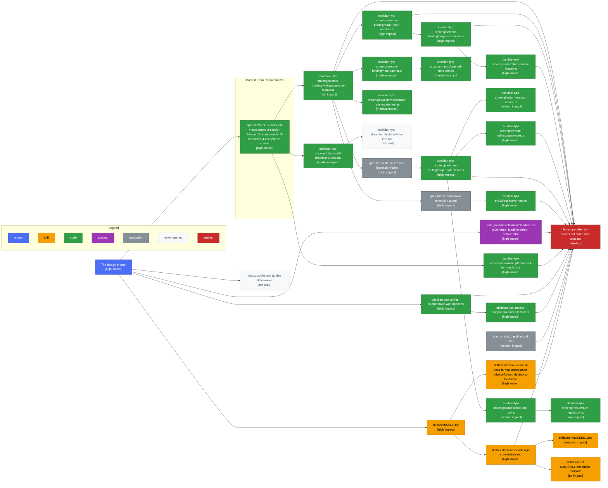

# Design Phase Context

What the design phase read, and what each source decided. The phase produced
[5-design-deferred-leaves.md](../5-design-deferred-leaves.md) and
[6-unit-tests.md](../6-unit-tests.md), settled D3, added D7, and cut a check
from the acceptance criteria. Conventions are in [1-index.md](1-index.md).

Cost: 36,586 estimated tokens. By category, code 22,550, skill 10,934, command
2,272, navigation 828, state 4. By impact, high 19,447, medium 9,021, low 4,014,
no 4,104. The split is in [4-context-budget.md](4-context-budget.md).

## Discovery Path

Arrows: discovery path, source pointed me at the target.

## Per Source

| Source                        | Impact    | What it decided                                                                      |
| ----------------------------- | --------- | ------------------------------------------------------------------------------------ |
| The design prompt             | high      | Named the five verifiable claims, which is what made the phase checking rather than searching |
| The spec, four files          | high      | The five settled decisions the design implements, and D3 as the one to close          |
| sdd SKILL.md                  | high      | The file set, the numbering, and that the unit plan breaks out past 120 lines         |
| design-conventions.md         | high      | The section order, and the one-diagram rule the sequence follows                      |
| The three sdd format files    | high      | The test-outline shape, the AC revisit step, and the D7 entry's shape                 |
| workspace-note-locator.ts     | high      | The unchecked cast, and the two-case message that D7 turns on                         |
| target-resolution.ts          | high      | That ResolutionFailed is a class with three members, so narrowing beats deleting      |
| target-note-resolver.ts       | high      | That resolveFor is already async, which is half of D3                                 |
| turn-runner-factory.ts        | high      | The refusal site, confirmed at turn/turn-runner-factory.ts:75 rather than the prompt's path |
| open-note.ts                  | high      | The non-null Editor, which is the type change the whole of D5 rests on                |
| target-note-writer.ts         | high      | That tabShowsPath has two callers, and that the vault write guards only on stat       |
| grep for the markdown guard   | high      | That the locator holds the only extension check in the write path. This produced D7   |
| active-note.ts                | high      | That binding already filters non-markdown, so D7 is a belt rather than the only guard |
| obsidian.d.ts                 | high      | loadIfDeferred returns a promise, and activeEditor's editor is optional               |
| fake-workspace.ts             | high      | The three additions the test plan opens with                                          |
| fake-note-locator.ts          | high      | That the fake extends the real locator, so the signature ripples into test-support     |
| transcript-turn-section.ts    | high      | The unbounded slice, and that bounding it at both ends is the fix                     |
| grep for locate callers       | high      | Two production callers, which is the whole ripple D3 weighed                          |
| mermaid SKILL.md              | medium    | The no-theme rule, the legend line, and keeping predicates out of alt labels          |
| 6-reaching-a-note.md          | medium    | That a path becomes writable through an editor, which the nullable editor bends        |
| note-opener.ts                | medium    | That its read is on file rather than editor, so the fix there is the cast alone       |
| opened-note-wait.ts           | medium    | That it polls a mounting leaf, which is why it stays synchronous                      |
| turn-ending-service.ts        | medium    | The one focusEdit call site, and that it already guards on a null note                |
| note-edit-tool.ts             | medium    | That the tool reads only note.path, so the nullable editor needs no branch there       |
| workspace-note-locator.test.ts| medium    | The existing .base coverage the plan keeps and tightens                               |
| bun run test                  | medium    | 1343 green before and after, which is what says no code moved                         |
| turn-repository.ts            | low       | That targetNote reads through resolvedNote, confirming no change there                |
| context-audit skill, template | no        | This file's shape. No effect on the design                                            |
| defer-views guide             | not read  | Its content reached the design through the requirements, which already quoted it       |
| 4-the-turn.md                 | not read  | Pointed at by the requirements. Nothing in the design moved a turn boundary            |

## Shape Notes

- The locator is the hub: eight edges out of it, because every other site is
  either its caller, its twin, or its test. A design that starts at the reported
  failure gets this shape for free.
- The longest chain is four hops and it is the one that produced D7: locator, the
  extension grep, active-note.ts, then the writer's stat guard. Nothing pointed
  at that chain. It came from asking what the second branch of a message was for.
- Two greps did the work of a search. Both were cheap, both were high impact, and
  between them they bounded the change: two callers, one extension check.
- Two dead ends, both by design. The defer-views guide and 4-the-turn.md were
  pointed at by the requirements and never opened, because the requirements had
  already extracted the one line each contributed.
- test-support has no inbound edge from the production code. It arrived from the
  prompt, which named FakeWorkspace directly. Without that line it would have
  been found late, when the test plan was already written against a fake that
  cannot express the state.
