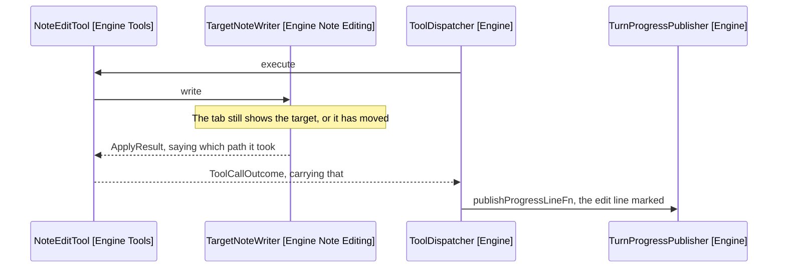

# Design: The Direct Write

How the panel says a write took the vault path. What a turn names is in
[6-design.md](6-design.md).

## Where It Comes From

The writer decides the path, the dispatcher owns the publisher, so the result
travels back rather than the writer reaching forward.



Arrows: uses-relationship (client to supplier).

ApplyResult gains the path it took on its applied state, so nothing new crosses
the boundary and the writer keeps its three collaborators.

ToolCallOutcome.edited takes it too. The outcome is built through factories that
set paired fields together, so the path travels as an argument rather than as a
field a call site could set on its own.

recordEdit publishes one line rather than a line and a warning. It reads the
turn's target already, so marking the line costs it nothing.

The step budget keeps its channel to itself. runningLowFn stays as it is, since
a direct write no longer reaches it.

## What The Line Says

A field on the line rather than a sentence beside the list, so the mark sits
with the edit that earned it.

```text
Edit applied directly. Undo not available - because editor moved to another note
1 - Journal/Weekly/Week-38/shopping-list.md
```

Only the warning is coloured. The label, the detail and the path read as they do
on every other line, so the one part needing attention is the one part that gets
it, and the path sits on its own line rather than wrapping into the text beside
it.

The note is named whatever the turn's target is, which is the one place D2's
rule bends. A line that merely read the target stays quiet; an edit the editor
cannot take back names where it landed, because that is where the user has to
go to undo it by hand.

The transcript marks the same line in words, since a document read away from the
panel has no colour to carry it:

```text
- Edit - applied - shopping-list.md - written directly, undo not available
```

Worded for undo being lost, per the assumption in
[4-decisions.md](4-decisions.md). If the probe shows undo survives, the warning
goes and "directly" stays: the cursor is still not where the user left it.

## Why Not A Warning Entry

A warning entry below the list was built first and tried in a real vault. It
named neither the edit it belonged to nor the note it reached, and two edits
produced the same sentence twice. D3 in [4-decisions.md](4-decisions.md) carries
the comparison.
