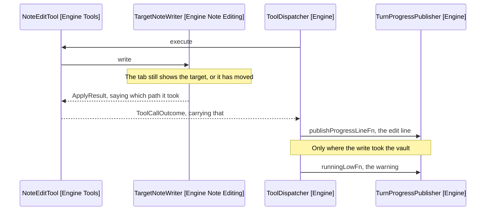

# Design: The Warning

How the panel says a write took the vault path. What a turn names is in
[6-design.md](6-design.md).

## Where It Comes From

The writer decides the path, the dispatcher owns the publisher, so the result
travels back rather than the writer reaching forward.



Arrows: uses-relationship (client to supplier).

ApplyResult gains the path it took on its applied state, so nothing new crosses
the boundary and the writer keeps its three collaborators.

ToolCallOutcome.edited takes it too. The outcome is built through factories that
set paired fields together, so the path travels as an argument rather than as a
field a call site could set on its own.

recordEdit publishes both. It reads the turn's target already, so the warning
costs it one branch.

The channel is the step budget's. A warning lands in the open turn, which is
where this belongs: the turn wrote the note, and the turn is what the user is
reading. runningLowFn is named for its first caller rather than what it does, so
it becomes warnedFn.

## What It Says

The note, and that the editor cannot undo the edit:

```text
Wrote shopping-list.md directly, since its tab moved. Editor undo will not
reverse this change.
```

Worded for undo being lost, per the assumption in
[4-decisions.md](4-decisions.md). If the probe shows undo survives, the second
sentence goes and the first stays: the cursor is still not where the user left
it.
