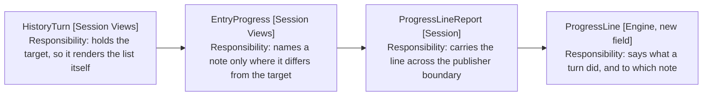

# Design

## Goal

Say what a turn touched, and stop saying what it did not. A note is narrated
only where it differs from the turn's target, or where a write took a path the
user cannot undo.

## Behaviour Change

| Concern                        | Today                                 | New                                  |
| ------------------------------ | ------------------------------------- | ------------------------------------ |
| The user opens a note mid-turn | A line per move, at the turn's end    | Nothing                              |
| The retargeted entry kind      | Eleven kinds, one of them this        | Gone, leaving ten                    |
| A progress line's note         | Baked into the detail text, or absent | A field, shown only where it differs |
| A write through the editor     | An edit line                          | Unchanged                            |
| A write through the vault      | The same edit line                    | The edit line, and a warning         |

## What A Progress Line Names

A line gains a note field, and the detail stops carrying the path: one fact in
one place rather than free text a reader compares by eye.

Arrows: uses-relationship (client to supplier).

The comparison is the view's, not the line's. A line is built where the work
happened and knows only its own note; whether that differs from the turn's
target is a fact about the turn. It also keeps a restored session showing what
it showed before, rather than recomputing against a target that has since moved.

Only the turn holds that target, so HistoryTurn renders the progress entry
rather than routing it through HistoryEntry. HistoryEntry keeps the other nine
kinds and gains no parameter: threading a target through it would hand every
kind a fact one of them needs.

Three factories carry a path today and keep it as the field: read, opened and
edited. The rest pass none, since a glob asks about names and a date resolve
about a calendar, so neither has a note to differ from.

## What The Panel Stops Saying

The retargeted entry kind goes, and with it RetargetedText, the retargeted
action, the entry weight row, the CSS class and the transcript line. Ten kinds
remain.

The retargets channel stays. The panel still has to know the session's note
changed, because that is the target the next turn opens with, and useTargetNote
is its one reader. What goes is the dispatch beside it: useEngineEvents forwards
a tool's move to the open turn and drops the user's.

byUser is then read by nothing, and stays anyway. The engine has two callers to
tell apart, and a channel that cannot say which is worse than a flag nobody
branches on.

## Where The Warning Comes From

In [6-design-the-warning.md](6-design-the-warning.md): the result that carries
the path taken, where it is published, and what the line says.

## Unit Tests

In [7-unit-tests.md](7-unit-tests.md), broken out to keep this file under the
limit.

## Out Of Scope

- Migrating a stored session that holds a retargeted entry. The version already
  discards a record of the wrong shape, and removing a kind changes the shape.
- Saying where the next turn will start. The panel records where edits landed,
  per D4 of
  [reaching-a-note-by-path](../../3-archived/2026-09-16b-reaching-a-note-by-path/4-decisions-showing.md).

## References

- [4-decisions.md](4-decisions.md) - D1 on what stops showing, D2 on which lines name a note, D3 on the warning
- [architecture/12-the-panel-vocabulary.md](../../../architecture/12-the-panel-vocabulary.md) - the entry kinds this removes one of
- [3-requirements.md](3-requirements.md) - the files each change starts in, with a brief each
