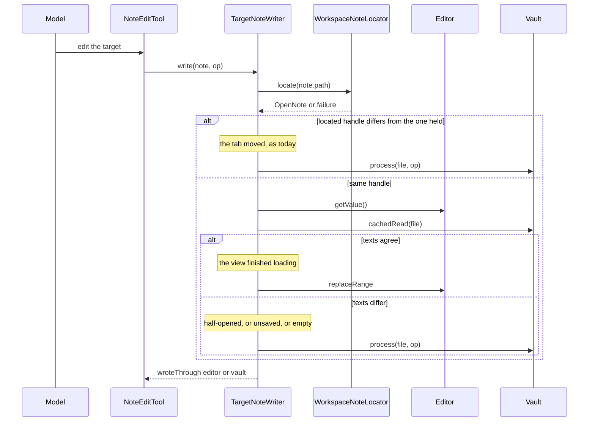

# Design: The Half-Opened Note

Stop a turn reading one note's body under another note's path. The editor handle
is trusted only where its text matches the file at the path its view reports,
and the read falls back to the vault where it does not (D1).

- [2-the-check.md](2-the-check.md) - where the comparison sits, and why focus asks a cheaper question
- [3-testing-it.md](3-testing-it.md) - how a test reaches a half-opened view, and what no test can prove
- [4-rollout.md](4-rollout.md) - out of scope, the order it lands in, and every site it touches

## What the Code Says

Three claims the spec makes, checked against the tree today.

| Claim                                              | Holds | What the design does with it                     |
| -------------------------------------------------- | ----- | ------------------------------------------------- |
| write, read and focusEdit all consult tabStillShows | Yes   | One place to change, at target-note-writer.ts:56  |
| ProgressLine carries wroteDirect                    | Yes   | Reuse it; only the panel wording names a cause    |
| OpenedNoteWait.hasEditor settles on path + editor   | Yes   | Left alone: D1 guards the use, not the capture    |

Two refinements the spec does not record.

- The transcript already names no cause: transcript-entry-lines.ts:41 writes
  `written directly, undo not available`. Only EntryProgress.tsx:37 names the
  moved tab, so D2 costs one line of JSX rather than two wordings.
- focusEdit (TargetNoteWriter) is synchronous, and a text comparison is not.
  [2-the-check.md](2-the-check.md) settles that.

## Behaviour Change

| Concern                             | Today                                   | After                                                    |
| ----------------------------------- | --------------------------------------- | -------------------------------------------------------- |
| Trust test                          | Handle identity against the locator     | Handle identity, then editor text against the file       |
| Read of a half-opened view          | Returns the previous note's body        | Returns the file at the path                             |
| Write to a half-opened view         | Overwrites the previous note through it | Goes to the vault, marked wroteDirect                    |
| Read of an editor with unsaved text | Returns the typed text                  | Returns the typed text, until the two-second save window |
| Read of an empty note               | Returns the empty editor                | Returns the vault, same empty string                     |
| Vault reads per turn step           | One, only after a tab moved             | One per trust test, on every read and write              |
| Panel wording on a direct write     | Names a moved tab as the cause          | Names no cause (D2)                                      |

The cost of the two states the check cannot separate is in
[6-what-obsidian-tells-us.md](../6-what-obsidian-tells-us.md): both reach the
right content the slower way.

## Behaviour Sequence

No feature flag: the plugin has no gate registry, so the change lands whole.

## Unit Tests

See [8-unit-tests.md](../8-unit-tests.md).
