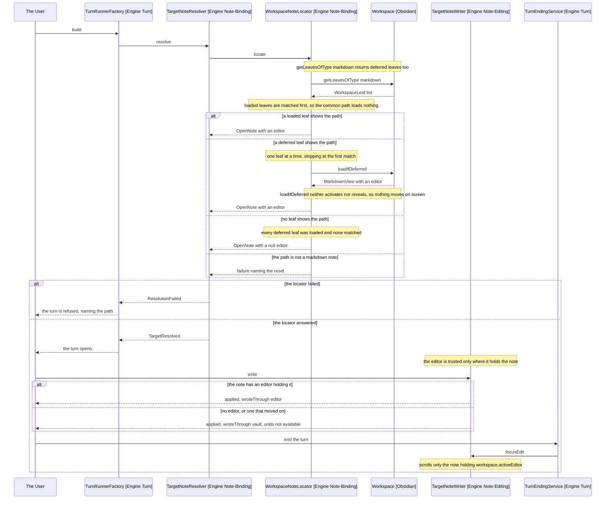

# Design: Deferred Leaves

## Goal

Load a deferred leaf before reading its view, so a note sitting in a background
tab still resolves to its editor. Stop refusing the turn when nothing resolves,
narrow the turn-end scroll to the note in front, and give a turn with no steps
its own setup lines.

## Feature flag

None. This repo has no feature gates and no flag registry, so the Feature flag
and Gating sections the design conventions mandate have no content here. Every
change below lands unconditionally, guarded by minAppVersion rather than a flag.

## Behaviour change

| Concern                             | Today                                                   | New                                                          |
| ----------------------------------- | ------------------------------------------------------- | ------------------------------------------------------------ |
| Leaf whose view is deferred         | Read as a MarkdownView, so it has no file and no editor | Loaded in place, then read, so it has both                   |
| Search across leaves                | One pass over every leaf, matching on `view.file.path`  | Loaded leaves first, then deferred ones loaded until a match |
| `WorkspaceNoteLocator.locate`       | Synchronous, returns `Attempt<OpenNote>`                | Async, returns `Promise<Attempt<OpenNote>>`                  |
| `WorkspaceNoteLocator.saveOpenNote` | Saves nothing when the leaf is deferred                 | Loads the leaf, so the flush reaches the view that holds it  |
| Target with no leaf anywhere        | `ResolutionFailed`, and the turn is refused             | `TargetResolved` with a note carrying no editor              |
| Target that is not markdown         | `ResolutionFailed`, and the turn is refused             | Unchanged: still `ResolutionFailed`, still refused           |
| `TargetResolution` states           | Three                                                   | Three, with the failure narrowed to the unrecoverable case   |
| Write to a note with no leaf        | Never reached, the turn was refused                     | `vault.process`, reported `wroteThrough: 'vault'`            |
| Panel on such a write               | Nothing, no turn ran                                    | "Undo not available", as any vault write already reports     |
| Turn end scroll                     | Scrolls any note whose tab shows the path               | Scrolls only when the note holds `workspace.activeEditor`    |
| `OpenNote.editor`                   | `Editor`, non-null                                      | `Editor \| null`                                             |
| Setup block of a turn with no steps | Reprints the previous turn's progress lines             | Prints only the lines that turn produced                     |
| minAppVersion                       | 1.5.0                                                   | 1.13.0, so `isDeferred` and `loadIfDeferred` need no guard   |

## Behaviour sequence

One diagram, branched on the state of the target's leaf rather than on a flag.

Arrows: uses-relationship (client to supplier).

## The Leaf Search

`WorkspaceNoteLocator.findView` becomes a two-pass ordered search, which is what
D2 chose. Both passes run over the same `getLeavesOfType('markdown')` list.

1. Match the leaves that are not deferred, on `view.file?.path`, as today.
2. On a miss, walk the deferred leaves, awaiting `loadIfDeferred()` on each and
   re-reading its view, stopping at the first path that matches.

The ordering is what keeps the Obsidian warning satisfied. The target is
usually the tab the user is looking at, so pass one answers and pass two loads
nothing. Pass two runs only on a genuine miss, is bounded by the tab count, and
ends either at the target or at a note with no leaf.

Two details the code must carry:

- The view is re-read after the load, not before. A deferred leaf's `view` is a
  `DeferredView` and the load replaces it, so the match has to be made against
  what the leaf holds afterwards.
- The result is still checked with `instanceof MarkdownView` rather than cast,
  which is what the Obsidian guide requires and what the current unchecked cast
  fails to do. A leaf that loads into something else is skipped rather than
  trusted.

`WorkspaceNoteLocator.saveOpenNote` calls the same `findView`, so it inherits
the search without a change of its own beyond the extra await it already has.
That is worth stating rather than leaving implied: the save exists because a
view disagrees with its file for two seconds after a write, and a save that
silently found nothing would put a note's own last edit outside a read that
follows it. A deferred leaf is exactly the case where the old search found
nothing, so this is the second defect the load fixes.

`NoteOpener.hasEditor` and `OpenedNoteWait.hasEditor` share the same unchecked
read and are corrected with it. Neither can reach a deferred leaf today, since
both run against a note being opened into the foreground, so the change there is
the cast and nothing else. Both stay synchronous: they are polling for a leaf
Obsidian is in the middle of mounting, and loading one would race that mount.

## Resolution Loses A State, Not A Class

D5 says the turn is never refused for a note that will not resolve. It does not
say the resolution has no failure, and the code says it must keep one.

`WorkspaceNoteLocator.notOpenMessage` carries two cases today. The first, a
markdown note with no editor, is what D5 removes: the note is written through
the vault instead. The second, a path that is not markdown, is unrecoverable
in a way vault-writing makes worse. `TargetNoteWriter.writeThroughVault` guards
only on `'stat' in file`, which a canvas, a PDF and a Bases file all satisfy, so
a session bound to one would have its JSON rewritten as markdown.

So `ResolutionFailed` stays, with its only remaining cause the non-markdown
path. This corrects D5, which said the class comes out; see D7 in
[3-decisions.md](3-decisions.md).

`ActiveNote.path` already refuses to bind a session to a non-markdown file, so
this branch is reached only by a rename under a live session. It is a belt on a
brace, and the cost of dropping it is a corrupted file rather than a refused
turn, which is the wrong way round.

## OpenNote Carries A Nullable Editor

`OpenNote` requires a non-null `Editor` today, and that constructor is what
stops a note with no editor being a turn's target. D5 needs such a note to be
the target, so the field becomes `Editor | null`.

Every read of it is already guarded or becomes so:

- `TargetNoteWriter.tabShowsPath` compares the located editor against
  `note.editor`. A null editor never equals a located one, so the comparison
  answers false and the write falls to the vault, which is the wanted answer
  with no extra branch.
- `TargetNoteWriter.writeThroughEditor` and `read` sit behind
  `editorHoldsTheNote`, which `tabShowsPath` already gates.
- `TargetNoteWriter.focusEdit` gains the D6 guard below, which a null editor
  also fails.
- `NoteEditTool` reads only `note.path`.

The type change is therefore the whole of the work: the null case routes itself
through guards the writer already has. That is why D5 could say the fallback was
already built.

## Focus Only The Note In Front

`TargetNoteWriter.focusEdit` guards on `tabShowsPath`, which asks whether the
note has an editor rather than whether the user is on it. D6 replaces the
question.

The new guard compares the note's editor against `workspace.activeEditor`, which
Obsidian types as `MarkdownFileInfo | null` with an optional `editor`:

- A note the user is looking at holds the active editor, so the comparison holds
  and the scroll runs, which is the affordance being kept.
- A note behind the panel does not, so nothing scrolls. On mobile the panel
  always holds the screen, so this is always the answer there, with no platform
  branch written anywhere.
- A null editor fails the comparison, so a note with no leaf is never scrolled.

`tabShowsPath` keeps its other caller, `editorHoldsTheNote`, unchanged: asking
whether the handle is still good is a different question from asking whether the
user is watching, and only the second moves the screen.

The workspace reaches `TargetNoteWriter` as a constructor dependency, since
nothing outside `src/wiring` may construct across packages.

## The Setup Slice

`TranscriptTurnSection.setup` slices the progress lines from zero to the first
step's first line, so a turn with no steps slices to
`this.progressLines.length`, which is the whole session's lines. Every line any
earlier turn produced is reprinted as this turn's setup.

The fix bounds the slice at both ends. The start is where the previous turn's
last step ended rather than zero, and the end stays the first step of this turn
where there is one. A turn with no steps then slices a range that holds only its
own lines, and an empty one where it produced none.

This is the one piece that touches no note-binding code, so it can land in
either order.

## Logging

The repo logs with `console.debug` behind a `[tyto]` prefix and has no levels,
so the conventions' Level column collapses to that one call. Customer data is
the vault path, which the panel and the transcript already show the user and
which never leaves the device.

| Priority | Point                           | Call            | Message shape                            | Customer data      |
| -------- | ------------------------------- | --------------- | ---------------------------------------- | ------------------ |
| 1        | `WorkspaceNoteLocator.findView` | `console.debug` | `[tyto] loaded deferred leaf for <path>` | yes, the note path |
| 2        | `WorkspaceNoteLocator.findView` | `console.debug` | `[tyto] no leaf holds <path>`            | yes, the note path |

Priority 1 is the line that answers the question this bug asked: whether the
load fired at all. Priority 2 is what separates a note with no tab from a search
that found the wrong one, which is otherwise only visible as a vault write.

Nothing is logged on the common path, where a loaded leaf matches on the first
pass. A line per resolve is a line per turn, and the thing worth seeing is the
departure from it.

## Unit tests

In [6-unit-tests.md](6-unit-tests.md), with the FakeWorkspace changes the plan
needs.

## Out of scope

- Reopening a closed tab. D5 settled that nothing moves the user, and
  `NoteOpener.reveal` calls `openFile` on the active leaf, so a reopen is the
  behaviour being removed rather than a way out.
- Re-loading a leaf per write rather than per resolve. The design assumes a
  loaded leaf stays loaded for the turn; the assumption is recorded in D2 and
  the acceptance criteria reach it.
- Deciding who owns the version bump. Both this spec and
  community-plugin-submission raise minAppVersion to 1.13.0, and whichever lands
  first owns the manifest and versions.json edit. Neither has landed, so the
  rollout below carries it.
- Telling the model that its target has no editor. The write succeeds through
  the vault, so there is nothing for the model to route around.

## Rollout

1. Land the transcript setup slice. It shares no code with the rest and makes
   the next report of this bug readable.
2. Raise minAppVersion to 1.13.0 in manifest.json, and remap 0.1.0 to it in
   versions.json, which pins the same floor and would otherwise let 1.5.0 users
   install a build whose API calls they do not have. Skip both if
   community-plugin-submission has already landed them.
3. Give FakeWorkspace its deferred-leaf state, so the regression is reachable.
4. Make `locate` async and load the deferred leaf. This alone fixes the reported
   failure, since the target does resolve once the leaf is loaded.
5. Make `OpenNote.editor` nullable and narrow `ResolutionFailed` to the
   non-markdown case, which removes the refusal.
6. Narrow `focusEdit` to the active editor.
7. Update [6-reaching-a-note.md](../../../architecture/6-reaching-a-note.md).
   It says a path becomes writable through an editor, and after step 5 a path
   with no editor is writable through the vault. Record the deferred-view
   constraint there too: it governs every leaf read in the plugin and is
   currently written down nowhere, which is why three call sites share one
   defect.
8. Run the acceptance criteria on desktop and on a phone. Steps 4 and 6 both
   need a real workspace, and neither is visible to the suite.

Nothing in this change touches `src/model/prompt`, so the release-3 prompt
fixture stays green throughout. A red fixture means a commit altered what the
model is told, which no step above asks for.

## References

- [2-requirements.md](2-requirements.md) - the failure and the three call sites
- [3-decisions.md](3-decisions.md) - D2 the leaf search, D3 the async signature, D5 the removed refusal, D6 the focus guard, D7 the correction to D5
- [4-acceptance-criteria.md](4-acceptance-criteria.md) - the six manual checks
- [Defer views](https://docs.obsidian.md/plugins/guides/defer-views) - the instanceof rule and the warning about loading sparingly
- [docs/architecture/6-reaching-a-note.md](../../../architecture/6-reaching-a-note.md) - owns note-binding and the rule that a path becomes writable through an editor
- [src/engine/note-binding/workspace-note-locator.ts:31-41](../../../../src/engine/note-binding/workspace-note-locator.ts) - `findEditor` and `findView`, the unchecked cast and the search that replaces it
- [src/engine/note-binding/workspace-note-locator.ts:26-29](../../../../src/engine/note-binding/workspace-note-locator.ts) - `notOpenMessage`, whose two cases split
- [src/engine/note-binding/target-note-resolver.ts:37-44](../../../../src/engine/note-binding/target-note-resolver.ts) - `resolveFor`, already async, and the one `ResolutionFailed` construction
- [src/engine/note-binding/target-resolution.ts:37-52](../../../../src/engine/note-binding/target-resolution.ts) - `ResolutionFailed`, kept and narrowed
- [src/engine/turn/turn-runner-factory.ts:75](../../../../src/engine/turn/turn-runner-factory.ts) - the refusal, which now fires only for a non-markdown path
- [src/engine/note-editing/open-note.ts:5-11](../../../../src/engine/note-editing/open-note.ts) - the constructor whose `Editor` becomes nullable
- [src/engine/note-editing/target-note-writer.ts:39-41](../../../../src/engine/note-editing/target-note-writer.ts) - `focusEdit` and the guard D6 replaces
- [src/engine/note-editing/target-note-writer.ts:71-74](../../../../src/engine/note-editing/target-note-writer.ts) - `tabShowsPath`, the second `locate` caller, kept for `editorHoldsTheNote`
- [src/engine/note-editing/target-note-writer.ts:89-93](../../../../src/engine/note-editing/target-note-writer.ts) - `writeThroughVault`, whose `stat` guard is why the non-markdown refusal stays
- [src/engine/note-binding/note-opener.ts:37-41](../../../../src/engine/note-binding/note-opener.ts) - `hasEditor`, the same unchecked read
- [src/commands/opened-note-wait.ts:64-69](../../../../src/commands/opened-note-wait.ts) - `hasEditor` again, inside the mount poll
- [src/wiring/active-note.ts:10-13](../../../../src/wiring/active-note.ts) - the bind-time markdown filter the kept refusal backs up
- [src/session/transcript/transcript-turn-section.ts:41-48](../../../../src/session/transcript/transcript-turn-section.ts) - `setup`, and the slice that runs to the whole session
- [src/test-support/fake-workspace.ts:55-58](../../../../src/test-support/fake-workspace.ts) - `getLeavesOfType`, which mounts a full view on every leaf
- [src/test-support/fake-note-locator.ts:59-63](../../../../src/test-support/fake-note-locator.ts) - the `locate` override that follows the signature
- [node_modules/obsidian/obsidian.d.ts:8279-8285](../../../../node_modules/obsidian/obsidian.d.ts) - `isDeferred` and `loadIfDeferred`, both @since 1.7.2
- [node_modules/obsidian/obsidian.d.ts:7814](../../../../node_modules/obsidian/obsidian.d.ts) - `activeEditor`, typed `MarkdownFileInfo | null`
