# Requirements Phase Context

Produced the four spec files: index, requirements, decisions and acceptance
criteria. Conventions, colour key and impact scale are in
[1-index.md](1-index.md).

Cost: 28,234 estimated read tokens across 50 reads. By category, skill 13,096,
code 9,975, navigation 2,284, command 1,423, external 1,238, state 218. By
impact, high 4,046, medium 5,912, low 2,058, and the rest structural. Split and
reasoning in [4-context-budget.md](4-context-budget.md).

## Discovery Path

```mermaid
flowchart LR
    Paste["Pasted session transcript [Prompt]<br/>error text, note path, model, turn counts<br/>[high impact]"]

    subgraph Investigation["Investigation"]
        Grep["grep 'is not open in an editor' [Navigation]<br/>[high impact]"]
        Locator["obsidian-tyto src/engine/note-binding/workspace-note-locator.ts [Code]<br/>the failing read<br/>[high impact]"]
        Resolver["obsidian-tyto src/engine/note-binding/target-note-resolver.ts [Code]<br/>[medium impact]"]
        Factory["obsidian-tyto src/engine/turn/turn-runner-factory.ts [Code]<br/>refuses the turn<br/>[high impact]"]
        Binding["obsidian-tyto src/engine/edit-engine.ts and session-panel-props-builder.ts [Code]<br/>getActiveFile binds, locator cannot resolve<br/>[high impact]"]
        Siblings["obsidian-tyto note-opener.ts and opened-note-wait.ts [Code]<br/>the same assumption twice more<br/>[high impact]"]
        Fake["obsidian-tyto src/test-support/fake-workspace.ts [Code]<br/>why the suite stayed green<br/>[high impact]"]
        Probe["Deferred-leaf probe test [Code]<br/>reproduced the message<br/>[high impact]"]
    end

    subgraph External["Obsidian API"]
        Search["WebSearch deferred views [External]<br/>[medium impact]"]
        Guide["docs.obsidian.md defer-views [External]<br/>loadIfDeferred, load sparingly<br/>[high impact]"]
        Typings["node_modules/obsidian/obsidian.d.ts [External]<br/>since 1.7.2, ViewState.state untyped<br/>[high impact]"]
        Manifest["obsidian-tyto manifest.json [Code]<br/>minAppVersion 1.5.0<br/>[high impact]"]
    end

    subgraph Transcript["Second Defect"]
        SetupGrep["grep 'Setup' in src [Navigation]<br/>[medium impact]"]
        Section["obsidian-tyto transcript-turn-section.ts [Code]<br/>setup slices from zero<br/>[high impact]"]
        Record["obsidian-tyto models/transcript-record.ts [Code]<br/>[low impact]"]
    end

    subgraph Conventions["Artefact Rules"]
        Sdd["skills/sdd, text-generation, mermaid [Skill]<br/>file shape, prose rules, diagram rules<br/>[high impact]"]
        Precedent["docs/spec/2-active community-plugin-submission [Navigation]<br/>house style<br/>[medium impact]"]
        Arch["docs/architecture/6-reaching-a-note.md [Code]<br/>[low impact]"]
    end

    Spec["Spec: index, requirements, decisions, acceptance criteria [Artefact]"]

    Cycles["docs/architecture/1-overview.md [Never Opened]<br/>[not read]"]

    Paste --> Grep
    Grep --> Locator
    Locator --> Resolver
    Resolver --> Factory
    Factory --> Binding
    Locator --> Siblings
    Siblings --> Fake
    Fake --> Probe
    Locator --> Search
    Search --> Guide
    Guide --> Typings
    Typings --> Manifest
    Paste --> SetupGrep
    SetupGrep --> Section
    Section --> Record
    Paste --> Sdd
    Sdd --> Precedent
    Sdd --> Arch
    Arch -.-> Cycles
    Probe --> Spec
    Manifest --> Spec
    Record --> Spec
    Precedent --> Spec
    Binding --> Spec

    classDef prompt fill:#4c6ef5,stroke:#364fc7,color:#fff
    classDef skill fill:#ae3ec9,stroke:#862e9c,color:#fff
    classDef code fill:#1c7ed6,stroke:#1864ab,color:#fff
    classDef external fill:#0ca678,stroke:#087f5b,color:#fff
    classDef navigation fill:#868e96,stroke:#495057,color:#fff
    classDef never stroke-dasharray: 5 5,fill:#f8f9fa,stroke:#adb5bd,color:#212529
    classDef artefact fill:#f76707,stroke:#d9480f,color:#fff

    class Paste prompt
    class Sdd skill
    class Locator,Resolver,Factory,Binding,Siblings,Fake,Probe,Section,Record,Manifest,Arch code
    class Search,Guide,Typings external
    class Grep,SetupGrep,Precedent navigation
    class Cycles never
    class Spec artefact

    subgraph LEGEND["Legend"]
        L1["Prompt"]
        L2["Skill"]
        L3["Code"]
        L4["External"]
        L5["Navigation"]
        L6["Never Opened"]
        L7["Artefact"]
    end
    class L1 prompt
    class L2 skill
    class L3 code
    class L4 external
    class L5 navigation
    class L6 never
    class L7 artefact
```

Arrows: discovery path, source pointed me at the target.

## Per Source

| Source                           | Impact   | What it decided                                                      |
| -------------------------------- | -------- | -------------------------------------------------------------------- |
| Pasted session transcript        | high     | The error string, which located the defect in one grep               |
| grep on the error message        | high     | Named the failing file without a search of the engine                |
| workspace-note-locator.ts        | high     | The MarkdownView cast, and the message the user sees                 |
| turn-runner-factory.ts           | high     | That the turn is refused before any model call, not mid-turn         |
| edit-engine, panel-props-builder | high     | The getActiveFile and locator split, which is why binding looks fine |
| note-opener, opened-note-wait    | high     | Made it three call sites, so the fix needs one shared seam           |
| fake-workspace.ts                | high     | Why the suite is green, and the In Scope line about the fake         |
| Deferred-leaf probe test         | high     | Reproduced the exact message, so the diagnosis is measured           |
| docs.obsidian.md defer-views     | high     | loadIfDeferred, and the warning that fixed the narrowing decision    |
| obsidian.d.ts                    | high     | since 1.7.2, and ViewState.state untyped, which is D2                |
| manifest.json                    | high     | minAppVersion 1.5.0, which raised D4 and the bump to 1.13.0          |
| transcript-turn-section.ts       | high     | The setup slice from index zero, which is the second defect          |
| sdd skill and format files       | high     | File names, numbering, frontmatter, and what each file may carry     |
| target-note-resolver.ts          | medium   | The path between the locator and the refusal                         |
| WebSearch on deferred views      | medium   | Pointed at the guide; the guide carried the content                  |
| grep on Setup in src             | medium   | Reached the transcript section                                       |
| community-plugin-submission spec | medium   | House style: frontmatter, relative links, index shape                |
| text-generation skill            | medium   | Sentence length, no bold, no em dashes, table padding                |
| mermaid skill                    | medium   | Flowchart over mindmap, classDef legend, bracketed suffixes          |
| transcript-record.ts             | low      | Confirmed the range semantics already visible in the section         |
| 6-reaching-a-note.md             | low      | Confirmed the architecture reference was the right one to cite       |
| tool-dispatcher.ts detach grep   | low      | The mobile-detach comment, which is context rather than a decision   |
| 1-overview.md                    | not read | Pointed at by the architecture doc, never opened                     |

## Shape

- One hub: the pasted transcript. Three chains leave it, and they do not
  reconverge until the spec.
- Longest chain is five hops, through the Obsidian API cluster to the manifest.
  Each hop was forced: the guide raised a question the typings answered, and the
  typings raised the version question the manifest answered.
- The probe test is the only node that produced evidence rather than reading it,
  and it is what moved the diagnosis from plausible to measured.
- The skill cluster has no inbound edge from the investigation. It is
  fixed-cost: triggered by the artefact being written, not by anything read.
- One dead end, and it cost nothing.
