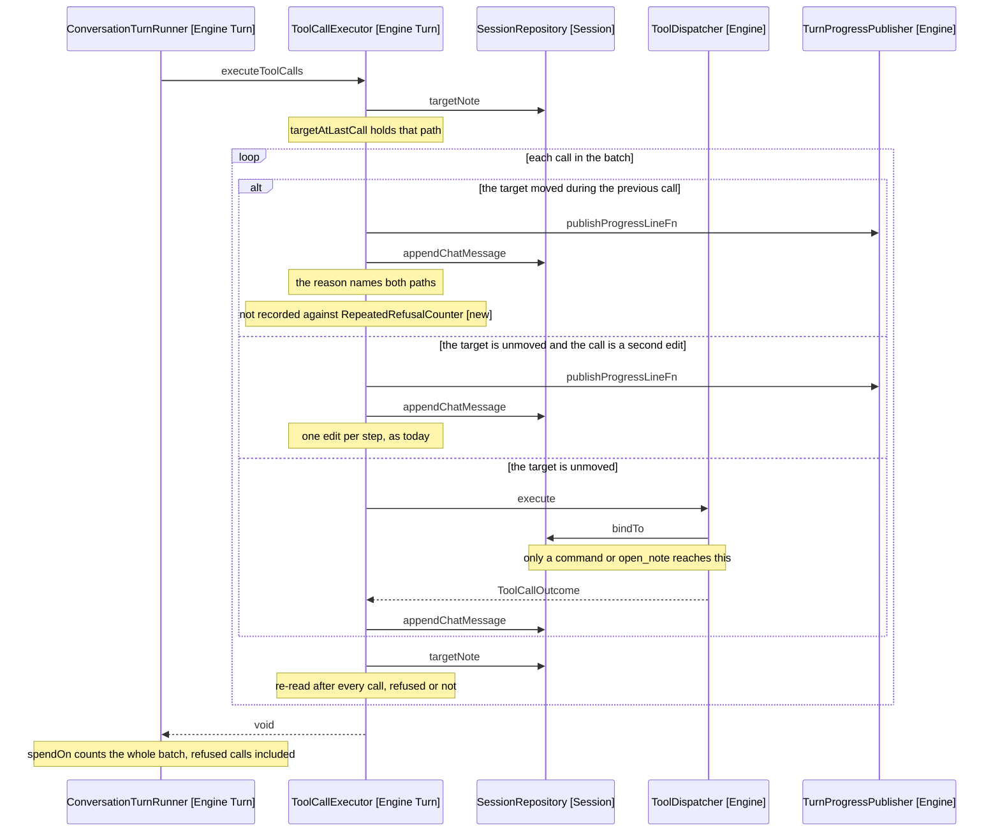

# Design: A Step's Target Holds Still

## Goal

Refuse a tool call that follows an actual change of target within a turn step, so every edit in a step anchors against the note ModelService (Engine Turn) read at that step's start. It mirrors the single-edit rule already in ToolCallExecutor (Engine Turn), and per D4 it counts the target moving rather than the call that might have moved it.

## Feature flag

None. This repo has no feature flags and no flag registry, so the Feature flag and Gating sections both have no content and are dropped rather than invented. The rule lands on by default, as the single-edit rule did.

## Where the guard reads the move

The guard reads SessionRepository.targetNote (Session), per D5, and compares it before and after each call.

SessionRepository.bindTo runs unconditionally inside ToolDispatcher.moveSessionTargetNoteTo (Engine), so the session's path moves on every retarget. TurnRepository.retargetTo (Engine Turn) runs only when the path resolves; where it does not, cannotWriteTo is set and TurnRepository.targetNote still answers the note it held. That case is still a moved target, so reading the turn's note would let it through.

## The two rules stop mirroring each other

One loop, two guards, different shapes. That is the cost D4 named and D6 accepts.

- The edit rule reads a ToolCall before dispatch. isSecondEditIn (Engine Turn) asks what the call is, and refuses it without running.
- The retarget rule reads the session's target around dispatch, because nothing about a call says whether it will move the target.

The edit rule does not move to match: running the second edit to discover it was a second edit is the duplicated write it prevents. The loop therefore holds two pieces of per-step state, whether an edit has applied and the path as it stood after the last call.

## Behaviour change

| Concern                          | Today                                                     | New                                                                  |
| -------------------------------- | --------------------------------------------------------- | -------------------------------------------------------------------- |
| Second retargeting call in a step | Runs, and moves the target again                          | Refused before dispatch, with the reason as its tool result           |
| Edit following a retarget in a step | Runs, anchored against the previous note's text           | Refused, since the target moved ahead of it                          |
| Command that opened nothing      | Runs, target untouched                                    | Unchanged: no move, so what follows still runs                        |
| First retargeting call of a step | Runs                                                      | Unchanged                                                             |
| Search or read after a retarget  | Runs                                                      | Refused, as the guard covers every call after a move                  |
| RepeatedRefusalCounter           | Sees a no-op command's refusal                            | Unchanged; the new refusal is not recorded, as refuseSecondEdit is not |
| IterationCounter                 | Spends one per call in the batch, refused or not          | Unchanged, per D3                                                     |
| Panel                            | One retarget line per move                                | A refused line per call after the move                                |

The fifth row is the widest consequence and is deliberate. The refusal is about the step's read being stale, and a read_note or a glob after a move is answering against a target the model no longer holds. Narrowing the guard to edits and retargets would need a second predicate saying which calls tolerate a moved target, and nothing in the tool list today does.

## Behaviour sequence



Arrows: uses-relationship (client to supplier).

## The refusal text

Matches the shape of SECOND_EDIT_REFUSAL: what the rule is, why the step cannot carry the call, and what to do next.

```text
One note per step. Running that opened <path>, and the note this step was read
against was <previous path>, so this call would act on a note you have not been
shown. Send it on the next step, which reads <path> first.
```

The paths are what makes it actionable, and both are in hand at the refusal site since the guard compares them.

## Where it lands in code

ToolCallExecutor.executeToolCalls (Engine Turn), which loops the calls of one step and is the only caller of the dispatcher's execute. ConversationTurnRunner (Engine Turn) is untouched, and the comparison is a private method on the executor rather than a new class.

No new predicate joins ToolCall (Model Providers Models). The requirements offer isEditTool as the model to follow, and D4 rules it out: a retargets() predicate answers what a call might do, where the guard needs what the target did.

## D3: a refused retarget spends its step

Resolved in 3-decisions.md and nothing here changes it. ConversationTurnRunner.spendOn (Engine Turn) spends iterationCounter.spend(calls.length) over the whole batch after the executor returns, so a refused second edit already spends today and the new refusal inherits that.

The design's only obligation is not to make it worse. It does not: the guard refuses inside the loop and the runner still counts the batch it sent.

## Prompt change

One line beside the one-edit rule in ModelsRole.build (Model Prompt System-Prompt-Sections), at line 19 of models-role.ts, where the existing rule sits.

It goes in ModelsRole.widenedReach rather than the always-stated block. A vault with no commands and no search cannot retarget at all, and the release 3 fixture guards exactly that prompt, so widenedReach leaves the fixture green.

The wording is judged against a real vault and a real API key, per CLAUDE.md: the suite cannot tell a line that changes the model's planning from one it ignores. Treat it as tuning, and if the fixture does need re-recording, re-record it deliberately rather than relaxing the test.

## Unit tests

In [6-unit-tests.md](6-unit-tests.md), which holds the plan for ToolCallExecutor.executeToolCalls and the prompt section.

## Out of scope

- Re-reading the note mid-step so a step can both reach and edit. D2 settled it: that is a round trip, which is a step.
- Exempting a read-only open from the rule. No such call exists today, and the assumption in 3-decisions.md says what would force one.
- Changing what IterationCounter spends on a refused call, per D3 above.
- A shortlist offering several notes at once, which confirm mode would want for a three-note turn. Its own spec.

## Rollout

1. Land the guard and its tests. The rule is on for every turn from that commit.
2. Run the acceptance checks in 4-acceptance-criteria.md against a real vault on mistral-medium-latest, which is the model both failures were observed on.
3. Add the prompt line only if step 2 shows the model still batching its opens. The refusal carries the behaviour; the line saves a wasted step.
4. Re-record the release 3 fixture if the line lands outside widenedReach, and say so in the commit.

## References

- [2-requirements.md](2-requirements.md) - the once-per-step read and the two tools that move the target
- [3-decisions.md](3-decisions.md) - D1 to D4 from requirements, D5 and D6 from this design
- [4-acceptance-criteria.md](4-acceptance-criteria.md) - the five manual checks
- [src/engine/turn/tool-call-executor.ts:24](../../../../src/engine/turn/tool-call-executor.ts) - executeToolCalls, the loop the guard joins
- [src/engine/turn/tool-call-executor.ts:34](../../../../src/engine/turn/tool-call-executor.ts) - isSecondEditIn, the before-dispatch guard it sits beside
- [src/engine/turn/tool-call-executor.ts:40](../../../../src/engine/turn/tool-call-executor.ts) - refuseSecondEdit, and why it skips RepeatedRefusalCounter
- [src/engine/tool-dispatcher.ts:308](../../../../src/engine/tool-dispatcher.ts) - moveSessionTargetNoteTo, which binds before it resolves
- [src/engine/tool-dispatcher.ts:300](../../../../src/engine/tool-dispatcher.ts) - moveTargetNote, the early return for a command that opened nothing
- [src/session/session-repository.ts:24](../../../../src/session/session-repository.ts) - targetNote, the path the guard compares
- [src/engine/turn/turn-repository.ts:48](../../../../src/engine/turn/turn-repository.ts) - targetNote, which does not move on an unresolvable retarget
- [src/engine/turn/model-service.ts:58](../../../../src/engine/turn/model-service.ts) - targetNoteDetails, the once-per-step read
- [src/engine/turn/conversation-turn-runner.ts:73](../../../../src/engine/turn/conversation-turn-runner.ts) - spendOn, which D3 turns on
- [src/model/prompt/system-prompt-sections/models-role.ts:19](../../../../src/model/prompt/system-prompt-sections/models-role.ts) - the one-edit rule the new line sits beside
- [docs/architecture/6-reaching-a-note.md](../../../architecture/6-reaching-a-note.md) - the target, the retarget and the three routes
- [docs/architecture/2-vocabulary.md](../../../architecture/2-vocabulary.md) - turn, turn step and retarget
