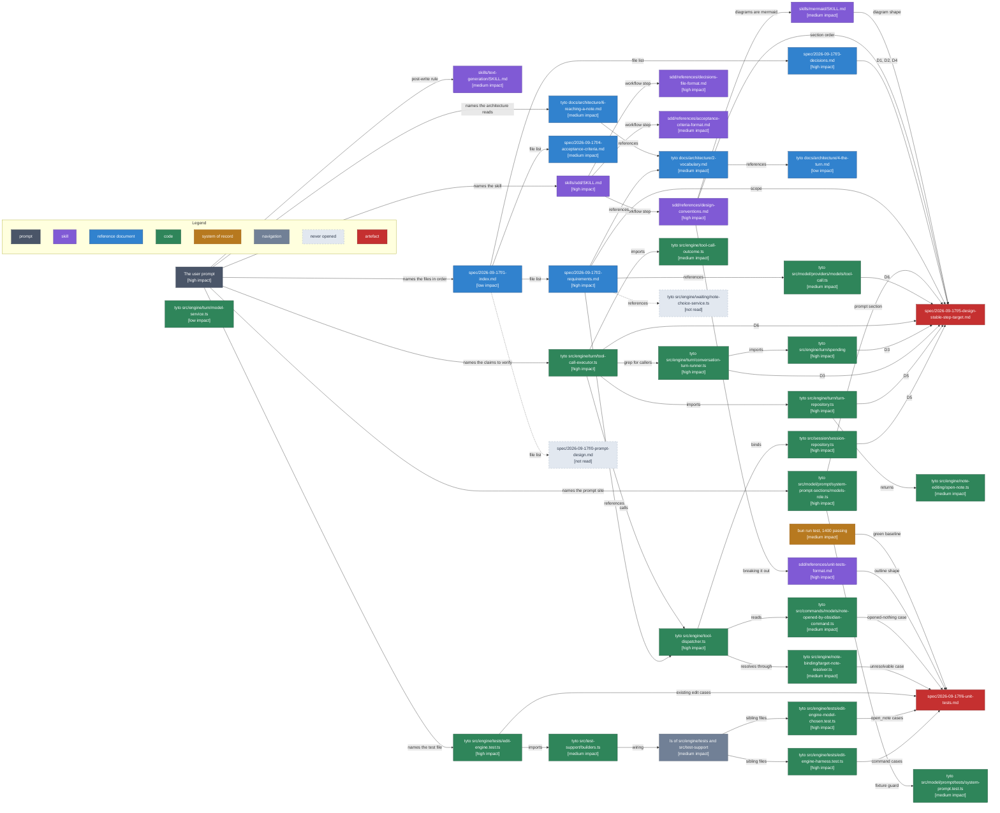

# Design Phase Context

The phase produced 5-design-stable-step-target.md and 6-unit-tests.md, resolved D3, added D5 and D6, and cut one acceptance check. Conventions are in [1-index.md](1-index.md).

Cost: about 51,300 estimated read tokens. By category: code 32,600, skill 14,400, navigation 3,700, system of record 600. By impact: high 12,900, medium 21,400, low 11,600, none 5,400. The accounting is in [4-context-budget.md](4-context-budget.md).

## Discovery path

Arrows: discovery path, source pointed me at the target.

## What each source decided

| Source                          | Impact | What it decided                                                                       |
| ------------------------------- | ------ | ------------------------------------------------------------------------------------- |
| The user prompt                 | high   | Scope, D3 as mine to settle, the five claims to verify, and no build run              |
| session-repository.ts           | high   | D5: bindTo runs unconditionally, so the session's path is the target the guard reads  |
| turn-repository.ts              | high   | D5's other half: retargetTo is conditional, so the turn's note misses a failed resolve |
| conversation-turn-runner.ts     | high   | D3: spendOn counts the whole batch, so a refused call already spends                  |
| spending counters               | high   | D3's cost: changing it needs a new return shape for two steps in twenty               |
| tool-call-executor.ts           | high   | D6: the edit rule reads a call before dispatch and cannot move after it               |
| tool-dispatcher.ts              | high   | Both retarget routes reach line 308, and moveTargetNote returns early on a no-op      |
| 2-requirements.md               | high   | The rule, the two tools, and the refusal shape to match                                |
| 3-decisions.md                  | high   | D1, D2 and D4 as settled inputs the design implements                                 |
| models-role.ts                  | high   | The prompt line belongs in widenedReach, which leaves the fixture green               |
| edit-engine.test.ts             | high   | The three-edit batch and search-then-edit cases the new guard must not break          |
| edit-engine-harness.test.ts     | high   | The command cases land here; it already drives both open and opened-nothing           |
| edit-engine-model-chosen.test.ts| high   | The open_note cases land here; it already runs glob, choose and open end to end       |
| sdd skill and design-conventions| high   | Section order, the flag preflight, and that the flag sections get dropped              |
| unit-tests-format.md            | high   | Breaking the plan out to 6-unit-tests.md past 120 lines                                |
| decisions-file-format.md        | high   | Resolved last, the Design section, and the answer as the first body line              |
| target-note-resolver.ts         | medium | resolveOrNothing returns null on a miss, which is the unresolvable-retarget test case |
| note-opened-by-obsidian-command | medium | rebinds() false is the no-op command, and its refusal does reach the counter          |
| tool-call.ts                    | medium | No retargets() predicate: it would answer what a call might do, not what the target did |
| tool-call-outcome.ts            | medium | refused() carries the reason the counter reads, so the new refusal must bypass it     |
| open-note.ts                    | medium | The turn's target is an object, so the session's string is the cheaper comparison     |
| builders.ts and the tests ls    | medium | Which file each test case lands in, and that no new fake is needed                    |
| system-prompt.test.ts           | medium | The fixture is a raw import, so any always-stated line re-records it                  |
| 6-reaching-a-note.md            | medium | Target and retarget as the architecture defines them, and the three routes            |
| 2-vocabulary.md                 | medium | Turn step versus progress line, and retarget as the word for the move                 |
| 4-acceptance-criteria.md        | medium | Which check the unit plan now covers, so it came out                                  |
| acceptance-criteria-format.md   | medium | The bar for removing a check: anything the suite asserts                              |
| text-generation skill           | medium | Prose shape, table padding, no bold, one line per paragraph                           |
| mermaid skill                   | medium | Rewrote the sequence diagram: method-name labels and client-to-supplier arrows        |
| bun run test                    | medium | 1400 green, so the plan rests on a known baseline and src stayed untouched            |
| 4-the-turn.md                   | low    | Engine's folder table, confirming the guard stays in turn/                            |
| model-service.ts                | low    | Confirmed the once-per-step read, which the prompt had already stated                 |
| 1-index.md                      | low    | Framing already carried by the requirements                                            |
| 0-prompt-design.md              | not read | Its content was the user prompt, so opening it would have duplicated the turn        |
| note-choice-service.ts          | not read | Auto versus confirm mode does not change a rule about the target moving              |

## Shape notes

- The prompt is the hub. It named seven of the eight starting points directly, including all five code claims to verify, so the chains are short: most sources are two hops from it.
- The deepest chain is four hops and it is the one that mattered: prompt to executor to dispatcher to session-repository, which is where D5 came from. Nothing in the spec folder pointed at session-repository.ts.
- Two sources contradicted the spec and both were code. D4's body says the guard can read turnRepository.targetNote(); reading both repositories showed that misses an unresolvable retarget, which became D5. The requirements' reference list offers isEditTool as the model for a new predicate; D4 rules that predicate out.
- Two dead ends, both cheap and both correct to skip. 0-prompt-design.md is the user prompt in a file, and note-choice-service.ts answers a question the rule is indifferent to.
- The test files have no inbound link from any spec document. They were reached through a directory listing, which is the one piece of navigation that paid for itself.
