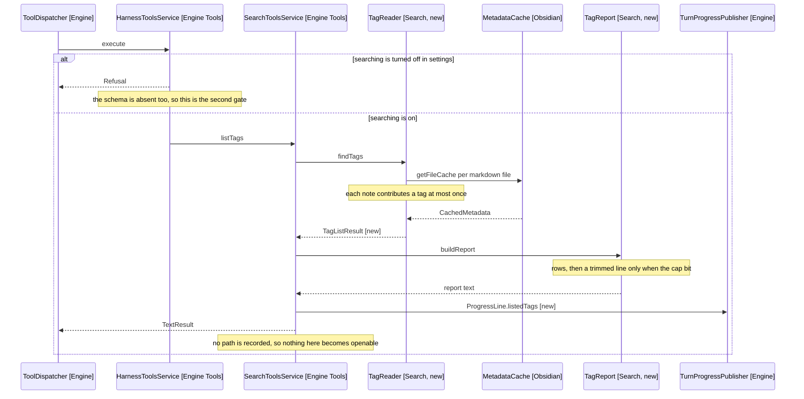

# Design: Listing The Vault's Tags

## Goal

Add list_tags, a read-only tool answering the vault's tags with the number of notes carrying each, sorted by count descending and narrowed by an optional substring filter. It reads MetadataCache (Obsidian) rather than note text, so a frontmatter tags list and an inline hash are one vocabulary and #health never matches #healthcare.

## Table of Contents

1. [Feature flag and gating](#feature-flag-and-gating)
2. [Where the tag reader lives](#where-the-tag-reader-lives)
3. [What one call returns](#what-one-call-returns)
4. [What the model reads back](#what-the-model-reads-back)
5. [Where the search gate holds](#where-the-search-gate-holds)
6. [The tool lists tags and does not find notes](#the-tool-lists-tags-and-does-not-find-notes)
7. [Behaviour change](#behaviour-change)
8. [Behaviour sequence](#behaviour-sequence)
9. [New interfaces](#new-interfaces)
10. [Telling the model to list before suggesting](#telling-the-model-to-list-before-suggesting)
11. [Re-recording the prompt fixture](#re-recording-the-prompt-fixture)
12. [Out of scope](#out-of-scope)
13. [Unit tests](#unit-tests)
14. [Rollout](#rollout)
15. [References](#references)

## Feature flag and gating

None. This repo has no feature flags and no flag registry, so both sections have no content and are dropped rather than invented. The tool lands on by default for any vault with searching enabled, which is a settings gate rather than a rollout one and is designed in Where the search gate holds.

## Where the tag reader lives

In src/search, beside NoteGlob and NoteReader, as TagReader (Search, new) with TagCount (Search Models, new) and TagListResult (Search Models, new) beside it.

Search owns reading the vault without binding to it, which is what this does. That a cache walk is not a content search is the weaker argument; the dependency shape is the stronger one. A package of its own would depend on obsidian and shared, be constructed in EngineFactory (Wiring), and be reached only through the engine's tool service. That is the arrow set Search already has, so it gives a second package indistinguishable from the first, against a ten-file limit src/search is nowhere near at five.

TagReader takes the Vault and the MetadataCache both: the vault lists the markdown files, the cache answers each file's tags. Every other search class takes the Vault alone, so the constructor states the difference.

## What one call returns

TagReader.findTags(filter) walks every markdown file once, reads getAllTags (Obsidian) on its cache entry, and tallies distinct tags per note.

- getAllTags (Obsidian) combines the frontmatter tags list and the inline hashes into one array, each normalised with a leading hash. That is the one call that makes frontmatter and inline the same vocabulary.
- A tag repeated within a note counts once, per D2 and D7. The walk puts each note's tags through a Set before tallying.
- A nested tag counts as written, per the requirements. #project/tyto is its own row and is not rolled into #project, because the full string is what an edit has to write.
- The filter matches a case-insensitive substring of the tag name, applied after the tally, so a filtered row still carries its whole-vault count.
- Rows sort by count descending, then by tag ascending, so a vault where many tags are used once returns a stable order rather than whatever the file walk produced.
- The cap is MAX_TAG_RESULTS of 50 (Search, new), mirroring MAX_GLOB_RESULTS, with the uncapped total held beside the rows as GlobResult holds it.

## What the model reads back

TagReport.buildReport (Search, new), a second reporter beside SearchReport rather than a third method on it. A tag row is a count and a name where a glob row is a path, and the empty case is a statement about the vault rather than about a pattern, so the two share no branch.

```text
#journal - 312 notes
#health - 48 notes
#project/tyto - 12 notes
showing the top 3 of 87 tags; narrow with filter to see the rest
```

Three shapes, and nothing else:

- Rows, one per tag, count first in words so the model does not read a bare number as a rank.
- A trimmed line naming the shown count and the total, in the shape SearchReport.trimmedLine uses, pointing at the filter rather than at a pattern.
- One empty message, and which one depends on the filter. With none, "this vault uses no tags", which is what the acceptance criteria's empty-vault check reads. With a filter, "no tag contains journal; call list_tags with no filter to see the vocabulary", because a model told only that nothing matched retries narrower filters, which is the failure SearchReport.noGlobMatch exists to prevent.

## Where the search gate holds

Three places, which is what every search tool already needs.

- SEARCH_TOOLS (Engine Tools) gains LIST_TAGS (Model Providers Models, new), so ToolCatalogue.isOffered drops the schema when searching is off. The tool belongs there rather than beside ASK_USER: it reaches outside the open note, which is what the setting governs.
- HarnessToolsService.execute (Engine Tools) refuses it after the searchEnabled check, as a disabled flow refuses as well as being absent. The branch must be explicit and must precede the final line: that line falls through to NotePathsShortlistTool.offerPaths (Engine Tools), so a new call added without a branch is dispatched as a shortlist.
- ToolCall.isListTags (Model Providers Models, new) names it, and isHarnessTool gains it so the dispatcher routes it with the other vault readers.

It stays out of requiresVaultAccess, so it carries no applicable_skills argument. That gate exists for calls that can be a turn's first reach into the vault, where a skill knows where notes live and how they are named. A tag list takes no path and covers the whole vault, so a skill has nothing to say about it.

SearchToolsService (Engine Tools) grows a listTags method taking the ToolCall and returning a TextResult with ProgressLine.listedTags (Engine, new). It takes no TurnState: no path comes back, so nothing is recorded against PathsReturnedByVaultRepository. That is its whole relationship with the write path, and the reason D4 settles as it does.

## The tool lists tags and does not find notes

D4 resolved: list only. The tool answers which tags the vault uses, and never which notes carry one.

A path this tool returned would be one the model may shortlist and open, so a paths flag makes a read-only vocabulary tool a third source of write candidates. Every such source is designed in 6-reaching-a-note.md, and adding one for a case no turn has needed is the untested widening the requirements warned about.

A model needing those notes greps for the tag, with the two failures the decision names. Both are recoverable rather than silent: a grep for the word finds the frontmatter notes even without the hash, and the model reads the excerpt to see which tag the note carries. That is worse than a cache walk and good enough until a real turn shows otherwise, which is what reopens this.

## Behaviour change

| Concern                        | Today                                         | New                                                        |
| ------------------------------ | --------------------------------------------- | ---------------------------------------------------------- |
| Asking what tags a vault uses  | No tool answers it; the model invents a tag   | list_tags returns the vocabulary with a note count per tag |
| Frontmatter tags               | Reachable only by grepping the word, unhashed | Counted with inline tags, as one tag, by getAllTags        |
| Tool list with search on       | Fourteen schemas                              | Fifteen; list_tags joins SEARCH_TOOLS                      |
| Tool list with search off      | Seven schemas, or five with commands off      | Unchanged: the gate drops it with the other readers        |
| applicable_skills gate         | Eight tools carry it                          | Unchanged; list_tags reaches no path, so it stays out      |
| Paths offerable to choose_note | Set by a glob, a grep or a read               | Unchanged: list_tags records none                          |
| Panel                          | Globbed, Grepped, Read lines                  | A Listed tags line, naming the filter and the count        |
| Writing a tag                  | The edit tools write text                     | Unchanged, per D1                                          |
| release-3-prompt.txt           | The search-off prompt                         | Unchanged; see Re-recording the prompt fixture             |

## Behaviour sequence



Arrows: uses-relationship (client to supplier).

## New interfaces

Ordered as the Rollout section orders the commits.

src/search/models/tag-count.ts, one row of the list: a tag and the number of notes carrying it.

```ts
export class TagCount {
  constructor(
    readonly tag: string,
    readonly noteCount: number,
  ) {}
}
```

src/search/models/tag-list-result.ts, the rows that survived the cap plus the uncapped total, in the shape GlobResult (Search) holds.

```ts
export class TagListResult {
  constructor(
    readonly tags: readonly TagCount[],
    readonly total: number,
  ) {}

  wasTrimmed(): boolean
}
```

src/search/tag-reader.ts, the walk itself. TagReader is an agent noun beside NoteReader and NoteGlob (Search), where TagIndex would name a thing that holds state and this holds none. It takes the MetadataCache beside the Vault, which no other search class does.

```ts
// Fifty, mirroring MAX_GLOB_RESULTS: a vocabulary trimmed shorter than that
// stops being the vault's conventions and starts being a sample.
export const MAX_TAG_RESULTS = 50

export class TagReader {
  constructor(
    private vault: Vault,
    private metadataCache: MetadataCache,
  ) {}

  // Null filter lists everything. No cachedRead anywhere in this class: the
  // cache already holds the tags, so a tally must not cost a read.
  findTags(filter: string | null): TagListResult
}
```

src/search/tag-report.ts, what the model reads back. It builds a string rather than a TagReport, so it is a factory by the naming rules and its method takes build. SearchReport.ofGlob (Search) is the nearer precedent and the of- shape is wrong there too, but the unchanged path stays unchanged: renaming it is its own commit.

```ts
export class TagReport {
  static buildReport(filter: string | null, result: TagListResult): string
}
```

src/model/providers/models/tool-call.ts, an added constant and an added method on the existing ToolCall class.

```ts
export const LIST_TAGS = 'list_tags'

// On ToolCall, beside isGlobNotes. isHarnessTool gains it; requiresVaultAccess
// does not, so the call carries no applicable_skills argument.
isListTags(): boolean
```

src/engine/tools/search-tools-service.ts, an added method on the existing SearchToolsService class. No TurnState parameter, unlike glob and grep: nothing it returns is a path.

```ts
listTags(call: ToolCall): HarnessResult
```

src/engine/progress-line.ts, an added factory on the existing ProgressLine class.

```ts
// Null filter reads as the whole vault, so the line says which question was
// asked rather than showing an empty detail.
static listedTags(filter: string | null, found: number): ProgressLine
```

src/engine/tools/tool-schemas.ts gains one ToolSchema in TOOL_SCHEMAS and one name in SEARCH_TOOLS. The schema declares a single optional filter argument, so required is empty.

## Telling the model to list before suggesting

Two sentences at the end of SearchSection.rules (Model Prompt), under a Tagging label beside Globbing and Asking.

- List the vault's tags with list_tags before suggesting any tag, and suggest only tags that call returned.
- Where none fits, say the vault has no tag for it rather than inventing one.

The wording is a judgement no unit test makes, per the acceptance criteria. Judge it against a real vault and a real API key before the change is called done.

## Re-recording the prompt fixture

The fixture does not move, which is the opposite of what a reader expects from a prompt change.

release-3-prompt.txt records the prompt for a vault with no commands, no search and no skills, asserted at system-prompt.test.ts:511. SearchSection.build returns nothing when search is off, so text added inside it cannot reach that fixture. The guard stays green unrecorded, and re-recording it here would be the workaround CLAUDE.md warns against rather than the deliberate act.

## Out of scope

- Rolling a nested tag up into its parent, or returning the tag tree. A flat list of the strings an edit writes is what the suggesting flow reads.
- Caching the walk between calls. A tally over a few thousand cache entries costs no read, and a repository holding it across turns would be session-scoped state for a tool called once a turn.
- Watching MetadataCache for changes. A turn reads the cache as it stands, per the requirements' assumption about cold starts.

## Unit tests

Broken out to [6-unit-tests.md](6-unit-tests.md), since the plan runs past what the design can hold.

The obsidian mock and the fakes need extending before any of it runs. src/test-support/`__mocks__`/obsidian.ts declares no MetadataCache, no CachedMetadata and no getAllTags, so the mock gains all three, and FakeVault (Test Support) gains a withTags method and a metadataCache accessor. That is test-support work rather than a new fake, per CLAUDE.md.

## Rollout

1. Land the mock and FakeVault (Test Support) extensions, with no production code.
2. Land TagReader, TagCount, TagListResult and TagReport (Search, new) with their tests.
3. Land LIST_TAGS, the schema, the SEARCH_TOOLS entry, the dispatcher branch and the progress line, with the catalogue's search-off case.
4. Construct TagReader in EngineFactory.buildHarnessTools (Wiring) and pass it to SearchToolsService.
5. Land the prompt section, run bun run test, then judge the wording against a real vault and key.

## References

- [2-requirements.md](2-requirements.md) - what the tool returns and what stays out
- [3-decisions.md](3-decisions.md) - D1 to D3 resolved, D4 settled here, D5 to D7 raised by this design
- [4-acceptance-criteria.md](4-acceptance-criteria.md) - the checks a person runs against a real vault
- [docs/architecture/6-reaching-a-note.md](../../../architecture/6-reaching-a-note.md) - why a tool returning paths is a write-permission question
- [docs/architecture/1-overview.md](../../../architecture/1-overview.md) - the package table, the construction rule and the ten-file limit
- [src/engine/tools/tool-schemas.ts:23](../../../../src/engine/tools/tool-schemas.ts) - TOOL_SCHEMAS, with ToolCatalogue.isOffered at line 293 and SEARCH_TOOLS at line 335
- [src/engine/tools/harness-tools-service.ts:60](../../../../src/engine/tools/harness-tools-service.ts) - execute, whose last line falls through to the shortlist
- [src/engine/tools/search-tools-service.ts:21](../../../../src/engine/tools/search-tools-service.ts) - glob, the shape listTags follows
- [src/search/note-glob.ts:8](../../../../src/search/note-glob.ts) - MAX_GLOB_RESULTS and the capped-with-total result
- [src/search/search-report.ts:48](../../../../src/search/search-report.ts) - trimmedLine, the shape the trimmed line copies
- [src/wiring/engine-factory.ts:151](../../../../src/wiring/engine-factory.ts) - where SearchToolsService is constructed
- [src/model/prompt/tests/system-prompt.test.ts:511](../../../../src/model/prompt/tests/system-prompt.test.ts) - the fixture assertion, and why it is search-off
