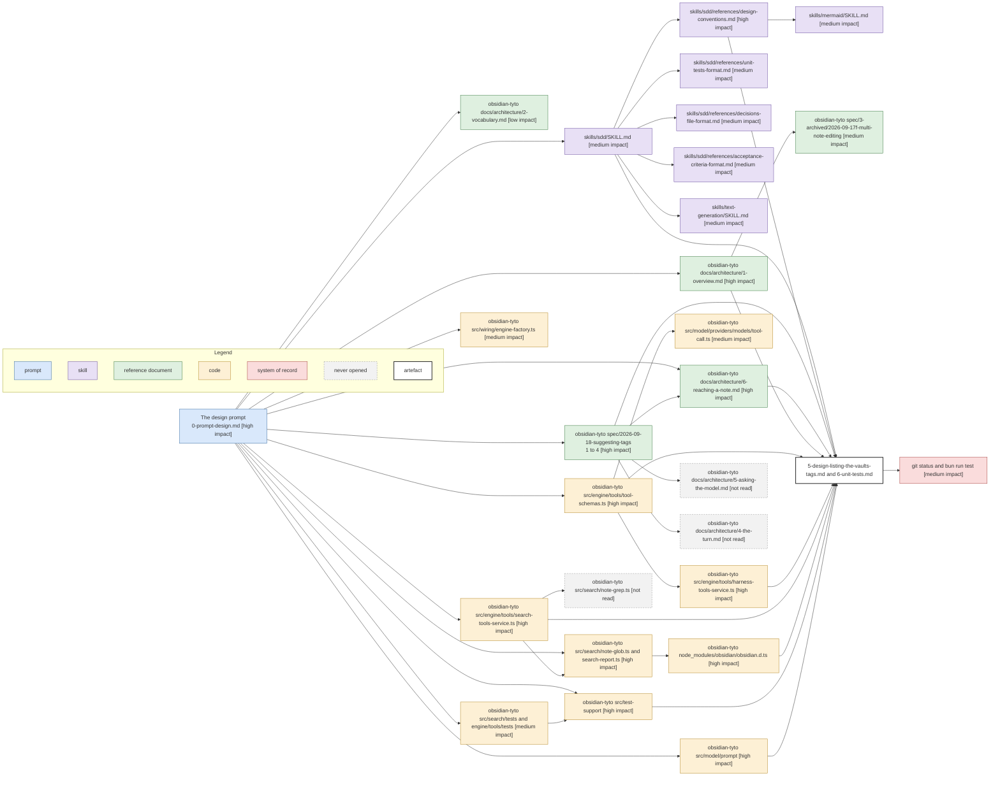

# Design Phase Context

The phase produced 5-design-listing-the-vaults-tags.md and 6-unit-tests.md, and corrected the requirements, the decisions, the acceptance criteria and the index. Conventions are in [1-index.md](1-index.md).

Cost: 53810 estimated read tokens across 60 reads. Code 21400, skill 16893, reference document 8500, navigation 6288, system of record 727, after re-bucketing the markdown reads the script filed as code. Just under half of it changed a decision. Full accounting in [4-context-budget.md](4-context-budget.md).

## Discovery path

Arrows: discovery path, source pointed me at the target.

## Per source

| Source                            | Impact   | What it decided                                                                       |
| --------------------------------- | -------- | ------------------------------------------------------------------------------------- |
| 0-prompt-design.md                | high     | Named every code claim to verify, which is where two spec corrections came from       |
| 1 to 4 of this spec               | high     | D1 to D3 as given, the D4 lean the design then settled, and the criteria to revise    |
| design-conventions.md             | high     | Section order, the behaviour table shape, the one-diagram rule                        |
| 6-reaching-a-note.md              | high     | The argument settling D4: a returned path is a write-permission question              |
| 1-overview.md                     | high     | D5, via the package table, the construction rule and the ten-file limit               |
| tool-schemas.ts                   | high     | Where the gate sits, and the schema counts the behaviour table states                 |
| harness-tools-service.ts          | high     | That execute falls through to the shortlist, so a new branch must be explicit         |
| search-tools-service.ts           | high     | The method shape listTags copies, and that glob records paths where this will not     |
| note-glob.ts and search-report.ts | high     | The cap, the total-beside-rows result, and D6 on a reporter of its own                |
| obsidian.d.ts                     | high     | getAllTags as the one call covering frontmatter and inline, which the design rests on |
| src/test-support                  | high     | That the mock has no MetadataCache, making test support the first commit              |
| src/model/prompt                  | high     | That the release 3 fixture is search-off, correcting the requirements                 |
| sdd/SKILL.md                      | medium   | The workflow order and the file naming                                                |
| unit-tests-format.md              | medium   | The outline shape and the break-out rule                                              |
| decisions-file-format.md          | medium   | D5 to D7 as h3s with state markers, and where they sort                               |
| acceptance-criteria-format.md     | medium   | The three-to-six bar that cut two checks                                              |
| text-generation/SKILL.md          | medium   | Sentence length, no bold, keyboard characters only, the ToC threshold                 |
| mermaid/SKILL.md                  | medium   | The flowchart legend subgraph and the arrow legend line                               |
| tool-call.ts                      | medium   | That isHarnessTool and requiresVaultAccess are separate lists                         |
| src/search/tests and tools/tests  | medium   | The test files to follow, and that tool-catalogue.test.ts has no gating case yet      |
| engine-factory.ts                 | medium   | That app.metadataCache is reachable at the one legal construction site                |
| 2026-09-17f-multi-note-editing    | medium   | The house voice, and that 139 to 308 lines is normal for a design doc here            |
| git status and bun run test       | medium   | That nothing under src moved and 1420 tests pass                                      |
| 2-vocabulary.md                   | low      | Confirmed turn, target and progress line, none of which this change renames           |
| 5-asking-the-model.md             | not read | Pointed at by the requirements for prompt changes; src/model/prompt answered instead  |
| 4-the-turn.md                     | not read | Pointed at by 6-reaching-a-note.md; the tool parks no turn, so it never applied       |
| note-grep.ts                      | not read | Named beside note-glob.ts; the glob was the closer precedent for a capped result      |

## Shape

- The prompt is the hub, with eleven direct edges. It named the files to verify, which is why the code reads needed almost no search to find.
- The longest chain is four: prompt to sdd to design-conventions to mermaid. Every other path is two or three hops.
- Two of the three dead ends were architecture docs the spec pointed at. Both were skippable because the code answered the same question more exactly, which is the signal worth acting on.
- The two reads that settled a decision outright, obsidian.d.ts and 6-reaching-a-note.md, cost about 2850 tokens between them. Neither was among the ten most expensive.
- Nothing arrived without an inbound link. Every source was named by the prompt, by the spec, or by a skill.
