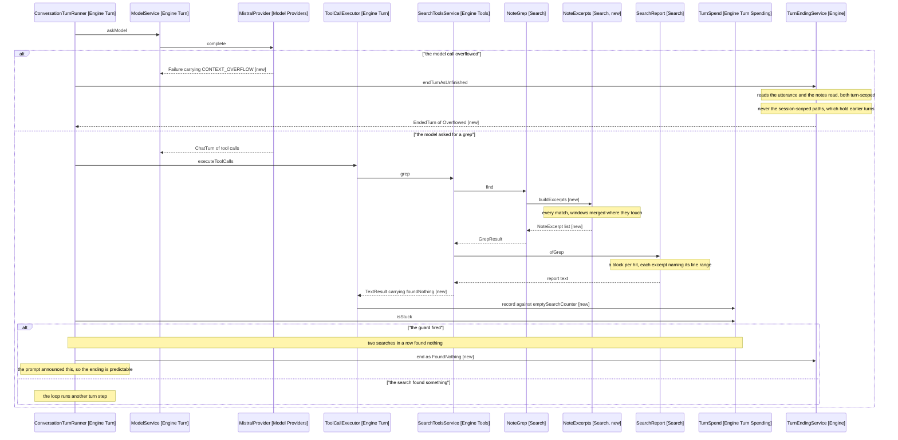

# Design: Behaviour Change And Sequence

What moves, and the one flow that carries both new endings. Part of [1-index.md](1-index.md).

## Behaviour change

| Concern                          | Today                                                  | New                                                              |
| -------------------------------- | ------------------------------------------------------ | ---------------------------------------------------------------- |
| Matches shown per matched note   | One excerpt, from the first match                      | Every match, merged where windows touch                          |
| Excerpt width                    | Fixed 200 characters                                   | context_lines, default 3, capped 15 per match                    |
| Excerpt unit                     | Character offsets                                      | Line ranges, stated in the row                                    |
| MAX_HITS                         | 10, sized for a 200-character row                      | 6, sized for a block                                              |
| MAX_PATHS                        | 50                                                     | Unchanged: a paths-only row is still a path                       |
| A grep row                       | One line, path and count and excerpt                   | A block: path and count, then each excerpt with its line range   |
| Two searches finding nothing     | Counts for nothing; the turn runs to its step ceiling  | Ends the turn, named as found-nothing                            |
| A context overflow               | API responded 400 plus a 200-character snippet         | Named as overflow, with what was read and a continuation prompt  |
| TurnEndingKind                   | Five values                                            | Seven: FoundNothing and Overflowed join them                     |
| Prompt, search on                | No transcription, read-first or question-route rule    | Four rules added across two sections                             |
| Prompt, search off               | Carries the duplicated checkbox line                   | Duplicate deleted, transcription rule added                      |
| release-3-prompt.txt             | 33 lines                                               | 33 lines: one deleted, one added                                 |

## Behaviour sequence

Arrows: uses-relationship (client to supplier).

