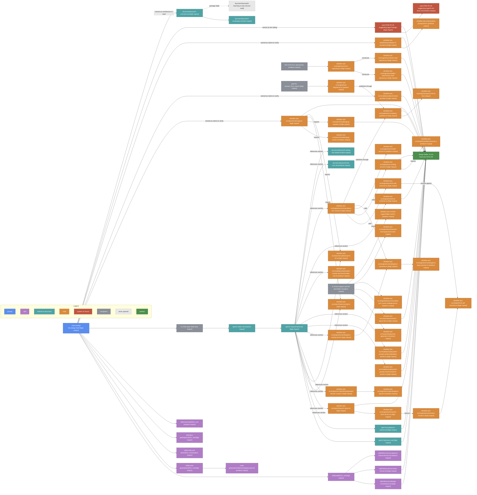

# Design Phase Context

The phase produced the six design files under design-searching-for-a-misheard-name, the test plan in 6-unit-tests.md, five design decisions appended to 3-decisions.md, and one rewritten acceptance criterion. Conventions are in [1-index.md](1-index.md).

## Cost

About 74,400 tokens of tool results across 73 reads. By category: code 43,164, skills 22,681, commands 5,309, navigation 3,285. By impact: high 31,200, medium 26,800, low 11,100, none 5,300. The accounting is [4-context-budget.md](4-context-budget.md).

## Discovery path

Arrows: discovery path, source pointed me at the target.

## What each source decided

| Source                             | Impact | What it decided                                                                     |
| ---------------------------------- | ------ | ----------------------------------------------------------------------------------- |
| User prompt                        | high   | The six claims to verify, the sibling to read, the sections to drop                 |
| sdd SKILL.md                       | high   | The workflow: design file, decisions appended, criteria revisited, audit            |
| design-conventions.md              | high   | The section list and their order                                                     |
| unit-tests-format.md               | high   | The outline shape, and that the plan breaks out past 120 lines                      |
| acceptance-criteria-format.md      | medium | That a check the suite now covers comes out, which rewrote the grep criterion       |
| code-generation SKILL.md           | high   | Splitting NoteExcerpt into a value and a factory; the constructor append rule       |
| typescript.md                      | medium | Class over interface for the new values; where a defaulted parameter goes           |
| code-unit-tests SKILL.md           | medium | One test per branch, which shaped every outline leaf                                |
| text-generation SKILL.md           | high   | The 120-line limit that forced the design split, and the backtick discipline        |
| mermaid SKILL.md                   | medium | Quoted alt labels with the predicate moved to a Note over                           |
| spec 2-requirements.md             | high   | The seven changes, and the reference list that found most of the code               |
| spec 3-decisions.md                | high   | D1 to D4, implemented rather than reopened                                          |
| spec 4-acceptance-criteria.md      | high   | What the suite must not duplicate; the Exhausted-is-a-failure constraint            |
| architecture 1-overview.md         | high   | Package placement for every new file, and the construction rule                     |
| architecture 4-the-turn.md         | medium | Where an ending fits, and that everything under turn dies with the turn             |
| architecture 2-vocabulary.md       | low    | Confirmed turn and turn step usage; nothing was renamed as a result                 |
| architecture 5-asking-the-model.md | low    | Confirmed the prompt assembly order; no prompt text moved between files             |
| sibling 5-design                   | high   | That TagReport is a new file, so two of the three named collisions are not real     |
| sibling 6-unit-tests.md            | medium | Confirmed the sibling asserts nothing this design's rendering would break           |
| note-grep.ts                       | high   | matches[0].index at line 92, MAX_HITS 10, and the comment sizing it to one excerpt  |
| note-excerpt.ts                    | high   | The fixed 200-character window, and that it has one caller, so it can be replaced   |
| search-hit.ts                      | high   | That describe renders the row, so deleting it is part of the change                 |
| grep-request.ts                    | high   | Where the model's arguments are clamped, so the context cap lives there             |
| search-report.ts                   | high   | The three branches of ofGrep, and that total === 0 is the structured empty fact     |
| grep-result.ts                     | medium | wasTrimmed and readNothing, which the new rendering leaves alone                    |
| tool-schemas.ts                    | high   | The grep_notes schema the context argument joins, and its required list             |
| conversation-turn-runner.ts        | high   | The isStuck branch the found-nothing one copies                                     |
| turn-ending-kind.ts                | high   | Five values, so the two new ones make seven                                         |
| turn-outcomes.ts                   | high   | The split between endings that write history and those that do not                  |
| turn-ending-service.ts             | high   | That it holds the session repository, so it builds the continuation prompt          |
| repeated-refusal-counter.ts        | high   | The counter shape, its threshold of two, and its message method                     |
| tool-call-executor.ts              | high   | Where the refusal is recorded, so where the empty-search fact is recorded           |
| harness-results.ts                 | high   | That TextResult is the carrier for the empty-search fact                            |
| tool-call-outcome.ts               | high   | The last hop to the loop, and its paired-factory discipline                         |
| search-tools-service.ts            | high   | That it holds the result, so it knows total === 0 without parsing a report          |
| turn-repository.ts                 | high   | That notesRead is turn-built and pathsReturnedByVault session-supplied              |
| paths-returned-by-vault-repository | high   | Session-scoped and exposes only includes, which ruled it out of the prompt          |
| notes-read-repository.ts           | high   | Turn-scoped, and exposes only includes, so it needs an accessor                     |
| turn-progress-publisher.ts         | high   | One-way by design, which ruled the progress lines out of the prompt                 |
| mistral-provider.ts                | high   | parseResponse reads the status alone, so the overflow branch goes there             |
| search-section.ts                  | high   | The trailing unheaded group three rules join, and the Globbing rule left alone      |
| dictation-section.ts               | high   | The duplicate at lines 11 and 12, confirmed verbatim and adjacent                   |
| models-role.ts                     | medium | The refusal-announcement wording the new one is shaped after                        |
| release-3-prompt.txt               | high   | 33 lines, no gated word, duplicate as the last two lines: the two-line diff         |
| system-prompt.test.ts              | medium | The fixture assertion site and the re-record comment shape                          |
| search-report.test.ts              | high   | That ofGrep has no coverage at all, so the rendering tests are new                  |
| note-grep.test.ts                  | medium | The existing cases, so the plan says which stay and which change shape              |
| conversation-turn-runner-endings   | medium | That endings are asserted through EditEngine and the transcript                     |
| harness-tools-grep.test.ts         | low    | The construction shape; no design decision turned on it                             |
| fake-vault.ts                      | medium | That withNote takes multi-line content, so no test-support change is needed         |
| tool-dispatcher.ts                 | medium | That answerFromSearch needs no bound note, and its publisher path                   |
| turn-step-outcome.ts               | medium | The EndedTurn shape the two new endings build                                       |
| turn-spend.ts                      | medium | Where the new counter is held                                                       |
| outcome.ts                         | medium | The three states and FailureStep, for the overflow failure's shape                  |
| model-service.ts                   | medium | That the runner sees the failure through endTurnAsUnfinished                        |
| progress-line.ts                   | low    | The factory shape; no new line was needed                                           |
| grep for answer_from_search        | high   | Found the dispatcher's publish path in one call, unpointed by any document          |
| find of the four repositories      | medium | Located turn-repository, which the requirements named without a path                |
| ls of the test folders             | medium | Found that search-report.test.ts exists, which the requirements did not say         |
| ls of the spec folder              | low    | Confirmed the four files; the prompt already named them                             |
| 6-reaching-a-note.md               | not read | Pointed at by the overview and the sibling; no path question arose                 |

## Shape of the reference tree

- The requirements file is the hub. Its References section named twelve of the sixteen high-impact code reads, and every one of those was worth opening. A design phase that skipped it would have had to grep for the same files.
- The chain is short. Three hops is the deepest path: prompt to requirements to note-grep to note-excerpt. Nothing needed a fourth, which is what a good References section buys.
- The three highest-impact reads were not pointed at by any document. That search-report.test.ts has no ofGrep coverage came from an ls; that turn-repository distinguishes turn-built from session-supplied came from a find; the dispatcher's publish path came from a grep. All three changed the design.
- The sibling spec was the only system-of-record read, and it corrected the prompt. Two of the three collisions it was cited for are not collisions, and two real ones went unnamed.
- One dead end, and it was cheap. 6-reaching-a-note.md was pointed at twice and never opened, because no question about write permission arose. Its absence cost nothing.
