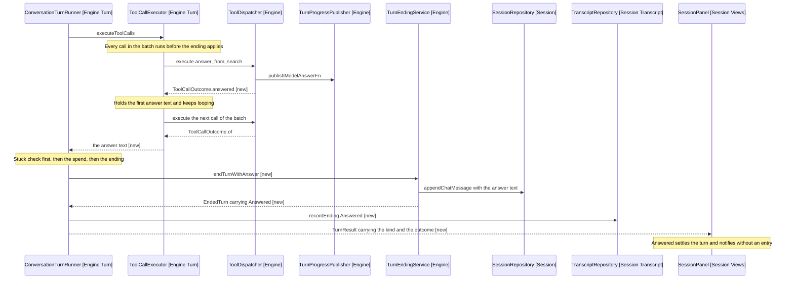

# Ending On An Answer: What Changes And How The Loop Stops

The behaviour the change lands, how a tool call says the turn is over given that every call in the batch has to run first, and the one sequence that carries both.

## Behaviour change

| Concern                          | Today                                                  | New                                                           |
| -------------------------------- | ------------------------------------------------------ | ------------------------------------------------------------- |
| Steps after the answer           | One more, which the model fills with a restatement     | None; the loop stops on the step that answered               |
| What ToolCallOutcome carries     | result, editEndPosition, refusal, panelSummary, wroteThrough | Those five, plus the answer that ends the turn          |
| What ToolCallExecutor returns    | void                                                   | The first answer of the batch, or nothing                    |
| TurnEndingKind values            | Five                                                   | Six, with Answered                                            |
| What ConversationTurnRunner.run returns | Outcome of string                               | TurnResult, holding the kind beside that outcome              |
| Panel entries for such a turn    | An answer entry and an assistant entry                 | The answer entry alone                                        |
| Chat history's closing message   | The model's restatement, uncited                       | The answer text, as published                                 |
| notifySucceeded                  | Fires with the restatement                             | Fires with the answer text                                    |
| Iteration spend for the step     | Charged, then another step is charged                  | Charged once, for the batch that answered                     |

## How a tool call tells the loop to stop

ToolCallOutcome (Engine) gains a sixth field, and one factory that sets it: ToolCallOutcome.answered (Engine, new) takes the result text the model reads and the answer text the ending appends. Both travel together or neither does, which is why a factory sets the pair rather than a call site.

The field is the answer text rather than a boolean. A boolean would make the dispatcher publish the text somewhere for the ending to fetch, and the text is what the ending needs.

### Why the executor accumulates rather than returns early

ToolCallExecutor.executeToolCalls (Engine Turn) returns Promise of string or null instead of Promise of void. The loop over the batch is unchanged; what changes is a local that remembers the first answer it saw, read after the loop finishes.

That local is the mechanism D3 requires. A return inside the loop is the discarded-calls option under another name, so the answer has to be held while the remaining calls run and their results are appended.

Two answers in one batch: the first wins. Both publish their block to the panel, because publishing is the dispatcher's and it happens per call; only the first supplies the ending's text. The alternative is the last winning, which reads as arbitrary rather than as first-past-the-post, and neither is a shape the schemas invite.

### Where the runner reads it

ConversationTurnRunner.executeToolCalls (Engine Turn) reads the returned answer after the stuck check and before the spend. Order matters at both ends.

- After the stuck check, because a batch that both answered and was refused twice is a stuck turn. The refusal counter is the thing that stops a loop, and an answer beside two identical refusals must not hide it.
- Before the keepGoing return, because the answer is what replaces it. The spend still runs, so the batch that answered is charged for its calls the way any other batch is.

## Behaviour sequence

Arrows: uses-relationship (client to supplier).
